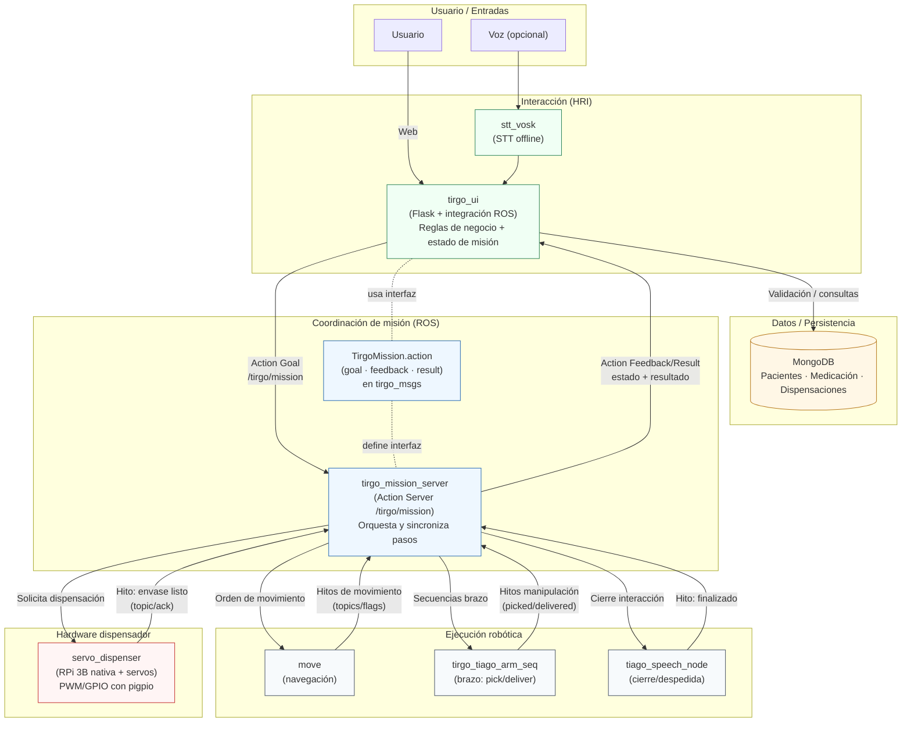
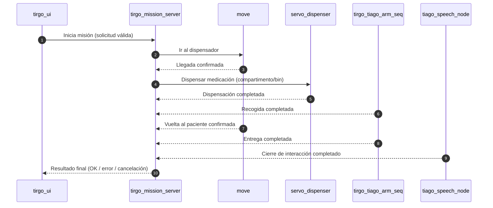
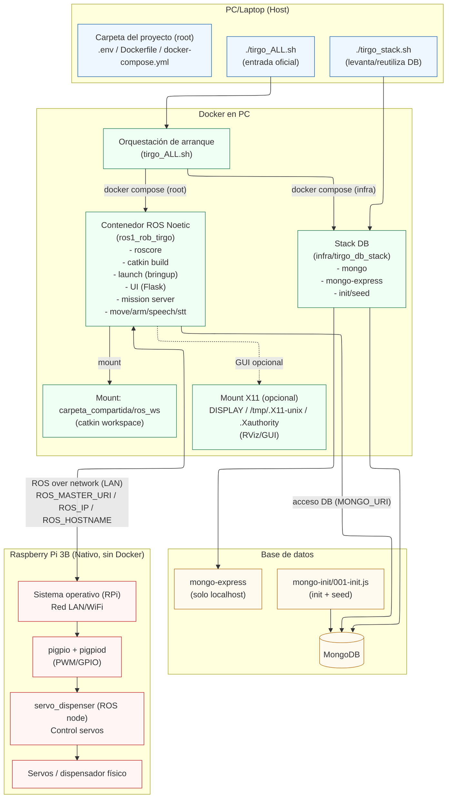

<div align="center">
  

# TirGoPharma

Dispensación y entrega de medicación con TIAGo usando ROS 1 (Noetic), Web (Flask), MongoDB y un dispensador físico por servos (Raspberry Pi 3B).  
Demo end-to-end reproducible.

  <p>
    <a href="http://wiki.ros.org/noetic"></a>
    <a href="https://releases.ubuntu.com/20.04/"></a>
    <a href="https://www.python.org/"></a>
    <a href="https://www.docker.com/"></a>
    <a href="https://www.mongodb.com/"></a>
    
  </p>

  <p>
    Proyecto desarrollado en el contexto de la asignatura <b>Robótica aplicada a servicios biomédicos</b> (Universidad de Deusto).<br/>
  </p>
</div>

---

## Tabla de contenidos

- [Estado del proyecto](#estado-del-proyecto)
- [Explicación general del proyecto](#explicación-general-del-proyecto)
- [Demo](#demo)
- [Qué hace y por qué importa](#qué-hace-y-por-qué-importa)
- [Quickstart](#quickstart)
- [Vista de alto nivel](#vista-de-alto-nivel)
- [Arquitectura](#arquitectura)
- [Estructura de carpetas](#estructura-de-carpetas)
- [Paquetes ROS](#paquetes-ros)
- [Interfaces ROS](#interfaces-ros)
- [Requisitos](#requisitos)
- [Uso detallado](#uso-detallado)
  - [Casos típicos](#casos-típicos)
- [Base de datos (Mongo)](#base-de-datos-mongo)
- [Troubleshooting (errores comunes)](#troubleshooting-errores-comunes)
- [Expected results / Cómo se evalúa la demo](#expected-results--cómo-se-evalúa-la-demo)
- [Testing](#testing)
- [Guía principal de testing (detallada)](./docs/TESTING.md)
- [Autores](#autores)

---

## Estado del proyecto

- Released (demo final estable): diseñado como una demo integrada y reproducible, con arquitectura modular para poder mantener o ampliar componentes sin romper el flujo end-to-end.
- Stack principal: ROS 1 Noetic. Se recomienda Docker para asegurar reproducibilidad (mismas dependencias, mismo entorno).
- Arquitectura modular: UI, DB, coordinación, ejecución y hardware están desacoplados para poder sustituir/iterar componentes.
- Entrada oficial de la demo final: `./tirgo_ALL.sh` (script de raíz).

### Despliegue híbrido (PC + Raspberry Pi)

La demo “completa con hardware” se despliega de forma **híbrida**:

- **PC/Laptop (Docker recomendado):** UI Web (Flask), coordinación (ROS), DB (Mongo) y el resto de nodos ROS.
- **Raspberry Pi 3B (nativo):** control del dispensador por PWM/GPIO (servos).

Esto se hace de forma intencional: el acceso a PWM/GPIO suele requerir permisos/demonios (p. ej. `pigpiod`) y un control de latencias/privilegios que no siempre es robusto en contenedores en RPi para este tipo de integración.

---

## Explicación general del proyecto

En un entorno hospitalario, dispensar y entregar medicación no es solo “mover un robot”: hay reglas (receta/ stock/restricciones), trazabilidad y coordinación entre varios subsistemas. En la práctica, gran parte del proceso es repetitivo y exige consistencia para minimizar errores.

TirGoPharma modela ese escenario como un flujo completo, reproducible y con capas claras:

1. Interacción con el usuario (Web + voz)  
   El usuario solicita medicación desde una interfaz web. Si se habilita voz, un módulo de STT captura audio y lo transforma en texto para apoyar la interacción.  
   Importante: la web no es solo “pantallas”: guía el flujo y aplica reglas típicas del dominio (identificación cuando corresponde, validación, etc.).

2. Datos consistentes (MongoDB con init + seed)  
   La información de pacientes/medicación/condiciones se almacena en MongoDB y se inicializa con scripts y datos semilla.  
   Esto hace que la demo sea reproducible: no depende de “preparar cosas a mano” cada vez y facilita depurar sin tocar el robot.

3. Misión robótica end-to-end (ROS)  
   Cuando la solicitud es válida, se dispara una misión y el sistema coordina:

   - Desplazamiento del TIAGo al punto de dispensación
   - Activación del dispensador físico (servos)
   - Recogida/entrega (secuencias del brazo)
   - Retorno al paciente
   - Cierre de interacción (p. ej., despedida)

4. Reproducibilidad y guion de demo (scripts)  
   El repo está organizado para que cualquier persona nueva pueda:

   - Levantar la infraestructura (DB + contenedor ROS)
   - Compilar y ejecutar con un “botón rojo” (`tirgo_ALL.sh`)
   - Localizar rápido dónde está cada cosa
   - Profundizar módulo a módulo leyendo los READMEs específicos

¿Qué te vas a encontrar en el repo?

- Carpeta de infra con base de datos y datos semilla.
- Workspace ROS con paquetes.
- Scripts de arranque (especialmente `tirgo_ALL.sh`) que actúan como guion de ejecución.
- Documentación distribuida: README general + READMEs por paquete.

---

## Demo

- Demo completa (Drive): [Ver vídeo](https://drive.google.com/file/d/1VaMOfHOuEfoE2NmdQ7rv2PXWNC4jCXaE/view?usp=drive_link)

<p align="center">
  
</p>

[Ver GIF en el repositorio](carpeta_compartida/docs/Galeria/general.gif)

---

## Qué hace y por qué importa

Problema: la dispensación/entrega de medicación requiere validación, trazabilidad y coordinación entre interfaz, datos, robótica y hardware.  
Solución: TirGoPharma separa el sistema en módulos claros (UI, DB, coordinación, ejecución, hardware) y los conecta con un flujo controlado end-to-end.  
Por qué importa (académica y técnicamente): es un ejemplo de robótica biomédica: el robot está integrado con una capa de negocio y una base de datos reproducible, no como un script aislado.

### Features clave

- Web (Flask) como interfaz + capa de negocio (flujo guiado y validaciones).
- MongoDB con init/seed para demo reproducible y depuración consistente.
- Coordinación central de misión para sincronizar pasos y manejar errores/cancelación.
- Dispensador físico por servos (Raspberry Pi 3B) integrado en el flujo.
- Voz opcional con STT offline para interacción más natural.
- Paquetes desacoplados + documentación por módulo para localizar y ampliar rápido.
- Testing enfocado al flujo (lo que suele romper demos end-to-end).

---

## Quickstart

Punto de entrada oficial (presentación final): `./tirgo_ALL.sh`  
Este script es el “guion” del sistema: levanta la BD (infra), levanta el contenedor ROS, compila el workspace y lanza los nodos principales.

### Requisitos mínimos

- Linux
- Docker + Docker Compose v2
- Red/entorno de laboratorio según el escenario (TIAGo/RPi)

### Nota importante: GUI/RViz en Docker (X11)

El `docker-compose.yml` monta X11 (`DISPLAY`, `/tmp/.X11-unix`, `.Xauthority`) para permitir GUI (p. ej. RViz) dentro del contenedor.

Si al lanzar RViz no aparece nada (o da error de display), normalmente hay que permitir acceso al servidor X del host. En un host Linux típico:

```bash
xhost +local:
````
Si prefieres restringirlo (recomendado), limita el permiso al usuario/contenedor según tu setup (depende de tu entorno).

### Pasos

```bash
cp .env.example .env
# (opcional) ajusta variables en .env
./tirgo_ALL.sh
```

### Smoke test

* MongoDB + mongo-express

  * `docker ps | grep tirgo_mongo`
  * mongo-express suele estar en `http://127.0.0.1:8081`

  Ejemplo de salida esperada parcial:

  ```text
  $ docker ps | grep tirgo_mongo
  tirgo_mongo         mongo:7                Up 2m
  tirgo_mongo_express mongo-express:latest   Up 2m
  ```

* UI Web

  * Por defecto está en `http://localhost:9001`
  * Visita la URL y comprueba que la pantalla de inicio de TirGo aparece.

* ROS (dentro del contenedor)

  ```bash
  docker exec -it "$(docker compose ps -q ros1_rob_tirgo)" bash -lc 'rostopic list | grep -E "tirgo|stt"'
  ```

  Ejemplo de salida esperada (nombres orientativos; ver contratos reales en READMEs por paquete):

  ```text
  /tirgo/ui/state
  /tirgo/ui/status
  /tirgo/ui/error
  /stt/text
  ```

---

## Vista de alto nivel

El repo se entiende mejor como capas. Si solo quieres orientarte, aquí está el mapa mental:

* Experiencia/negocio (Web): `tirgo_ui`
  UI web + flujo + validación + puente con ROS.
* Datos (DB): `infra/tirgo_db_stack`
  MongoDB + mongo-express + init/seed.
* Coordinación (misión): `tirgo_mission_server`
  Orquesta el proceso end-to-end (quién hace qué y en qué orden).
* Ejecución robótica: `move`, `tirgo_tiago_arm_seq`, `tiago_speech_node`
  Movimiento, manipulación y cierre de interacción.
* Hardware (dispensación): `servo_dispenser`
  Control del dispensador por servos (RPi 3B).
* HRI opcional: `stt_vosk`
  Voz → texto para apoyar el flujo.

---

## Arquitectura

### Diagrama completo



### Secuencia “misión de dispensación”



### Despliegue (Docker + DB stack)



---

## Estructura de carpetas

```text
TirGo/
├── Dockerfile
├── docker-compose.yml                  # contenedor ROS Noetic (recomendado)
├── .env / .env.example                 # configuración general del sistema
├── tirgo_stack.sh                      # levanta/reutiliza la DB (infra)
├── tirgo_ALL.sh                        # arranque completo (demo final): DB + contenedor + build + launch
├── infra/
│   └── tirgo_db_stack/                 # Mongo + mongo-express + init/seed
└── carpeta_compartida/
    └── ros_ws/                         # catkin workspace
        └── src/                        # paquetes ROS (cada uno con su README)
```

Dónde buscar según lo que quieras hacer:

* Guion de demo / arranque: `tirgo_ALL.sh`
* Infra y datos semilla: `infra/tirgo_db_stack/`
* Código ROS (nodos/launches): `carpeta_compartida/ros_ws/src/`
* UI web y assets: `carpeta_compartida/ros_ws/src/tirgo_ui/`

---

## Paquetes ROS

Ruta: `carpeta_compartida/ros_ws/src`
Este README es la visión global. Los READMEs de cada paquete te dan el “cómo lo corro” y “cómo lo configuro” en detalle.

| Paquete                | Qué vas a encontrar                                                                                                                   | README                                                                                             |
| ---------------------- | ------------------------------------------------------------------------------------------------------------------------------------- | -------------------------------------------------------------------------------------------------- |
| `tirgo_ui`             | Servidor web Flask, rutas, sesión, validación de negocio y puente con ROS. Incluye assets de UI.                                      | [`tirgo_ui/README.md`](./carpeta_compartida/ros_ws/src/tirgo_ui/README.md)                         |
| `tirgo_mission_server` | Coordinador end-to-end: orquesta el flujo y sincroniza pasos.                                                                         | [`tirgo_mission_server/README.md`](./carpeta_compartida/ros_ws/src/tirgo_mission_server/README.md) |
| `tirgo_msgs`           | Interfaces compartidas del sistema (acción principal).                                                                                | [`tirgo_msgs/README.md`](./carpeta_compartida/ros_ws/src/tirgo_msgs/README.md)                     |
| `move`                 | Movimiento/navegación y publicación de hitos del proceso.                                                                             | [`move/README.md`](./carpeta_compartida/ros_ws/src/move/README.md)                                 |
| `servo_dispenser`      | Dispensador por servos (RPi 3B): recibe solicitud y acciona el compartimento correspondiente. Incluye memoria técnica de fabricación. | [`servo_dispenser/README.md`](./carpeta_compartida/ros_ws/src/servo_dispenser/README.md)           |
| `stt_vosk`             | STT offline: captura audio y publica texto para UI/HRI.                                                                               | [`stt_vosk/README.md`](./carpeta_compartida/ros_ws/src/stt_vosk/README.md)                         |
| `tirgo_tiago_arm_seq`  | Secuencias del brazo para recogida y entrega durante la demo.                                                                         | [`tirgo_tiago_arm_seq/README.md`](./carpeta_compartida/ros_ws/src/tirgo_tiago_arm_seq/README.md)   |
| `tirgo_bringup`        | Launchers top-level para arrancar conjuntos coherentes de nodos (si aplica en tu versión del repo).                                   | [`tirgo_bringup/README.md`](./carpeta_compartida/ros_ws/src/tirgo_bringup/README.md)               |

---

## Interfaces ROS

Nivel conceptual (alto nivel): una misión principal + sincronización de hitos entre módulos.

* La UI inicia una misión y recibe estado/resultado.
* El coordinador guía el flujo y espera confirmaciones de cada parte del sistema.
* Los módulos de ejecución (movimiento/dispensación/brazo) reportan hitos para mantener el proceso trazable.

### Misión principal (Action Server)

La misión se expone como una **Action de ROS** en el namespace `/tirgo`, lo que permite:

* Feedback durante ejecución (estado/hitos)
* Cancelación
* Resultado final consistente (OK / error / cancelación)

### Contrato crítico: med_id vs bin_id (importante)

En MongoDB, el catálogo de `medicamentos` contiene el `bin_id` físico del dispensador.
La UI (`tirgo_ui`) valida stock/receta y envía un goal al Action `/tirgo/mission` con:

* `patient_id`
* `med_id` (que, en la demo, corresponde al `bin_id` físico)

El coordinador (`tirgo_mission_server`) usa ese valor para solicitar al dispensador la apertura del compartimento correspondiente.

Para el detalle (definiciones exactas y comportamiento):

* [`tirgo_mission_server/README.md`](./carpeta_compartida/ros_ws/src/tirgo_mission_server/README.md)
* [`tirgo_msgs/README.md`](./carpeta_compartida/ros_ws/src/tirgo_msgs/README.md)

---

## Requisitos

### Opción recomendada (Docker)

* Docker + Docker Compose v2
* Linux con X11 si necesitas interfaces gráficas (RViz)
* Audio en host si usas STT (micrófono)

### Opción nativa

* Ubuntu 20.04 + ROS 1 Noetic
* Dependencias por paquete
* MongoDB (o usar el stack de `infra/`)

### Hardware (demo completa)

* TIAGo (o equivalente)
* Raspberry Pi 3B + servos (dispensador)
* Micrófono (opcional)

Para profundizar en el diseño mecánico, validación CAD, parámetros de impresión 3D y proceso de ensamblaje del dispensador, consulta:

[`servo_dispenser/README_BUILD_DISPENSER.md`](./carpeta_compartida/ros_ws/src/servo_dispenser/README_BUILD_DISPENSER.md)

| Componente   | Recomendado                          |
| ------------ | ------------------------------------ |
| OS           | Linux (Ubuntu)                       |
| ROS          | ROS 1 Noetic                         |
| DB           | MongoDB (via `infra/tirgo_db_stack`) |
| Contenedores | Docker + docker compose              |
| Dispensador  | Raspberry Pi 3B + pigpio (hardware)  |

### Raspberry Pi (nativo) — mínimo necesario para el dispensador

* `pigpio` instalado
* demonio `pigpiod` en ejecución
* conectividad de red con el sistema (PC/ROS)

Guía completa:

* [`servo_dispenser/README.md`](./carpeta_compartida/ros_ws/src/servo_dispenser/README.md)


---

## Uso detallado

### Casos típicos

#### 1) Dispensación completa (modo demo)

1. Arranca todo con `./tirgo_ALL.sh`
2. Accede a la web (UI)
3. Sigue el flujo de solicitud/validación
4. Lanza misión y observa el proceso end-to-end

#### 2) Interacción por voz (opcional)

Con el stack levantado, el módulo STT permite capturar voz → texto para apoyar el flujo.

#### 3) Depuración sin hardware

Se puede validar por módulos (UI+DB, coordinación de misión, etc.) sin depender del dispensador físico real.

---

## Base de datos (Mongo)

En `infra/tirgo_db_stack/` encontrarás la infraestructura de base de datos usada por TirGoPharma:

* MongoDB (servidor)
* mongo-express (consola web para inspección/edición)
* Init automático (usuarios/índices/datos mínimos) en `mongo-init/001-init.js`
* Persistencia mediante volumen (`mongo_data`)

Documentación de la infraestructura de base de datos:

* [`infra/tirgo_db_stack/README.md`](./infra/tirgo_db_stack/README.md)

Archivos clave:

* `infra/tirgo_db_stack/docker-compose.yml`
* `infra/tirgo_db_stack/.env`
* `infra/tirgo_db_stack/mongo-init/001-init.js`

### Nota de consistencia

El init de Mongo crea un usuario/credenciales concretas (definidas por el `.env` del stack y por `mongo-init/001-init.js`).
Si la web no conecta a Mongo, lo más típico es que el `MONGO_URI` no coincida con el usuario/clave reales creados en la inicialización.

---

## Troubleshooting (errores comunes)

Aquí tienes una sección mínima para las fallas más habituales y cómo resolverlas rápidamente:

1. UI no conecta a la base de datos

   * Comprobar que el contenedor Mongo está arriba:

     ```bash
     docker ps | grep tirgo_mongo
     ```

     Salida esperada:

     ```text
     tirgo_mongo         mongo:7                Up Xm
     ```

   * Revisar que `.env` contiene el `MONGO_URI` correcto y que coincide con las credenciales creadas por `mongo-init`.

   * Ojo con `authSource`: el usuario se crea en la DB `tirgo`, así que lo típico es usar `authSource=tirgo` (no `admin`).

   * Ver logs de la UI (contenedor `ros1_rob_tirgo`) y de Mongo:

     ```bash
     docker logs tirgo_mongo
     docker logs <container_ui_or_ros>
     ```

2. Contenedor no arranca / falla al inicializar

   * Ver logs del contenedor problemático:

     ```bash
     docker logs <container_name>
     ```

   * Ejecutar `docker compose ps` para ver estado y nombres exactos de servicios.

   * Si el init de Mongo falló, borra volumen y vuelve a levantar (advertencia: borrará datos):

     ```bash
     docker compose down -v
     docker compose up -d
     ```

3. Puerto ocupado

   * Puertos usados por defecto que pueden colisionar:

     * UI web: 9001
     * mongo-express: 8081
     * MongoDB: 27017
   * Si hay conflicto, cambiar en `.env` o en `infra/tirgo_db_stack/docker-compose.yml` y volver a levantar.

4. Temas con ROS / roscore / topics faltantes

   * Entrar al contenedor ROS para listar topics:

     ```bash
     docker exec -it "$(docker compose ps -q ros1_rob_tirgo)" bash
     source /opt/ros/noetic/setup.bash
     rostopic list | grep -E "tirgo|stt"
     ```

   * Si faltan topics clave, revisar que los launchers están ejecutándose y consultar los logs del proceso que los publica.

5. Scripts no ejecutables

   * Si `./tirgo_ALL.sh` no tiene permiso de ejecución:

     ```bash
     chmod +x tirgo_ALL.sh
     chmod +x tirgo_stack.sh
     ```

6. Dispensador no responde (Raspberry Pi)

   * Comprobar que `pigpiod` está activo:

     ```bash
     sudo systemctl status pigpiod || true
     pgrep -a pigpiod || true
     ```

   * Si no está, arrancarlo:

     ```bash
     sudo systemctl enable pigpiod
     sudo systemctl start pigpiod
     ```

   * Consultar configuración y diagnóstico específico:

     * [`servo_dispenser/README.md`](./carpeta_compartida/ros_ws/src/servo_dispenser/README.md)

---

## Expected results / Cómo se evalúa la demo

Esta sección describe qué se debe comprobar y qué resultados esperar en una ejecución completa.

1. Objetivo general de la demo

   * Mostrar un flujo end-to-end reproducible: desde la interfaz web hasta la acción del dispensador y registro en la base de datos.

2. Pasos para la ejecución (rápido)

   * Ejecutar `./tirgo_ALL.sh` (tiempo estimado de arranque: 2–6 minutos según máquina).
   * Acceder a `http://localhost:9001` → la página de inicio de TirGo se debe cargar.
   * Realizar una solicitud desde la UI y lanzar la misión.
   * Observar la secuencia de misión (navegación, dispensación, recogida/entrega) en la UI y en los logs.
   * Verificar que en la DB existe un registro en la colección `dispensaciones` para la misión ejecutada.

3. Puntos clave a comprobar

   * UI funcional: formularios/botones responden y se muestran estados de misión.
   * Misión completa: el coordinador (`tirgo_mission_server`) ejecuta la secuencia y llega al estado final OK (o maneja errores).
   * Registro en DB: entradas en `dispensaciones` y logs de misión en `logs`.
   * Topics de ROS: los tópicos principales están activos (ver lista de topics esperada).
   * Comportamiento del dispensador (si se prueba con hardware): servos reciben la orden y se confirma “bin listo”.

4. Resultados esperados (ejemplos)

   * En la UI: mensaje final “Entrega completada” o similar.
   * En Mongo: documento en `dispensaciones` con campos de estado y timestamps.
   * En ROS: se observa el avance por estados/hitos y el cierre correcto del flujo.

5. Duración aproximada

   * Demo completa con hardware: 2–5 minutos (dependiendo de movimientos del robot).
   * Demo sin hardware (simulada): < 2 minutos.

---

## Testing

El testing en TirGoPharma está orientado a proteger lo que más suele romper una demo end-to-end: el flujo, la coordinación y los contratos entre módulos (inputs/outputs esperados).

### Enfoque general

* Unit tests (rápidos): validan lógica de negocio y utilidades sin depender de hardware real.

  * Ej.: validaciones de la UI, construcción de mensajes/requests, helpers y reglas.
* Integración (ROS): validan que los nodos se entienden entre sí y que el flujo “feliz” y los errores típicos están cubiertos.

  * Ej.: misión completa simulada (coordinación + estados + timeouts/cancelación).
* Hardware-in-the-loop (cuando aplica): pruebas específicas solo en el entorno real (p. ej. Raspberry Pi 3B + servos).

  * Ej.: dispensación real con `pigpio` y confirmación de “bin listo”.

### Dónde está el detalle

Este README solo da la visión global. Los comandos concretos, qué tests existen por paquete y cómo ejecutarlos están en:

* Guía principal de testing: [`carpeta_compartida/docs/TESTING.md`](carpeta_compartida/docs/TESTING.md)
* Tests por paquete en sus READMEs:

  * `tirgo_ui/README.md`
  * `tirgo_mission_server/README.md`
  * `servo_dispenser/README.md`
  * `stt_vosk/README.md`

---

## Autores

Proyecto desarrollado como parte de la asignatura Robótica aplicada a servicios biomédicos (Universidad de Deusto).

Equipo TirGoPharma

* Katrin Muñoz Errasti
* Lucas Campillo de Andrés
* Ángel Romero de la Maza

Institución: Universidad de Deusto (contexto académico / laboratorio)
