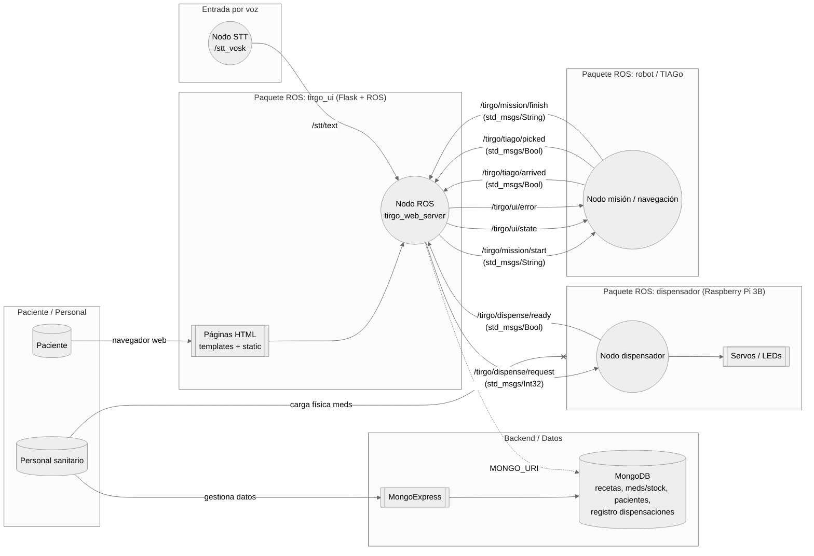

# Hito 2: Diseño Conceptual del Sistema Robótico

**Proyecto:** TIRGO PHARMA
**Fecha:** 15 de Noviembre de 2025

**Equipo:**

* Katrin Muñoz Errasti
* Lucas Campillo de Andrés
* Ángel Romero de la Maza

---

## 1. Resumen del Problema Biomédico

En el hospital, la dispensación de medicamentos consume mucho tiempo del personal y es fuente de errores (dosis/fármacos) y retrasos. Esto impacta en la seguridad del paciente y en la eficiencia del sistema.

**Propuesta:** Automatizar la dispensación y entrega con el robot **TIAGo** y un **dispensador** controlado por **Raspberry Pi**.

* El dispensador almacena comprimidos y los libera en un punto de recogida.
* TIAGo recoge el envase con el gripper y lo transporta de forma autónoma hasta el paciente.
* La interfaz conversacional confirma identidad, explica la medicación y resuelve dudas básicas.

**Impacto esperado:**

* **Personal Sanitario:** menos tiempo en transporte/entrega y menor riesgo de error.
* **Sistema Hospitalario:** mayor eficiencia y trazabilidad del fármaco.
* **Paciente:** mejor adherencia, comprensión y experiencia.

**Entorno:** Hospital/centro de salud, solo medicamentos autorizados y con requisitos de privacidad y seguridad.

---

## 2. Arquitectura del Sistema

### 2.a) Diagrama General y Lógica de Control

El sistema se despliega en la red local del robot **(ROS Master de TIAGo)** integrando:

* Ordenador externo (UI/BD)
* Raspberry Pi del dispensador

**Diagrama de arquitectura:**

#### Arquitectura de Control: Estado actual → evolución

**Fase 1 (Actual, basada en *Topics*):**

* La web `tirgo_ui` orquesta: valida (MongoDB via `MONGO_URI`), registra y publica a ROS a través de `rosio.py`:

  * `/tirgo/mission/start` — *String* (inicio de secuencia)
  * `/tirgo/dispense/request` — *Int32* (bin_id)
* Hardware (TIAGo + Raspberry) ejecuta y emite *flags*:

  * `/tirgo/tiago/arrived`, `/tirgo/dispense/ready`, `/tirgo/tiago/picked`
* La web escucha y actualiza la UI.

**Fase 2 (Objetivo, basada en *Actions*):**

* La web actuará como **Action Client** frente a `/tirgo/dispense_mission`.
* Nuevo nodo **`tirgo_mission_server`** (SimpleActionServer) gestiona la máquina de estados (navegar, abrir cajetín, confirmar sensores, mover brazo) y devuelve *feedback/result*.

#### Módulos funcionales

* **UI/Diálogo (UI Client):** `tirgo_ui`. Interacción (táctil/voz, `stt_vosk`). Recoge intención y valida.
* **Orquestación (Mission Server):** `tirgo_mission_server`. Máquina de estados central.
* **Backend (MongoDB):** Reglas de negocio (stock/recetas).
* **Dispensador (HW):** `dispenser_node` en la Raspberry. Acciona servos y publica ACK.
* **Robótico (Ejecución):** Navegación `move_base`. Pick & Place con `play_motion` (agarre “ciego” con posición mecánica conocida).

### 2.b) Especificación de Componentes de Hardware

| Componente                 | Especificación Técnica              | Justificación / Función                                                        |
| -------------------------- | ----------------------------------- | ------------------------------------------------------------------------------ |
| **TIAGo++**                | ROS 1 Noetic, gripper paralelo      | Validación de agarre por corriente del gripper (objeto presente si no cierra). |
| **Raspberry Pi 3**         | Alimentación a red 220 V            | Puesto fijo hospitalario; operación continua sin baterías.                     |
| **Servos SG90**            | Empuje tipo pistón                  | Par suficiente validado; diseño simple/robusto frente a trampillas.            |
| **Estructura dispensador** | 3D PLA; tolvas convergentes         | Unifica salida a un (X,Y,Z) fijo para el pick del robot.                       |
| **Envases (botes)**        | Cilindro “americano”, tapón naranja | Geometría óptima para gripper paralelo; evita atascos en rampa.                |
| **Conectividad**           | Wi-Fi (red TIAGo) + Ethernet        | Baja latencia local + acceso a servicios externos.                             |

### 2.c) Interfaz de Usuario (UI/UX) y Flujo de Interacción

**Diseño:** Web Flask, fondo blanco, tipografía legible y paleta azul “Tirgo Pharma”. Optimizada para tablet.

**Modos de entrada:**

* **Voz (manos libres):** hotword “Hola Tirgo” → desbloqueo.
* **Táctil (cards):** tres tarjetas grandes: *Consultar*, *Leer*, *Diagnóstico*.

**Flujos:**

* **A) Leer (Catálogo):**

  * Rejilla de tarjetas con foto, dosis, stock, bin_id, badge **L/R**.
  * Si `stock == 0` → se oculta para evitar frustración.
  * Si **R** → identificación; si **L** → dispensa directa.
* **B) Consultar (Pacientes):**

  * Formulario (Nombre, Apellidos, DNI).
  * **Privacidad:** búsqueda por hash de DNI.
  * Alta rápida si no existe.
  * Lista de recetas activas con “Pedir este”.
* **C) Diagnóstico (Triaje):**

  * Wizard con barra de progreso.
  * Resultados: **Derivación**, **Consejo**, **Medicación** (botón para pedir).

**Ejecución técnica y feedback:**

* Validación final (stock/receta) → registro en `dispenses` → publicación ROS (`/tirgo/mission/start`) → barra de estado reactiva a `/tirgo/tiago/picked`, `/tirgo/dispense/ready`.

---

## 3. Diseño de Software y Comunicación

### 3.a) Arquitectura de Nodos (ROS1)

**Integración Flask–ROS:**

* `app.py` (rutas/negocio/Mongo) sin ROS directo.
* `rosio.py` (pub/sub en hilos) como capa de hardware.

**Tópicos principales:**

| Dirección | Tópico                    | Tipo              | Función                      |
| --------- | ------------------------- | ----------------- | ---------------------------- |
| **Sub**   | `stt/text`                | `std_msgs/String` | Voz: hotword → desbloqueo.   |
| **Pub**   | `/tirgo/mission/start`    | `std_msgs/String` | Comando maestro de misión.   |
| **Pub**   | `/tirgo/dispense/request` | `std_msgs/Int32`  | `bin_id` al dispensador.     |
| **Pub**   | `/tirgo/ui/state`         | `std_msgs/String` | Telemetría UI.               |
| **Sub**   | `/tirgo/dispense/ready`   | `std_msgs/Bool`   | ACK dispensación finalizada. |
| **Sub**   | `/tirgo/tiago/arrived`    | `std_msgs/Bool`   | Llegada a destino.           |

**Configuración por entorno:**

* `MONGO_URI`, `TIRGO_HOTWORD`, `TIRGO_STT_TOPIC`, `TIRGO_DEV`.

### 3.b) Estructura del Repositorio

* `tirgo_ui` — Flask, Mongo, `rosio.py`.
* `stt_vosk` — ASR.
* `tiago_pharma_dispenser` — drivers Raspberry.
* `tiago_pharma_bringup` — *launch* globales.

### 3.c) Infraestructura Docker

* **Stack Datos:** MongoDB + Mongo Express.
* **Stack ROS:** imagen `ros1_rob_tirgo` (`network_mode: host`) para compartir red con TIAGo/BD.

---

## 4. Análisis de Viabilidad Técnica

### 4.a) Riesgos y Mitigaciones

| Área              | Riesgo / Limitación                       |  Impacto | Mitigación                                 |
| ----------------- | ----------------------------------------- | -------: | ------------------------------------------ |
| Control mecánico  | Atascos en tolva / desincronización       |    Medio | Rampa >45º y rutinas “shake” de servos.    |
| Manipulación      | Fallo de agarre ciego si se mueve el bote | **Alto** | Cuna con topes para posición determinista. |
| Migración SW      | Complejidad Topics → ActionServer         |    Medio | Mantener Topics como *fallback* estable.   |
| IA conversacional | Falsos positivos de hotword               |    Medio | Umbral Vosk + botón “Escuchar”.            |
| Latencia Wi-Fi    | Pérdida de mensajes a Raspberry           |     Bajo | ACK + *timeouts* en UI.                    |

### 4.b) Estrategia de Pruebas

* **Mecánica:** estrés 50 ciclos de caída.
* **Software:** `TIRGO_DEV=1` para *mocks* de hardware.
* **Seguridad:** logs inmutables y validación estricta de recetas.

---

## 5. Cronograma de Desarrollo (Hito 3 → Final)

### 5.a) Plan Temporal

| Fase                  | Tareas                                                                               |
| --------------------- | ------------------------------------------------------------------------------------ |
| **Semana 0 (Hito 3)** | Docker + repo; nodo dispensador (servos); logger en Mongo.                           |
| **Semana 1**          | Puente UI↔ROS; integrar Raspberry en red ROS; pruebas de dispensación simple.        |
| **Semana 2**          | Lógica (recetas/consultas); UX (feedback + voz); errores de conexión.                |
| **Semana 3**          | Integración total (voz+nav+manip+dispensa); migración a Actions (si viable); estrés. |
| **Semana 4**          | *Code freeze*, documentación y demo.                                                 |

### 5.b) Roles y Git

* **Workflow:** *Feature Branch*. Ramas: `feature/MongoDB`, `feature/movimiento-mapeado-ros1`, `feature/ui-flask`.
* **Responsabilidades:**

  * **ROS/Navegación:** mapas, `move_base`, `play_motion`.
  * **HW/Electrónica:** diseño 3D, servos, integración Raspberry.
  * **SW/Interfaz:** Docker, `tirgo_ui` (Flask/Mongo), sistema de voz.

---

5.a) Plan temporal desde el Hito 3 hasta la entrega nal (Gantt o tabla de tareas).
5.b) Reparto de responsabilidades actualizado, con enfoque colaborativo.
