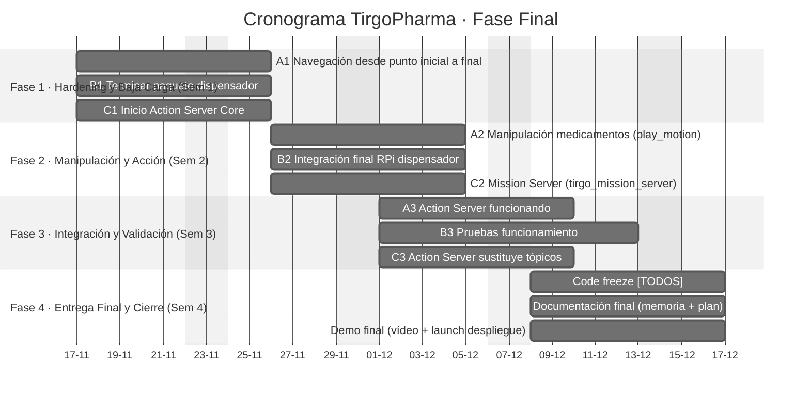

# Hito 2: Diseño Conceptual del Sistema Robótico

**Proyecto:** TirGo Pharma  
**Fecha:** 21 de Noviembre de 2025  
**Equipo:**

  * Katrin Muñoz Errasti  
  * Lucas Campillo de Andrés  
  * Ángel Romero de la Maza  

-----

## Índice de Contenidos

- [1. Resumen del Problema Biomédico](#1-resumen-del-problema-biomédico)
- [2. Arquitectura del Sistema](#2-arquitectura-del-sistema)
  - [2.a) Diagrama General y Lógica de Control](#2a-diagrama-general-y-lógica-de-control)
  - [2.b) Especificación de Componentes de Hardware](#2b-especificación-de-componentes-de-hardware)
  - [2.c) Interfaz de Usuario (UI/UX) y Flujo de Interacción](#2c-interfaz-de-usuario-uiux-y-flujo-de-interacción)
- [3. Diseño de Software y Comunicación](#3-diseño-de-software-y-comunicación)
  - [3.a) Arquitectura de Nodos en ROS 1](#3a-arquitectura-de-nodos-en-ros-1)
  - [3.b) Estructura del Repositorio y Gestión de Paquetes](#3b-estructura-del-repositorio-y-gestión-de-paquetes)
  - [3.c) Descripción de Contenedores Docker y Dependencias](#3c-descripción-de-contenedores-docker-y-dependencias)
- [4. Análisis de Viabilidad Técnica](#4-análisis-de-viabilidad-técnica)
  - [4.a) Identificación de Limitaciones y Riesgos](#4a-identificación-de-limitaciones-y-riesgos)
  - [4.b) Estrategia de Mitigación y Pruebas Iniciales](#4b-estrategia-de-mitigación-y-pruebas-iniciales)
- [5. Cronograma de Desarrollo](#5-cronograma-de-desarrollo)
  - [5.a) Plan Temporal](#5a-plan-temporal)
  - [5.b) Reparto de Responsabilidades Actualizado](#5b-reparto-de-responsabilidades-actualizado)

-----

## 1. Resumen del Problema Biomédico

En hospitales y centros de salud, la **dispensación de medicación** consume mucho tiempo del personal y es fuente frecuente de **errores de medicación** (fármacos/dosis equivocadas, retrasos).  
**TirGo Pharma** automatiza esta fase integrando TIAGo, un dispensador automático y una interfaz web con BD, para lograr una dispensación **segura, trazable y menos dependiente del personal**.

### 1.1 Ámbito de aplicación

- Entornos **hospitalarios / aula-laboratorio** con un mapa estático del entorno.  
- Entrega de **medicación ya prescrita**, no prescripción médica.  
- Uso con **botes cilíndricos estandarizados** y flujo de medicación controlado.

### 1.2 Descripción general del sistema

1. Paciente / personal solicita medicación desde la **web de TirGo Pharma**.  
2. El sistema verifica **paciente, receta y stock** en MongoDB.  
3. Se lanza una misión: TIAGo va al dispensador, la **RPi** libera el bote y TIAGo lo entrega al paciente.  
4. La dispensación queda **registrada** (paciente, fármaco, hora, resultado).

### 1.3 Justificación y valor biomédico

- **Seguridad:** menos errores de medicación y mayor trazabilidad.  
- **Carga asistencial:** libera tiempo de enfermería en tareas repetitivas de entrega.  
- **Estandarización:** flujo homogéneo entre turnos.  
- **Experiencia de paciente:** interacción guiada (voz + pantalla) y mejor comprensión de lo que recibe.

### 1.4 Requisitos funcionales

- **RF1 – Gestión de pacientes y recetas:** alta/baja/consulta y validación de recetas activas.  
- **RF2 – Gestión de stock y dispensación:** control de stock por medicamento y solicitud de un bote concreto.  
- **RF3 – Coordinación robot–dispensador:** misión completa TIAGo + dispensador (ir, dispensar, recoger, entregar).  
- **RF4 – Interfaz de usuario:** flujos simples (“Consultar”, “Leer”, “Diagnóstico”) con feedback de estado.  
- **RF5 – Registro y trazabilidad:** log de cada dispensación en BD.

### 1.5 Capacidades técnicas

- **Robótica:** TIAGo con **ROS 1 Noetic**, navegación (`move_base` + `amcl`) y pick pregrabado (`play_motion`).  
- **Dispensador:** **RPi 3B** + servos **SG90** (PWM por GPIO).  
- **Backend:** **MongoDB** (pacientes, recetas, stock, logs) + paquetes ROS (`tirgo_ui`, `tirgo_mission_server`, `tiago_pharma_dispenser`, `tirgo_msgs`, `stt_vosk`).  
- **Interfaz:** web **Flask** accesible en la red local, con integración de voz offline (Vosk).

### 1.6 Resultado esperado

- **Prototipo funcional** capaz de ejecutar el flujo completo:  
  solicitud → validación → misión TIAGo → dispensación física → entrega → registro.  
- Sistema **demostrable en aula/laboratorio**, base para una futura adaptación a un entorno hospitalario real.

-----

## 2. Arquitectura del Sistema

### 2.a) Diagrama General y Lógica de Control

El sistema se despliega sobre la red local del robot TIAGo (ROS Master), integrando el ordenador externo (Interfaz/BD) y la Raspberry Pi del dispensador en un mismo espacio.  
Actualmente conviven dos niveles de diseño:

- Una **arquitectura inicial basada en tópicos**, ya utilizada en pruebas de integración.
- Una **arquitectura mejorada con Action Server de misión**, ya implementada a nivel de `tirgo_mission_server` y del cliente en `tirgo_ui`, que está en proceso de sustituir por completo a la lógica basada en flags.

#### 2.a.1 Arquitectura Fase 1 – Basada en Tópicos

Esta fue la arquitectura original: la web orquesta directamente la misión publicando comandos de alto nivel y escuchando flags de estado.

```mermaid
---
config:
  look: classic
  theme: neutral
  layout: dagre
---
flowchart LR
 subgraph USU["Paciente / Personal"]
        PAC[("Paciente")]
        PER[("Personal sanitario")]
  end
 subgraph UI["Paquete ROS: tirgo_ui (Flask + ROS)"]
        HTML[["Páginas HTML<br>templates + static"]]
        UINODE(("Nodo ROS<br>tirgo_web_server"))
  end
 subgraph VOZ["Entrada por voz"]
        STT(("Nodo STT<br>/stt_vosk"))
  end
 subgraph DATA["Backend / Datos"]
        ME[["MongoExpress"]]
        DB[("MongoDB<br>recetas, meds/stock, pacientes,<br>registro dispensaciones")]
  end
 subgraph DISP["Paquete ROS: dispensador (Raspberry Pi 3B)"]
        DISP_NODE(("Nodo dispensador"))
        ACT[["Servos / LEDs"]]
  end
 subgraph ROBOT["Paquete ROS: robot / TIAGo"]
        R_NODE(("Nodo misión / navegación"))
  end
    HTML --> UINODE
    STT -- /stt/text --> UINODE
    ME --> DB
    UINODE -. MONGO_URI .-> DB
    DISP_NODE --> ACT
    PAC -- navegador web --> HTML
    PER -- carga física meds --x DISP
    PER -- gestiona datos --> ME
    UINODE -- /tirgo/dispense/request<br>(std_msgs/Int32) --> DISP_NODE
    UINODE -- /tirgo/mission/start<br>(std_msgs/String) --> R_NODE
    DISP_NODE -- /tirgo/dispense/ready<br>(std_msgs/Bool) --> UINODE
    R_NODE -- /tirgo/tiago/arrived<br>(std_msgs/Bool) --> UINODE
    R_NODE -- /tirgo/tiago/picked<br>(std_msgs/Bool) --> UINODE
    R_NODE -- /tirgo/mission/finish<br>(std_msgs/String) --> UINODE
    UINODE -- /tirgo/ui/state --> R_NODE
    UINODE -- /tirgo/ui/error --> R_NODE
````

En esta fase:

* La **web (`tirgo_ui`)**:

  * Publica `/tirgo/mission/start` y `/tirgo/dispense/request`.
  * Escucha directamente los flags `/tirgo/tiago/arrived`, `/tirgo/dispense/ready`, `/tirgo/tiago/picked`.

* El **estado de la misión** (en marcha, error, etc.) se reconstruye dentro de la propia UI a partir de esos flags.

Esta arquitectura se ha usado para validar el flujo básico de **UI ↔ MongoDB ↔ ROS** y los primeros tests de integración con el robot y la Raspberry (publicando y leyendo tópicos simples).

#### 2.a.2 Arquitectura Fase 2 – Con Action Server de Misión

Sobre esa base, se ha introducido un **Action Server** dedicado a la misión de dispensación, con un paquete de mensajes propio (`tirgo_msgs/TirgoMission.action`) y el nodo `tirgo_mission_server`.
La UI deja de coordinar los flags de bajo nivel y pasa a ser un **Action Client**.

```mermaid
---
config:
  look: classic
  theme: neutral
  layout: dagre
---
flowchart LR
  %% === Actores humanos ===
  subgraph USU["Paciente / Personal"]
    PAC[("Paciente")]
    PER[("Personal sanitario")]
  end

  %% === Capa UI / Web ===
  subgraph UI["Paquete ROS: tirgo_ui (Flask + ROS · Action Client)"]
    HTML[["Páginas HTML<br>templates + static"]]
    UINODE(("Nodo ROS<br>tirgo_web_server"))
  end

  %% === Voz ===
  subgraph VOZ["Entrada por voz"]
    STT(("Nodo STT<br>/stt_vosk"))
  end

  %% === Datos ===
  subgraph DATA["Backend / Datos"]
    ME[["MongoExpress"]]
    DB[("MongoDB<br>pacientes, recetas, stock,<br>registro dispensaciones")]
  end

  %% === Dispensador físico (RPi) ===
  subgraph DISP["Paquete ROS: dispensador (Raspberry Pi 3B)"]
    DISP_NODE(("Nodo dispensador<br>servo_node.py"))
    ACT[["Servos SG90 / mecánica<br>tolvas + rampa salida"]]
  end

  %% === Robot TIAGo / Misión ===
  subgraph ROBOT["Robot TIAGo (ROS Master)"]
    MISSION(("Action Server<br>tirgo_mission_server"))
    NAV(("Navegación / brazo<br>move_base + pick ciego"))
  end

  %% === Flujo UI / Humanos / Datos ===
  PAC -- navegador web --> HTML
  PER -- navegador web --> HTML

  HTML --> UINODE
  STT -- "/stt/text"<br>std_msgs/String --> UINODE

  ME --> DB
  PER -- gestiona datos --> ME
  UINODE -. "MONGO_URI"<br>pymongo .-> DB

  DISP_NODE --> ACT
  PER -- carga física meds --x DISP

  %% === Acción de misión TirgoMission.action ===
  UINODE == "TirgoMissionAction<br>(goal)" ==> MISSION
  MISSION == "feedback/result<br>TirgoMissionAction" ==> UINODE

  %% === Coordinación interna misión → robot / dispensador ===
  MISSION -- "/tirgo/mission/start"<br>std_msgs/String --> NAV
  MISSION -- "/tirgo/dispense/request"<br>std_msgs/Int32 (bin_id) --> DISP_NODE

  NAV -- "/tirgo/tiago/arrived"<br>std_msgs/Bool --> MISSION
  DISP_NODE -- "/tirgo/dispense/ready"<br>std_msgs/Bool --> MISSION
```

En esta fase:

* Se ha creado el paquete **`tirgo_msgs`** con la acción `TirgoMission.action`:

  * Goal: `patient_id` (`string`), `med_id` (`int32`).
  * Feedback: `state` (`string`), `progress` (`float32`).
  * Result: `success` (`bool`), `error_code` (`string`), `error_message` (`string`).

* Se ha implementado el nodo **`tirgo_mission_server`**, que:

  * Expone el Action Server `/tirgo/mission`.
  * Espera las señales internas `/tirgo/tiago/arrived` y `/tirgo/dispense/ready`.
  * Publica feedback y devuelve un resultado con éxito o códigos de timeout (`TIMEOUT_ARRIVE`, `TIMEOUT_READY`, etc.).

* En `tirgo_ui`:

  * `rosio.py` crea un `SimpleActionClient` a `/tirgo/mission` y una función `start_mission_async(patient_id, med_id)`.
  * Los blueprints de `leer.py` llaman a `start_mission_async(...)` cuando se lanza una dispensación.
  * Las callbacks de feedback y done actualizan el estado de la UI y los mensajes de progreso.

Los nodos de navegación y dispensador siguen en desarrollo, pero la **estructura de Actions ya está operativa** y ha sustituido, en el lado de la UI, al uso directo de los tópicos de misión.

#### 2.a.3 Topología de Red y Nodos

Todos los dispositivos operan bajo la misma subred local mediante conexión Wi-Fi, compartiendo el `ROS_MASTER_URI` alojado en el TIAGo:

* **ROS Master (TIAGo)**

  * Ejecuta `roscore`, el stack de navegación (`move_base`, `amcl`) y los servidores de acción propios del robot.
  * Aloja el Action Server `/tirgo/mission` (`tirgo_mission_server`).

* **Nodo Cliente de Hardware (Raspberry Pi 3B)**

  * Se conecta como nodo ROS esclavo.
  * Expone el **dispensador físico** (servos SG90) a través de un nodo Python (`servo_node.py`), suscrito a la orden de dispensación.

* **Nodo Cliente de Interfaz (PC / Contenedor Docker)**

  * Ejecuta la aplicación web Flask (`tirgo_ui`) dentro de un contenedor ROS 1 (`ros1_rob_tirgo`) con `network_mode: host`.
  * Se comunica con MongoDB, con el robot TIAGo y con la Raspberry Pi.
  * Actúa como **Action Client** de `/tirgo/mission` y como punto de entrada del usuario (web + voz).

#### 2.a.4 Estrategia de Navegación y Manipulación

* **Navegación**

  * Se utiliza el stack estándar (`move_base` + `amcl`) sobre un mapa estático del entorno.
  * El objetivo es posicionar al robot frente al dispensador dentro de un margen de tolerancia compatible con la maniobra de pick.

* **Manipulación ciega (open-loop)**

  * No se emplea visión activa para el agarre.
  * El robot ejecuta una trayectoria pregrabada (`play_motion`) suponiendo que, si la navegación ha sido correcta, el bote se encuentra en una posición fija de la rampa.
  * La fiabilidad del pick depende de:

    * La precisión de localización.
    * La repetibilidad mecánica del dispensador.

#### 2.a.5 Lógica de Control: Estado Actual vs. Evolución

La lógica de control puede verse como una transición progresiva entre dos paradigmas:

**Fase 1 – Orquestación basada en Tópicos**

* La web (`tirgo_ui`) actúa como **orquestador central**:

  * Valida paciente, receta y stock en MongoDB.
  * Publica `/tirgo/mission/start` y `/tirgo/dispense/request`.
  * Escucha directamente los flags `/tirgo/tiago/arrived`, `/tirgo/dispense/ready`, `/tirgo/tiago/picked`.

* La máquina de estados de la misión está repartida entre la UI y otros nodos, lo que complica la trazabilidad.

**Fase 2 – Orquestación basada en Action Server (en curso, con núcleo ya implementado)**

* La web pasa a ser un **Action Client**:

  * Envía un único goal de alto nivel a `/tirgo/mission` (`TirgoMission.action`).
  * Se alimenta de `feedback` y `result` para actualizar la UI.

* El nodo `tirgo_mission_server`:

  * Encapsula la máquina de estados de la misión (espera al robot, espera al dispensador, gestiona timeouts).
  * Es el único que escucha los flags `/tirgo/tiago/arrived` y `/tirgo/dispense/ready`.

* La UI deja de tener lógica de bajo nivel y se centra en:

  * Validación de negocio (pacientes, recetas, stock).
  * Registro en MongoDB.
  * Presentación de estados y errores de forma comprensible para el usuario.

El objetivo a corto plazo es completar la migración de todos los flujos de dispensación, manteniendo la primera fase como referencia y como punto de partida de las pruebas iniciales.

---

### 2.b) Especificación de Componentes de Hardware

La selección de hardware prioriza la integración directa con TIAGo, la simplicidad de mantenimiento y la adecuación a un entorno clínico controlado.

| Componente                         | Especificación Técnica                                                                                                                                                         | Justificación y Diseño Electrónico                                                                                                                                                                                                                                                                     |
| :--------------------------------- | :----------------------------------------------------------------------------------------------------------------------------------------------------------------------------- | :----------------------------------------------------------------------------------------------------------------------------------------------------------------------------------------------------------------------------------------------------------------------------------------------------- |
| **Robot base**                     | **TIAGo++ (PAL Robotics)** con base móvil, computador interno y brazo manipulador con gripper paralelo.                                                                        | Actúa como **plataforma robótica principal** y ROS Master. La base móvil se encarga de la navegación autónoma en el mapa del aula/hospital. El brazo con gripper paralelo permite la **manipulación ciega** del bote en la rampa del dispensador.                                                      |
| **Sensores integrados en TIAGo**   | Cabeza sensorizada con **cámara RGB** y **sensores de navegación** (láser/scan 2D y cámara de profundidad), además de **sensores de seguridad** (bumpers, E-stop de hardware). | La cámara RGB y la sensórica de navegación se utilizan para que el robot se desplace de forma segura por el entorno de pruebas. Los bumpers y el botón de parada de emergencia añaden una capa de seguridad física esencial en un entorno donde hay personas.                                          |
| **Actuadores integrados en TIAGo** | Motores de la base móvil, motores del brazo de 7 GDL, gripper paralelo y altavoz integrado.                                                                                    | Los motores de la base permiten posicionar al robot frente al dispensador y al paciente. El brazo y el gripper ejecutan trayectorias pregrabadas (`play_motion`) para recoger el bote en una posición fija. El altavoz puede utilizarse para ofrecer feedback de voz durante la entrega.               |
| **Controlador del dispensador**    | **Raspberry Pi 3B** con sistema operativo Linux/Ubuntu y ROS 1.                                                                                                                | Se utiliza como nodo ROS esclavo dedicado al dispensador. Expone el hardware del dispensador (servos) a través de tópicos y simplifica el cableado al concentrar toda la electrónica en una única placa.                                                                                               |
| **Actuadores del dispensador**     | Servomotores **SG90** (x2) controlados mediante GPIO.                                                                                                                          | Cada servo controla un lado del dispensador. El control se realiza con PWM por software desde la Raspberry Pi, eliminando la necesidad de controladores externos adicionales. El comportamiento es en **lazo abierto**: se confía en el diseño mecánico. |
| **Alimentación**                   | Alimentación principal desde la fuente de la Raspberry Pi (raíl de 5 V) para los servos y lógica.                                                                              | En este prototipo, los servos SG90 se alimentan directamente del raíl de 5 V de la RPi, aprovechando su bajo consumo en ciclos cortos de trabajo. Se asume **movimiento secuencial** (un servo cada vez) para minimizar picos de corriente.                                                            |
| **Estructura del dispensador**     | Módulos impresos en 3D: tolvas, guías y rampa de salida.                                                                                                                       | La geometría impresa de la tolva y la rampa está pensada para que el bote caiga de forma repetible a la zona de recogida del TIAGo. No hay sensores de caída, por lo que la fiabilidad depende de la precisión mecánica y de la repetibilidad del diseño.                                              |
| **Envases de medicamentos**        | Botes cilíndricos de geometría estandarizada.                                                                                                                                  | Facilitan el agarre por parte del gripper paralelo del TIAGo y el guiado dentro de la tolva. La elección de forma y tamaño se ha alineado con la capacidad del gripper y las dimensiones del dispensador.

#### Sensórica e Instrumentación Implicada

Para garantizar la fiabilidad del lazo abierto y la interacción, el sistema instrumenta los siguientes elementos:

* **Validación de agarre:**
  Monitorización de la corriente eléctrica del gripper del TIAGo para confirmar contacto físico con el bote.

* **Navegación:**
  Láser 2D (LIDAR) y encoders de rueda para odometría y localización AMCL.
####Conexión Electrónica:

La integración física se realiza mediante conexión directa a los pines GPIO de la Raspberry Pi. Los servomotores SG90 se alimentan desde el raíl de 5V y comparten la referencia de masa (GND) con la placa para cerrar el circuito de control. La señal PWM se genera por software a través de pines GPIO configurables, sin necesidad de shields intermedios gracias al bajo consumo de los actuadores seleccionados.|


---

### 2.c) Interfaz de Usuario (UI/UX) y Flujo de Interacción

La interfaz es una aplicación web (Flask) diseñada bajo criterios de diseño clínico: fondo blanco limpio para maximizar el contraste, tipografía de alta legibilidad y una paleta de colores basada en el azul corporativo ("TirGo Pharma"). La disposición de los elementos está optimizada para personas mayores, priorizando botones grandes y flujos lineales.

#### 2.c.1 Arquitectura de Interacción (Voz + Manual)

El sistema integra dos modalidades de entrada que coexisten para mejorar la accesibilidad y la higiene hospitalaria:

* **Modo Manos Libres (Voz):**
  La pantalla de bloqueo muestra un micrófono animado escuchando continuamente. Al pronunciar la hotword "Hola Tirgo", el sistema desbloquea el acceso al menú principal sin necesidad de contacto físico.

* **Modo Manual (Cards):**
  El menú principal se organiza en tres grandes tarjetas ("Consultar", "Leer", "Diagnóstico"), cada una con una descripción clara y gran tamaño, facilitando el uso a pacientes mayores o con movilidad reducida.

#### 2.c.2 Flujos de Usuario Detallados

**A. Opción "Leer" (Catálogo Visual y Disponibilidad)**

* **Diseño en Rejilla:**
  Presenta el inventario como una cuadrícula de tarjetas. Cada tarjeta incluye:

  * Fotografía real del envase.
  * Nombre y dosis (ej: "Amoxicilina 500 mg").
  * Datos técnicos: stock actual y cajetín de origen (Bin ID).

* **Etiquetado de Seguridad:**
  Badges visuales de color: Verde (L) para venta libre y Rojo (R) para receta obligatoria.

* **Lógica de Stock:**
  El sistema filtra proactivamente la vista; si `stock == 0` en MongoDB, la tarjeta desaparece de la interfaz para evitar frustración en el usuario.

* **Restricción por Receta:**
  Al pulsar "Pedir", si el fármaco es etiqueta (R), se fuerza una redirección al flujo de identificación. Si es (L), se permite la dispensación directa.

**B. Opción "Consultar" (Gestión de Pacientes)**

* **Formulario de Identificación:**
  Solicita explícitamente Nombre, Apellidos y DNI.

* **Privacidad (Hashing):**
  Antes de enviar la consulta, el DNI es procesado mediante un algoritmo de hash. La búsqueda en base de datos se realiza contra este hash, protegiendo la identidad real.

* **Manejo de Errores (Usuario Nuevo):**
  Si el hash no se encuentra, el sistema muestra una pantalla de estado "Paciente no encontrado" y ofrece un botón de acción primario "Crear paciente", permitiendo el registro sin abandonar el flujo.

* **Vista de Recetas:**
  Una vez autenticado, el usuario accede a una lista filtrada de sus recetas activas. Cada elemento muestra el medicamento prescrito, el stock disponible y un botón directo "Pedir este".

**C. Opción "Diagnóstico" (Sistema de Triaje Automatizado)**

* **Wizard Secuencial:**
  Interfaz paso a paso con barra de progreso superior.

* **Formularios Dinámicos:**
  Preguntas con selectores simples.

* **Feedback de Resultados:**

  * **Derivación (Doctor):**
    Tarjeta de aviso clara indicando que los síntomas requieren valoración presencial.
  * **Consejo (Advice):**
    Pautas de autocuidado sin fármacos.
  * **Tratamiento (Med):**
    Recomendación de un fármaco específico disponible en el catálogo, con un botón para iniciar la dispensación inmediata.

#### 2.c.3 Ejecución Técnica y Feedback Visual

Una vez confirmada una acción, la interfaz bloquea la entrada de datos y pasa a modo "Monitorización":

* **Validación Atómica:**
  El backend comprueba por última vez stock y receta en la BD.

* **Registro:**
  Se genera una entrada inmutable en la colección `dispenses`.

* **Comunicación ROS:**
  Se publican los tópicos de misión (en la Fase 1) o se envía el goal al Action Server (Fase 2).

* **Estado en Tiempo Real:**
  La web muestra notificaciones ("Robot en camino", "Dispensando...") que reaccionan a los mensajes de retorno del hardware (`/tirgo/tiago/picked`, `/tirgo/dispense/ready`) o al feedback del Action Server.

#### 2.c.4 Vista Preliminar de la Interfaz

A continuación se muestran capturas reales del prototipo funcional implementado en `tirgo_ui`, evidenciando el diseño de alto contraste y la adaptación a pantallas táctiles.

|                                                                         Menú Principal                                                                         |                                                                    Catálogo de Medicamentos                                                                    |                                                                   Identificación de Paciente                                                                   |
| :------------------------------------------------------------------------------------------------------------------------------------------------------------: | :------------------------------------------------------------------------------------------------------------------------------------------------------------: | :------------------------------------------------------------------------------------------------------------------------------------------------------------: |
|  |  |  |
|                                                *Acceso mediante tarjetas grandes para facilitar la interacción.*                                               |                                                    *Vista de stock con indicadores de receta (Rojo/Verde).*                                                    |                                                *Formulario de validación de identidad previo a la dispensación.*                                               |

---

## 3. Diseño de Software y Comunicación

### 3.a) Arquitectura de Nodos en ROS 1

La figura del apartado 2.a muestra la vista global del sistema (UI, robot, dispensador y BD).
En este apartado se detalla **cómo se organiza esa arquitectura a nivel de nodos ROS**, diferenciando claramente dos etapas:

* **Fase 1:** orquestación basada en tópicos y flags.
* **Fase 2:** orquestación basada en un **Action Server**.

---

#### 3.a.1 Nodos principales y distribución

| Nodo ROS                       | Dónde se ejecuta             | Rol general                                                                          |
| ------------------------------ | ---------------------------- | ------------------------------------------------------------------------------------ |
| `tirgo_web_server`             | PC (Docker `ros1_rob_tirgo`) | Nodo híbrido Flask + ROS. Atiende la web, consulta MongoDB y habla con el mundo ROS. |
| `stt_vosk`                     | PC / máquina de voz          | Reconocimiento de voz. Publica el texto de entrada en un tópico para la UI.          |
| `tirgo_mission_server`         | TIAGo                        | Nodo dedicado a la misión de dispensación (Action Server `/tirgo/mission`).          |
| `dispenser_node`               | Raspberry Pi 3B              | Nodo del dispensador físico (servos SG90 + mecánica de tolvas/rampa).                |
| `move_base`, `amcl`, etc.      | TIAGo                        | Navegación autónoma sobre mapa estático.                                             |
| Nodos de brazo / `play_motion` | TIAGo                        | Ejecución de la maniobra de pick “ciega” en la rampa.                                |
| `roscore` / Master             | TIAGo                        | ROS Master. Registra nodos, parámetros y conexiones.                                 |

Estos nodos son los mismos en ambas fases; lo que cambia es **quién coordina la misión** y **qué interfaces ROS usa cada bloque**.

#### 3.a.2 Fase 1 – Orquestación basada en tópicos y flags

En la **arquitectura inicial**, la orquestación se hacía directamente desde `tirgo_web_server` usando tópicos simples:

* La UI validaba paciente, receta y stock en MongoDB.
* Si todo era correcto, publicaba comandos de alto nivel:

  * `/tirgo/mission/start` (`std_msgs/String`) → inicio de misión.
  * `/tirgo/dispense/request` (`std_msgs/Int32`) → identificación de la cubeta (bin) a abrir.
* A la vez, la UI se suscribía a los flags publicados por el robot y el dispensador:

  * `/tirgo/tiago/arrived` (`std_msgs/Bool`) → TIAGo ha llegado al dispensador.
  * `/tirgo/dispense/ready` (`std_msgs/Bool`) → el bote ha caído en la rampa.
  * `/tirgo/tiago/picked` (`std_msgs/Bool`) → el robot ha cogido el bote.
* Con esos flags, la propia UI reconstruía el “progreso de misión” y actualizaba los estados.

**Papel de cada nodo en Fase 1:**

* `tirgo_web_server`

  * Publica `/tirgo/mission/start` y `/tirgo/dispense/request`.
  * Se suscribe a `/tirgo/tiago/arrived`, `/tirgo/dispense/ready`, `/tirgo/tiago/picked`.
  * Mapea los flags a mensajes de interfaz (“Robot en camino”, “Dispensando…”, etc.).

* `dispenser_node`

  * Se suscribe a `/tirgo/dispense/request` y mueve los servos para abrir la cubeta correspondiente.
  * Publica `/tirgo/dispense/ready` cuando el ciclo mecánico termina.

* Nodos de TIAGo (navegación / brazo)

  * Reciben la orden de comenzar la misión a través de `/tirgo/mission/start`.
  * Publican `/tirgo/tiago/arrived` y `/tirgo/tiago/picked` cuando alcanzan las posiciones clave.

En resumen, en Fase 1 la máquina de estados está repartida: parte en la UI, parte en los nodos del robot y el dispensador. Toda la lógica de cuándo pasa cada cosa vive principalmente en `tirgo_web_server`.

---

#### 3.a.3 Fase 2 – Orquestación basada en Action Server de misión

En la **arquitectura actual**, se ha introducido un Action Server dedicado, que centraliza la lógica de la misión y simplifica el papel de la UI.

1. Se define en `tirgo_msgs` la acción **`TirgoMission.action`** con:

   * **Goal**

     * `string patient_id`
     * `int32 med_id`
   * **Feedback**

     * `string state`
     * `float32 progress`
   * **Result**

     * `bool success`
     * `string error_code`
     * `string error_message`

2. Se implementa el nodo **`tirgo_mission_server`** en el TIAGo:

   * Expone el Action Server `/tirgo/mission`.
   * Espera a:

     * `/tirgo/tiago/arrived` (`std_msgs/Bool`) desde la navegación del robot.
     * `/tirgo/dispense/ready` (`std_msgs/Bool`) desde el `dispenser_node`.
   * Actualiza periódicamente `feedback.state` y `feedback.progress`.
   * Finaliza la acción con:

     * `success = true` si la secuencia llega a término.
     * `success = false` y `error_code` tipo `TIMEOUT_ARRIVE`, `TIMEOUT_READY`, etc., si alguna señal no llega a tiempo.

3. En `tirgo_ui` se introduce el cliente de acción:

   * `rosio.py` crea un `SimpleActionClient` hacia `/tirgo/mission`.
   * Expone una función `start_mission_async(patient_id, med_id)` que:

     * Construye el goal.
     * Lo envía de forma no bloqueante.
     * Registra callbacks para feedback y resultado.
   * Los blueprints de `leer.py` llaman a `start_mission_async(...)` en los distintos flujos (“Leer”, “Recoger”, etc.).

**Papel de cada nodo en Fase 2:**

* `tirgo_web_server`

  * Sigue validando paciente, receta y stock en MongoDB.
  * **Deja de suscribirse a `/tirgo/tiago/arrived` y `/tirgo/dispense/ready`**.
  * Lanza una única misión de alto nivel a `/tirgo/mission` y se limita a:

    * Mostrar el `feedback.state` / `feedback.progress`.
    * Mostrar el `result.error_code` / `result.error_message` si algo falla.

* `tirgo_mission_server`

  * Pasa a ser el **único nodo** que escucha directamente los flags del TIAGo y del dispensador.
  * Encapsula la máquina de estados de la misión: decide si hay timeout, si puede seguir al siguiente paso, etc.

* `dispenser_node` y nodos de TIAGo

  * Mantienen su interfaz de tópicos (`/tirgo/dispense/ready`, `/tirgo/tiago/arrived`, etc.), pero ahora sus mensajes se consumen en el Action Server, no en la UI.

---

#### 3.a.4 Resumen comparativo (Fase 1 vs Fase 2)

| Aspecto                 | Fase 1 – Solo tópicos/flags                       | Fase 2 – Action Server `/tirgo/mission`                     |
| ----------------------- | ------------------------------------------------- | ----------------------------------------------------------- |
| Orquestador principal   | `tirgo_web_server` (UI)                           | `tirgo_mission_server` (TIAGo)                              |
| Comunicación UI ↔ robot | `/tirgo/mission/start`, `/tirgo/dispense/request` | Acción `TirgoMission.action`                                |
| Flags de hardware       | Leídos directamente por la UI                     | Leídos por el Action Server                                 |
| Estado de la misión     | Reconstruido en la UI a partir de varios tópicos  | Encapsulado en la acción (goal, feedback, result)           |
| Papel de la UI          | Valida datos + coordina robot/dispensador         | Valida datos + muestra feedback/result de la misión         |
| Trazabilidad de errores | Dispersa (varios tópicos y logs)                  | Centralizada en `error_code` / `error_message` de la acción |

Esta transición mantiene los mismos nodos físicos (TIAGo, PC, Raspberry Pi), pero cambia dónde está la inteligencia de coordinación y qué tipo de interfaz ROS se usa entre la UI y el robot.

---

### 3.b) Estructura del Repositorio y Gestión de Paquetes

El proyecto se gestiona mediante un monorepositorio (monorepo) que agrupa todos los paquetes ROS del sistema. Esta estrategia facilita la integración continua, el versionado atómico y la reutilización de componentes.

#### 3.b.1 Árbol de Directorios del Proyecto

La estructura general del proyecto TirGoPharma sigue una separación clara entre:

* **Código ROS** (dentro del workspace `ros_ws/`, ubicado en la carpeta compartida del host para integrarse con Docker y la Raspberry Pi).
* **Infraestructura** (servicios de base de datos, inicialización y orquestación).
* **Recursos pesados** (modelos de voz, mapas, logs u otros ficheros que no se versionan).
* **Capa de contenedores** (Dockerfile y `docker-compose.yml` a nivel raíz).

```text
TirGo/
├── carpeta_compartida/                 # Volumen compartido con los contenedores
│   ├── ros_ws/                         # Workspace ROS (código principal)
│   └── stt_models/                     # Modelos de voz Vosk y otros recursos pesados
│
├── infra/                              # Infraestructura del sistema
│   └── tirgo_db_stack/
│       ├── docker-compose.yml          # MongoDB + Mongo Express
│       └── mongo-init/
│           └── 001-init.js             # Inicialización de la base de datos
│
├── Dockerfile                          # Imagen principal (ROS + TirgoPharma)
├── docker-compose.yml                  # Orquestación de contenedores
└── .gitignore                          # Exclusiones (modelos, binarios, etc.)
```

**Workspace ROS (`ros_ws/`)**

```text
ros_ws/
├── src/
│   ├── tirgo_msgs/                     # Definición de Interfaces
│   │   ├── action/
│   │   │   └── Mission.action          # Definición de la meta de dispensación
│   │   └── srv/
│   │       └── SystemCheck.srv         # Servicio de verificación de salud
│   │
│   ├── tirgo_ui/                       # Nodo híbrido Web + ROS
│   │   ├── launch/
│   │   │   └── web.launch              # Carga variables de entorno y lanza el servidor
│   │   ├── scripts/
│   │   │   └── tirgo_web_server        # Ejecutable (Entrypoint)
│   │   ├── src/tirgo_ui/               # Python Module
│   │   │   ├── app.py                  # Factory de Flask
│   │   │   ├── rosio.py                # Hilo de comunicación ROS (Pubs/Subs)
│   │   │   ├── storage_mongo.py        # Capa de acceso a Datos
│   │   │   ├── routes/                 # Blueprints (Modularización de vistas)
│   │   │   │   ├── main.py
│   │   │   │   ├── leer.py             # Lógica de dispensación
│   │   │   │   └── ...
│   │   │   └── ...
│   │   ├── templates/                  # Frontend: HTML (Jinja2)
│   │   └── static/                     # Frontend: CSS, JS y Assets
│   │
│   ├── stt_vosk/                       # Motor de Voz
│   │   ├── launch/
│   │   └── model/                      # (Ignorado en Git) montado desde `carpeta_compartida/stt_models`
│   │
│   ├── tiago_pharma_dispenser/         # Control Hardware Raspberry Pi
│   │   └── scripts/
│   │       └── servo_node.py           # Generación PWM
│   │
│   ├── tiago_pharma_bringup/           # Orquestación
│   │   └── launch/
│   │       └── tirgo_system.launch     # Arranque completo del sistema
│   │
│   └── move/                           # Paquete de navegación / visualización de mapas
│       ├── configs/
│       │   └── rviz_configs.rviz       # Configuración de RViz
│       ├── launch/
│       │   ├── README.md               # Notas de uso
│       │   └── rviz.launch             # Lanzador de RViz con el mapa del aula
│       ├── maps/                       # Mapas de navegación del aula
│       │   ├── Mapa_aula.pgm
│       │   ├── Mapa_aula.yaml
│       │   ├── Mapa_aula_mod_1.0.pgm
│       │   ├── Mapa_aula_mod_1.0.xcf   # Versión editable del mapa
│       │   └── Mapa_aula_mod_1.0.yaml
│       ├── scripts/
│       │   ├── README.md               # Descripción de scripts auxiliares
│       │   └── run_all.sh              # Script de arranque rápido (mapa + RViz, etc.)
│       ├── src/
│       │   └── move/                   # Código fuente del paquete
│       ├── CMakeLists.txt              # Configuración de build Catkin
│       ├── README.md                   # Descripción general del paquete move
│       ├── notas.txt                   # Notas de desarrollo / pruebas
│       └── package.xml                 # Metadatos del paquete ROS
│
└── CMakeLists.txt                      # Top-level de catkin (si aplica)
```
---

#### 3.b.2 Descripción Funcional de Paquetes

El repositorio está organizado en un monorepo con paquetes ROS que encapsulan las distintas capas funcionales del sistema.

> **Nota:** La documentación técnica detallada de instalación, dependencias específicas y uso de cada paquete se encuentra disponible en los archivos **`README.md`** individuales dentro del repositorio.

A continuación, se presenta el resumen funcional de la arquitectura de paquetes:

| Paquete (`Package`)          | Lenguaje       | Responsabilidad Principal                                                                                                                              |
| :--------------------------- | :------------- | :----------------------------------------------------------------------------------------------------------------------------------------------------- |
| **`tirgo_ui`**               | Python (Flask) | **Nodo Híbrido UI/ROS.** Gestiona la interfaz web, valida recetas contra MongoDB y actúa como *Action Client* para solicitar misiones de dispensación. |
| **`tirgo_mission_server`**   | Python         | **Orquestador (Cerebro).** Action Server que encapsula la máquina de estados del sistema: Navegación → Espera → Dispensación → Recogida.               |
| **`tiago_pharma_dispenser`** | Python         | **Driver de Hardware.** Convierte las peticiones ROS en señales PWM (GPIO) precisas para los servos SG90 de la Raspberry Pi.                           |
| **`tirgo_msgs`**             | CMake/Msg      | **Interfaces Puras.** Definición de Actions (`TirgoMission.action`) y mensajes para desacoplar dependencias entre el robot y la web.                   |
| **`stt_vosk`**               | Python         | **Voz Offline.** Motor de reconocimiento de voz para la interacción "manos libres" sin depender de internet.                                           |
| **`move`**                   | Python     | **Navegación.** Configuración y scripts de lanzamiento para el stack de navegación (`move_base`) y localización en el mapa del aula.                   |

Además de la organización por paquetes, el repositorio se gestiona con Git siguiendo una estrategia de ramas sencilla:

* `main` se mantiene como rama estable asociada a versiones entregables del sistema (hitos).
* `develop` actúa como rama de integración, donde se validan conjuntamente los cambios de los distintos paquetes antes de pasar a main.
* Las nuevas funcionalidades (por ejemplo, `tirgo_mission_server` o mejoras en `tirgo_ui`) se desarrollan en ramas `feature/*` creadas desde develop, que se integran mediante Pull Requests tras su revisión.


Este flujo permite trabajar en paralelo sobre módulos distintos sin comprometer la estabilidad del sistema.

---

### 3.c) Descripción de Contenedores Docker y Dependencias

Para garantizar la reproducibilidad del entorno de desarrollo y la estabilidad del hardware, el sistema utiliza una **arquitectura híbrida de despliegue** que combina contenedores Docker en el PC central y ejecución nativa en la Raspberry Pi.

#### 3.c.1 Arquitectura de Despliegue (Híbrida)

* **PC Central**
  Se utiliza un contenedor principal (`ros1_rob_tirgo`) con `network_mode: host`. Esto aísla la lógica de negocio, las dependencias de la UI (Flask, drivers de MongoDB) y el entorno de desarrollo, permitiendo que cualquier miembro del equipo replique el entorno con un solo comando (`docker compose up`).

* **Raspberry Pi / Dispensador (Nativo):**
  Ejecución **nativa** de ROS 1 sobre el sistema operativo base.

  *Justificación:* Como se detalla en la sección 4 (Estrategia de Mitigación), se descartó el uso de Docker en este nodo específico para garantizar el acceso de bajo nivel a los pines GPIO y asegurar la estabilidad de la señal PWM de los servos.

#### 3.c.2 Stack de Datos (Docker)

Se despliegan servicios estándar para la gestión de información mediante `docker-compose`:

* **`mongo`:**
 Base de datos. Se configura un Volumen Docker persistente (/data/db) para garantizar que los registros de pacientes y el histórico de dispensaciones sobrevivan al reinicio o destrucción de los contenedores.

3.c.2 Gestión de Dependencias del Entorno

Todas las dependencias se definen explícitamente en el Dockerfile para asegurar que cualquier miembro del equipo pueda replicar el entorno exacto con un solo comando (docker build).

   * Dependencias de Sistema (APT): Sobre la imagen base ros:noetic-ros-base, se instalan:
       - Paquetes de compilación básicos (build-essential, git).
       - Drivers de audio y sistema (libasound2, portaudio19-dev) necesarios para la captura de micrófono y el motor de voz.
   * Dependencias de Python (PIP): Se gestionan mediante un archivo requirements.txt que incluye:
       - Core Web: Flask, Flask-Cors (para la interfaz de usuario).
       - Datos: pymongo (driver oficial de MongoDB).
       - IA/Voz: vosk (motor de reconocimiento de voz offline) y sounddevice.

Los modelos de voz se almacenan fuera de la imagen, bajo `carpeta_compartida/stt_models`, para no inflar el tamaño de la imagen Docker.

---

## 4. Análisis de Viabilidad Técnica

El análisis de viabilidad se centra en dos aspectos:

* Riesgos globales del sistema (seguridad de datos, control mecánico, navegación).
* Riesgos específicos por módulo/paquete (UI, servidor de misión, dispensador, navegación), junto con las pruebas iniciales realizadas o planificadas.

### 4.a) Identificación de Limitaciones y Riesgos

#### 4.a.1 Riesgos y limitaciones globales

| Riesgo o Limitación                                                                                                                                            | Impacto    | Estrategia de Mitigación y Justificación                                                                                                                                                                                                                                                                                                                                                                         |
| :------------------------------------------------------------------------------------------------------------------------------------------------------------- | :--------- | :--------------------------------------------------------------------------------------------------------------------------------------------------------------------------------------------------------------------------------------------------------------------------------------------------------------------------------------------------------------------------------------------------------------- |
| **Seguridad y Datos:** Acceso no autorizado a datos sensibles (DNI) o a la base de datos MongoDB.                                                              | Alto       | Se utiliza **hashing de DNI** para proteger la identidad del paciente en la BD. El acceso a Mongo Express se restringe a tareas de desarrollo/mantenimiento y no forma parte del flujo normal de paciente. En la memoria final se incluirán recomendaciones adicionales (VPN, firewall, segmentación de red) para un despliegue real en hospital.                                                                |
| **Control mecánico del dispensador (lazo abierto):** Atascos por caída descentrada del bote, fricción excesiva en la tolva o deriva posicional de los pushers. | Alto       | Diseño Mecánico: El centrado del bote se asegura mediante guías cónicas en la tolva. Se integrarán superficies de baja fricción. Control: La deriva de los servos se mitiga con una calibración de cero al inicio del sistema y anclajes mecánicos reforzados. Monitorización: Aunque es lazo abierto, se valida el éxito final mediante el sensor de corriente del gripper del robot (confirmación de agarre). |
| **Manipulación ciega (TIAGo):** El bote no cae, cae fuera de la zona de agarre o el robot agarra “aire”.                                                       | Alto       | La recogida se basa en una trayectoria pregrabada (`play_motion`) que asume una posición fija de la rampa. Como mitigación clave, se utiliza la **monitorización de corriente del gripper** para validar que se ha realizado contacto físico con el objeto antes de continuar la misión.                                                                                                                         |
| **Gestión de potencia en la Raspberry Pi:** Picos de corriente debidos a los servos SG90.                                                                      | Bajo–Medio | El diseño del sistema establece que los servos trabajan de forma **secuencial** (no simultánea), reduciendo los picos de corriente. Se han diseñado pruebas de estrés específicas para verificar que la RPi no sufre reinicios ni inestabilidades apreciables.                                                                                                                                                   |
| **Navegación y localización:** Desviación posicional por errores de localización o por cambios en el entorno.                                                  | Medio      | Se configuran tolerancias en el `move_base` de 5–10 cm. Si el robot no alcanza la pose precisa, el Action Server aborta la misión. Se recomienda realizar conductas de recuperación (giros, reexploración del entorno) antes de misiones críticas.                                                                                                                                                               |
| **Seguridad de la capa de tránsito (ROS 1):** Tráfico sin cifrado ni autenticación.                                                                            | Medio      | En el entorno actual se trabaja sobre una **red de laboratorio**. De cara a un despliegue real, se plantean medidas de ciberseguridad adicionales (VPN, firewall, VLANs específicas para tráfico de control).                                                                                                                                                                                                    |

#### 4.a.2 Riesgos específicos por módulo/paquete

**Módulo UI / Backend (`tirgo_ui` + MongoDB)**

* Riesgo de bloqueo si la gestión de ROS (publicación y espera de acciones) se realiza en el hilo principal de Flask.
* Dependencia fuerte de MongoDB:

  * Si la base de datos no está disponible, la UI no puede autorizar dispensaciones ni registrar el histórico.
* Posibles inconsistencias si el resultado de la misión (éxito/error) no se refleja adecuadamente en el registro de `dispenses`.

**Módulo de Orquestación de Misiones (`tirgo_mission_server` + `tirgo_msgs`)**

* Depende de la recepción de `/tirgo/tiago/arrived` y `/tirgo/dispense/ready`.
* La máquina de estados debe contemplar correctamente todos los estados y transiciones para evitar esperas infinitas.
* Cualquier desacuerdo entre la semántica de `success`/`error_code` y lo que espera la UI puede generar inconsistencias en el registro en MongoDB.

**Módulo Dispensador (Raspberry Pi 3B + `tiago_pharma_dispenser`)**

* Control de servos SG90 en lazo abierto (sin sensores de final de carrera ni detección directa de caída del bote).
* Posible deriva mecánica y desgaste con el uso.
* Riesgo de inestabilidad eléctrica si los servos generan picos de corriente.

**Módulo de Navegación (TIAGo + paquete `move`)**

* Dependencia de un mapa estático correcto y de una localización robusta.
* Sensibilidad al ruido de `/robot_pose` para determinar inicio/fin de movimiento.
* Necesidad de ajustar tolerancias y conductas de recuperación para escenarios con obstáculos dinámicos.

---

### 4.b) Estrategia de Mitigación y Pruebas Iniciales

La estrategia de mitigación combina decisiones de arquitectura de software con pruebas de estrés sobre el prototipo físico.

#### 4.b.1 Evolución de la Arquitectura y Mitigación de Riesgos (Software)

**Cambio de Docker a Nativo en Raspberry Pi**

Durante la fase inicial de desarrollo, se intentó containerizar el nodo del dispensador utilizando Docker sobre el sistema operativo de la Raspberry Pi para mantener la homogeneidad con el PC central. Sin embargo, las pruebas revelaron dos problemas críticos:

1.  **Inestabilidad en el PWM:**
    La capa de virtualización introducía micro-latencias que provocaban vibraciones en los servos, comprometiendo la posición de apertura de las tolvas.

2.  **Acceso a GPIO:**
    La gestión de permisos privilegiados para el acceso directo al hardware resultó compleja, añadiendo una capa de configuración frágil para un nodo que debe ser fiable.

**Acción Correctiva y Estabilización**

Se decidió migrar el nodo `tiago_pharma_dispenser` a una **instalación nativa de ROS 1 sobre Ubuntu 20.04** en la Raspberry Pi. Esta migración ha implicado:

* **Mejora del Control Hardware:** Se ha eliminado la capa de virtualización, garantizando tiempos de PWM precisos y simplificando el acceso a los GPIO.
* **Resolución de Incompatibilidades SSH:** La transición a Ubuntu 20.04 presentó inicialmente problemas de conexión remota con **Visual Studio Code** (error de negociación de claves). Esto se mitigó instalando las librerías de compatibilidad SSH necesarias para recuperar el flujo de trabajo remoto.
* **Persistencia del Entorno (Imagen de Seguridad):** Dada la complejidad de la configuración base (SO + ROS + Librerías SSH + GPIO), se ha generado una **imagen de disco (.img) estable**. Esto permite restaurar el sistema funcional de inmediato en caso de corrupción de la tarjeta SD o necesidad de formateo, sin repetir el proceso de instalación manual.

En paralelo, se ha mantenido el uso de Docker en el PC central (UI, BD, voz), donde el impacto sobre el hardware es mínimo y priman las ventajas de reproducibilidad.

---

#### 4.b.2 Pruebas de Ejecución y Mecánica (Dispensador + Navegación)

En el subsistema físico se han planteado pruebas centradas en la **repetibilidad** y la **estabilidad eléctrica**:

**Prueba de Estrés Secuencial (Dispensador)**
* *Objetivo:* Evaluar atascos y fricción en las tolvas y comprobar la fiabilidad del lazo abierto.
* *Procedimiento:* Ejecutar **10 ciclos completos** de dispensación por cubeta sin intervención manual.
* *Criterio de éxito:* Superar al menos **8 de 10 ciclos** (80% de repetibilidad) con dispensación y recogida exitosa.

**Prueba de Estabilidad Eléctrica**
* *Objetivo:* Comprobar la estabilidad del raíl de 5V ante la carga de los servos SG90.
* *Procedimiento:* Realizar **20 dispensaciones consecutivas**, monitorizando reinicios de la RPi o caídas de tensión.
* *Mitigación:* Confirmar que la política de accionamiento secuencial (un servo cada vez) evita picos de corriente críticos.

**Prueba de Calibración respecto al mapa (Navegación)**
* *Objetivo:* Reducir el error posicional inicial de TIAGo antes de maniobras sensibles.
* *Procedimiento:* Ejecutar conductas de recuperación (giros) al inicio de la misión para actualizar la nube de puntos del AMCL.
* *Justificación:* Asegura que la posición del robot respecto al dispensador es coherente con la trayectoria pregrabada de `play_motion`.

#### 4.b.3 Pruebas de Software y Comunicación

Se ha validado la robustez del stack de software mediante las siguientes pruebas específicas:

**Validación de Interfaces (`tirgo_msgs`)**
* Se ha creado y compilado el paquete `tirgo_msgs` con `Mission.action`.
* Verificación de que los mensajes generados tras el `catkin_make` son visibles tanto desde el entorno de Python (Flask) como desde C++ (si fuera necesario).

**Validación del Action Server (`tirgo_mission_server`)**
* **Pruebas Unitarias (Local Master):** Lanzamiento del nodo aislado para verificar la máquina de estados, el manejo de timeouts (`TIMEOUT_ARRIVE`, `TIMEOUT_READY`) y la correcta publicación del feedback.
* **Pruebas de Integración (TIAGo Master):**
    * Configuración del entorno de red utilizando `gallium` y el script `setup_env.sh`.
    * Verificación de que el servidor recibe correctamente los flags reales del robot (`/tirgo/tiago/arrived`) y del dispensador (`/tirgo/dispense/ready`).

**Integración de UI y Lógica de Negocio**
* **Migración a Action Client:** Se ha sustituido la lógica de tópicos en `tirgo_ui`. Ahora, `rosio.py` gestiona la comunicación asíncrona, evitando bloqueos en el hilo web.
* **Validación de Flujo:** Las rutas en `leer.py` han sido adaptadas para validar reglas de negocio (stock, recetas) antes de enviar el *Goal* al servidor.
* **Modo Desarrollo (`TIRGO_DEV`):** Se mantiene la funcionalidad `TIRGO_DEV=1` para simular respuestas de hardware, permitiendo depurar la UI y la base de datos sin acceso físico al robot.

**Seguridad de la Capa de Tránsito (ROS 1)**
Para mitigar la falta de encriptación nativa en ROS 1, la memoria final incluirá un plan de hardening de infraestructura:
* Uso de **VPNs** para tunelizar el tráfico.
* Reglas de **Firewall** en hosts (TIAGo/RPi) restringiendo puertos.
* Segregación de red mediante **VLANs** para aislar el tráfico de control.

---

## 5. Cronograma de Desarrollo



### 5.a) Plan Temporal

El presente cronograma detalla la planificación de las actividades restantes del proyecto TirGo Pharma, abarcando un periodo de cuatro semanas hasta la entrega final. Se estructura en fases secuenciales que priorizan la estabilidad del hardware y la lógica de control, culminando en una fase intensiva de pruebas e integración.

**Fase 1: Hardening y Baja Carga (Semana 1)**

Esta fase se centra en consolidar los componentes de bajo nivel y establecer las bases de la nueva arquitectura de control.

* **A1: Navegación desde punto inicial a final**
  Puesta a punto final del stack de navegación autónoma del TIAGo (`move_base`, `amcl`). El objetivo es garantizar que el robot puede desplazarse de forma fiable desde su posición de inicio hasta el punto de recogida del dispensador.

* **B1: Terminar paquete dispensador**
  Finalización del nodo `tiago_pharma_dispenser` en la Raspberry Pi. Esto incluye el ajuste fino del control de los servomotores (PWM) para asegurar movimientos precisos y repetibles al dispensar los medicamentos.

* **C1: Inicio Action Server Core**
  Definición de las interfaces de acción en el paquete `tirgo_msgs` (especialmente `Mission.action`) y el esqueleto del `tirgo_mission_server` (Action Server) que orquestará las tareas complejas.

**Fase 2: Manipulación y Acción (Semana 2)**

Una vez estabilizados los componentes básicos, esta fase se enfoca en la interacción del robot con el entorno físico y la lógica central de la misión.

* **A2: Manipulación medicamentos (`play_motion`)**
  Programación y ajuste de la trayectoria pregrabada de manipulación (`play_motion`) para que el gripper del TIAGo pueda agarrar el bote de medicamento de la cuna de recepción de forma fiable y repetitiva.

* **B2: Integración final RPi dispensador**
  Integración completa del nodo `tiago_pharma_dispenser` con el ROS Master del TIAGo, asegurando una comunicación robusta y bidireccional entre el robot y el hardware del dispensador.

* **C2: Mission Server funcionando**
  Implementación de la lógica de la máquina de estados dentro del `tirgo_mission_server` (Action Server). Este módulo será el "cerebro" que coordine las secuencias de navegación, dispensación y manipulación.

**Fase 3: Integración y Validación (Semana 3)**

Esta es la fase crítica de consolidación, donde todos los componentes se unen y se someten a pruebas rigurosas.

* **A3: Action Server funcionando**
  Verificación de que el Action Server gestiona correctamente la comunicación (Goal/Feedback/Result) con la UI y los demás nodos, reemplazando la lógica anterior basada en tópicos.

* **B3: Pruebas funcionamiento**
  Ejecución de pruebas de funcionamiento de extremo a extremo (E2E) y pruebas de estrés intensivas. Se realizarán varios ciclos completos de dispensación y recogida, con un criterio de éxito basado en repetibilidad y ausencia de errores críticos.

* **C3: Action Server sustituye tópicos**
  Confirmación final de que la lógica basada en Action Servers ha reemplazado completamente la anterior implementación mediante tópicos para las misiones principales.

**Fase 4: Entrega Final y Cierre (Semana 4)**

La última fase se dedica a la finalización de la documentación, la preparación de los materiales de entrega y el "congelamiento" del código.

* **Code freeze [TODOS]**
  Congelación del código. A partir de este punto, solo se permitirán correcciones de bugs críticos, enfocándose en la estabilidad y no en la adición de nuevas funcionalidades.

* **Documentación final (memoria + plan)**
  Redacción y revisión final de la memoria del proyecto, incluyendo el plan de seguridad específico para ROS 1 y cualquier manual de usuario o guía técnica.

* **Demo final (video + launch despliegue)**
  Preparación del material de la demo (grabación de vídeo del sistema funcionando) y creación del archivo `roslaunch` maestro para el despliegue sencillo y reproducible del sistema completo.

---

### 5.b) Reparto de Responsabilidades Actualizado

A continuación se detalla el reparto actualizado de responsabilidades, alineando **tareas, paquetes ROS y entregables** con cada miembro del equipo. La integración y las pruebas finales se consideran **responsabilidad compartida**.

#### 5.b.1 Visión global de roles

| Integrante         | Rol principal en el sistema            | Paquetes / componentes principales                   |
| ------------------ | -------------------------------------- | ---------------------------------------------------- |
| **Ángel Romero**   | Navegación y recogida con TIAGo        | `move`, integración con `tirgo_mission_server`       |
| **Lucas Campillo** | Dispensador físico y electrónica       | `tiago_pharma_dispenser` (RPi + servos + tolvas)     |
| **Katrin Muñoz**   | Software, HRI y coordinación de misión | `tirgo_ui`, `tirgo_mission_server`, `tirgo_msgs`, BD |

Además, todos los miembros colaboran en:

* Pruebas de integración extremo a extremo (TIAGo + RPi + UI).
* Documentación final y preparación de la demo.

#### 5.b.2 Detalle de responsabilidades por integrante

**Ángel Romero – Responsable de Navegación y Recogida**
* **Navegación TIAGo:** Configuración y *tunnig* del stack `move_base` + `amcl`, definiendo las poses objetivo para la recogida y entrega.
* **Paquete `move`:** Desarrollo del cliente de navegación, monitorización de `/robot_pose` y gestión de scripts de arranque (`run_all.sh`) y visualización en RViz.
* **Integración:** Ajuste de tolerancias de aproximación para viabilizar el *pick* y sincronización de flags de llegada con el servidor de misión.

**Lucas Campillo – Responsable de Dispensador Físico y Electrónica**
* **Hardware:** Diseño mecánico (impresión 3D) de tolvas/rampas y ensamblaje del circuito de servos SG90.
* **Software (`tiago_pharma_dispenser`):** Implementación de `servo_node.py` para control GPIO/PWM y gestión de tópicos de dispensación.
* **Infraestructura:** Configuración de la Raspberry Pi como nodo ROS esclavo, validación de la conexión Wi-Fi y análisis de riesgos mecánicos/eléctricos.

**Katrin Muñoz – Responsable de Software, HRI y Coordinación de Misión**
* **Full-Stack (`tirgo_ui` + BD):** Desarrollo de la web en Flask (diseño clínico, voz con `stt_vosk`) y capa de datos `storage_mongo.py` (gestión de pacientes, recetas y stock en MongoDB).
* **Orquestación (`tirgo_mission_server`):** Implementación del Action Server y la máquina de estados (navegación $\to$ dispensación $\to$ entrega), definiendo las interfaces en `tirgo_msgs`.
* **Integración:** Desarrollo del cliente `rosio.py` y liderazgo en la documentación y cohesión de la arquitectura global.---

#### 5.b.3 Responsabilidades compartidas (todos los integrantes)

Más allá de los focos individuales, hay una serie de tareas que requieren la participación de todo el equipo:

* **Pruebas de integración extremo a extremo:**

  * Lanzar el sistema completo (TIAGo + RPi + UI + BD).
  * Ejecutar múltiples ciclos de dispensación desde la UI y registrar resultados.
  * Documentar incidencias y refinar parámetros (tolerancias, timeouts, mensajes de error).

* **Validación funcional y demo:**

  * Preparar escenarios de demostración realistas (uno o varios pacientes, varios medicamentos).
  * Asegurar que la demo final refleja:

    * El valor biomédico del sistema.
    * La robustez de la arquitectura.
    * La trazabilidad de las dispensaciones.

* **Documentación y entrega final:**

  * Completar la memoria técnica (arquitectura, viabilidad, pruebas).
  * Preparar materiales de apoyo (vídeo, guía de despliegue con `roslaunch`/`docker-compose`).
  * Revisar el documento de forma conjunta para garantizar coherencia entre secciones.
