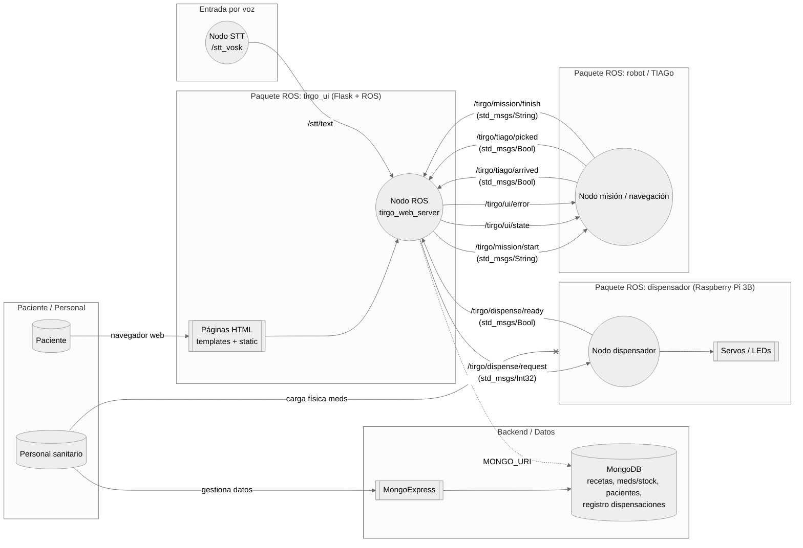

Resumen del problema biomédico (síntesis del Hito 1, máx. 1 página).

1. Resumen del problema biomédico
En el contexto hospitalario, una de las tareas que más tiempo y recursos del personal sanitario consume es la dispensación de medicamentos. Este proceso, además de implicar un elevado coste operativo, presenta riesgos asociados a errores humanos (confusión de dosis o fármacos) y retrasos en la entrega, afectando tanto a la seguridad del paciente como a la eficiencia del sistema de salud.
El proyecto TIRGO PHARMA plantea una solución basada en la automatización del proceso de dispensación y entrega de medicamentos mediante la integración del robot TiaGo con un dispensador automático controlado por una Raspberry Pi. El dispensador almacena distintos tipos de comprimidos y los libera bajo demanda en un punto de recogida. El robot TiaGo recoge el medicamento con su gripper y lo transporta de forma autónoma hasta el paciente, garantizando una entrega segura y trazable.
La interacción con el paciente se realiza a través de una interfaz conversacional, que permite confirmar la identidad del usuario, explicar la medicación prescrita y resolver dudas básicas sobre su administración. De esta manera, el sistema combina robótica móvil, manipulación, y comunicación natural para ofrecer un servicio integral de dispensación.
El impacto esperado de la solución se manifiesta en distintos niveles. Para el personal sanitario, supone una reducción significativa del tiempo dedicado a tareas de transporte y entrega de medicamentos, lo que disminuye la carga operativa y el riesgo de error humano. A nivel del sistema hospitalario, se incrementa la eficiencia global y la trazabilidad del medicamento, optimizando el flujo de trabajo dentro de las unidades clínicas y mejorando la gestión de recursos. Finalmente, desde la perspectiva del paciente, la solución favorece una mayor adherencia al tratamiento, una mejor comprensión de las indicaciones médicas y una experiencia más cercana y personalizada gracias a la interacción con el robot.
El entorno previsto de implementación es un hospital o centro de salud, aunque las primeras fases del desarrollo se realizan en un laboratorio simulado con conectividad estable y entornos controlados. El sistema se limita al manejo de medicamentos previamente autorizados y cumple con los requisitos de privacidad y seguridad de datos personales y clínicos, fundamentales en el contexto biomédico actual.

Hay que poner los cambios + relevantes que hemos hecho
2. Arquitectura del sistema:
2.a) Diagrama general del sistema y descripción de los principales módulos funcionales.

Modulos:
Módulos principales:
Módulo de interfaz y diálogo

Reconocimiento y síntesis de voz.

Sistema de compresión para intenciones farmacéuticas.

Módulo de gestión de recetas y órdenes

Asocia peticiones de medicación con pacientes.

Controla los estados: pendiente, en preparación, dispensado.

Módulo dispensador (Raspberry Pi)

Controla los servomotores (SG90).

Señaliza estado mediante LEDs.

Módulo robótico (TIAGo++)

Navegación autónoma hasta el punto de recogida y entrega.

Control de gripper para recoger los cilindros.

Mapeado

Módulo de registro y trazabilidad (DB)

Guarda logs de cada evento (usuario, hora, medicación).

Permite auditoría o análisis posterior.
Comunicación ROS

2.b) Especificación de componentes de hardware: robot base, sensores, actuadores, periféricos, sistemas de comunicación.

Componente
Función principal
Notas
Robot TIAGo++
Transporte y comunicación con el paciente
ROS 1 Noetic, sensores base y gripper integrados
Raspberry Pi 3
Control de dispensador
Ejecución de nodos ROS y control PWM
Servomotores SG90
Apertura/cierre de canales de medicación
2 unidades, un canal por tipo de comprimido
LEDs 
Iluminación durante el proceso de dispensación
Blanco constante
Fuentes de 5 V/3 A
Alimentación estable de la Raspberry y servos
Fuente independiente
Estructura impresa en 3D
Tolvas y rampa de caída
Diseño modular y reemplazable
Cámara RGB 
Verificación visual del dispensador
Integrable en futuro para lectura de QR
Conectividad Wi-Fi/Ethernet
Comunicación ROS entre módulos
ROS TCPROS o rosbridge WebSocket

2.c) Esquema preliminar de interfaz de usuario (UI/UX) y fujo de interacción con el sistema.
Flujo funcional:
Autenticación del personal sanitario o cliente.

Selección de paciente o medicación.

Confirmación → envío de orden ROS

Retroalimentación visual y/o verbal:

“Dispensando medicación del paciente Juan Pérez…”

Finalización y registro automático en el log del sistema.

Principios UX:
Mensajes claros y breves.

Confirmaciones antes de acciones críticas.

Diseño adaptado a interfaz web.

3. Diseño de software y comunicación:
3.a) Arquitectura de nodos en ROS 1 (diagrama de topics, servicios y acciones).

3.b) Estructura del repositorio y principales packages o módulos.
SUBIR TODO A DEVELOP PARA VER LOS PAQUETES MERGE
3.c) Descripción de posibles contenedores Docker y dependencias del entorno.

4. Análisis de viabilidad técnica:
4.a) Identificación de posibles limitaciones técnicas (alcance, precisión, tiempo de res-
puesta, compatibilidad).

Área
Riesgo o limitación
Impacto
Mitigación
Control mecánico
Desincronización entre servos, colisiones internas
Medio
Calibración y rutinas de reposo, redimensionamiento de los componentes
Comunicación ROS
Latencia o pérdida de paquetes
Bajo
Reintentos y confirmación de estados
IA conversacional
Ambigüedad de respuesta
Medio
Definición clara de intenciones y fallback
Navegación TIAGo
Interferencia con flujo hospitalario
Bajo
Operación restringida a entornos controlados
Seguridad de datos
Privacidad del paciente
Alto
Uso de datos simulados en prototipo docente

4.b) Estrategia de mitigación y pruebas iniciales.
Mecánica y control:

Prototipo de dispensador con 4 variables.

Pruebas de ciclo: abrir/cerrar múltiples veces para validar robustez.

Software:

Tests unitarios en nodos principales.

Simulación de comandos desde UI sin hardware para validar flujo.

Seguridad básica:

Implementar roles/usuarios en entorno demo.

Log obligatorio de todas las dispensaciones.

Estrategia docente:

Documentación clara del flujo para que cualquier miembro del equipo pueda seguirlo.

5. Cronograma de desarrollo:
Plan temporal
Semana (Hito 3)

Implementar estructura del repositorio según este diseño.

Desarrollar tiago_pharma_dispenser_node (control básico de de los 2 servos).

Implementar tiago_pharma_logger simple.

Semana 1 tras hito 3

Implementar tiago_pharma_ui_bridge y flujo básico desde UI → ROS → dispensador.

Integrar Raspberry Pi en red ROS.

Pruebas funcionales con casos simples (dispensación única).

Semana 2

Añadir gestor de peticiones tiago_pharma_order_manager.

Mejorar interfaz usuario (confirmaciones, estados).

Añadir detección de errores básicos de dispensación.

Semana 3

Integración completa de módulos.

Pruebas de estrés (varias dispensaciones, diferentes usuarios).

Refinar documentación técnica (diagramas, README, manual básico de uso).

Semana 4

Ajustes finales.

Verificación de coherencia entre requisitos, arquitectura y prototipo.

Revisión de contribuciones en Git.

2. Arquitectura del sistema
El sistema se despliega sobre la red del Tiago, que actía como el punto central de ROS, es decir, el ROS master. Tanto el ordenador que lanza la interfaz web como la Raspberry del dispensador se conectan al Wi-Fi del TiaGo de esta manera, todos los nodos ven los mismo tópicos. El ordenador ademas, esta conectado por Ethernet a la red del aula para publicar la web y para levantar MongoDB en local. La idea es que la web sea el punto de entrada pero que la ejecucion fisica (dispensr y mover el robot) la hagan otros nodos de ROS.
2.a) Diagrama general del sistema y descripción de los principales módulos funcionales.
	A nivel funcional el sistema se organiza en los siguientes modulos:
Modulo de interfaz y dialogo: es un nodo ROS que levanta la aplicacion web y muestra al usuario las pantallas de menú, diágnostico, consulta y lectura de receta. Las acciones, se convierten en mensajes ROS que se publican en el ROS master.
Síntesis de voz: es un nodo que corre en el ordenador y publica en /stt/text el texto reconocido. Actualmente se usa para activar la eb pero el objetivo es que pueda lanzar la peticion de medicación y la orden al robot.
Gestión de recetas y ordenes: es la logica de la propia interfaz que se conecta a MongoDB. 
Modulo dispensador (Raspberry Pi): nodo de ROS que esta en la Raspberry conectada al dispensador. Se suscribe al topic de peticion de dispensasicion mueve los servos, señaliza con LEDs y al terminar publica para avisar a la UI.

Modulo robotico (TiaGo): cuando recibe una mision publicada por la UI ejecutta la navegación hasta el punto de recogida, coge el medicamento y vuelve al punto de entrega. Publica eventos del progreso que la UI usa para actualizar la interfaz.

Modulo de registro y trazabilidad (DB): servicio MongoDB que corre en el ordenador. Guarda pacientas, recetas, medicamentos y el historico de dispensaciones. Por la confidencialidad y seguridad de los pacientes la UI es el unico modulo que se conecta aqui.

5.a) Plan temporal desde el Hito 3 hasta la entrega nal (Gantt o tabla de tareas).
5.b) Reparto de responsabilidades actualizado, con enfoque colaborativo.
