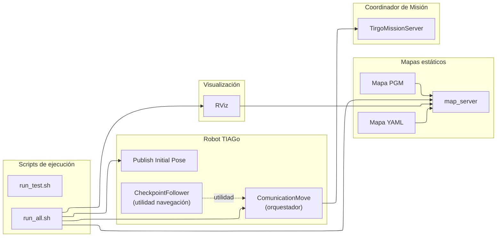

<div align="center">

# `move`

Paquete de **navegación del robot TIAGo** para el sistema **TirGoPharma**.

Implementa la **lógica mínima y controlada de movimiento autónomo**  
necesaria para la demo: desplazamiento entre puntos clave  
(dispensador ↔ paciente) y publicación de **hitos de navegación**  
para el coordinador de misión.

Compatible con **ROS 1 (Noetic)**.

</div>

---

## 1. Visión general

El paquete **`move`** encapsula la navegación del robot TIAGo para la demo end-to-end de **TirGoPharma**.

Su objetivo **no es** desarrollar un stack completo de navegación, sino proporcionar un comportamiento:

- **fiable** (para demo),
- **reproducible** (con mapa estático),
- **trazable** (publicando hitos ROS consumidos por la misión).

Este paquete se encarga de:

- Lanzar **RViz** con una configuración predefinida
- Cargar el **mapa estático** del entorno (`map_server`)
- Ejecutar el **orquestador de navegación** `comunication_move.py`
  - gestiona el flujo de movimiento dentro de la demo (dispensador ↔ paciente)
- Publicar **flags ROS** que indican el progreso del movimiento
  (llegada al dispensador, llegada al paciente, etc.)

> Nota: también incluye nodos auxiliares (pose inicial, tests, validación),
> documentados en `src/move/README.md`.

El coordinador de misión (`tirgo_mission_server`) utiliza estos flags para avanzar su **máquina de estados**.

---

## 2. Estructura del paquete

```text
move/
├── CMakeLists.txt
├── package.xml
├── configs/
│   └── rviz_configs.rviz           # Configuración visual de RViz
├── launch/
│   └── rviz.launch                 # Lanzador de RViz
├── maps/
│   ├── Mapa_aula.yaml              # Metadatos de mapa (ejemplo)
│   ├── Mapa_aula.pgm               # Imagen de mapa (ejemplo)
│   ├── Mapa_aula_mod_1.0.yaml      # Versión depurada (si aplica)
│   └── Mapa_aula_mod_1.0.pgm       # Versión depurada (si aplica)
├── scripts/
│   ├── run_all.sh                  # Script principal de ejecución (demo)
│   └── run_test.sh                 # Script auxiliar (desarrollo/debug)
└── src/
    └── move/
        ├── comunication_move.py    # Orquestador de navegación para la demo
        ├── checkpointfollower.py   # Utilidad de navegación por goals/checkpoints
        ├── publish_initial_pose.py # Publicador de pose inicial
        ├── comunicacion_test.py    # Test de comunicación por topics
        └── test_puntos.py          # Validación de coordenadas
````

---

## 3. Rol dentro de TirGoPharma

Dentro del sistema global, el paquete **`move`** actúa como **módulo de ejecución de navegación**:

* **Recibe el evento de inicio** (p. ej. `/tirgo/mission/start`)
* Ejecuta el desplazamiento físico del robot
* **Publica hitos** indicando la finalización de cada tramo

Flags publicados (reales en el flujo):

* `/tirgo/tiago/arrived`
* `/tirgo/tiago/at_patient`

Estos flags permiten que la misión avance de forma **determinista y trazable**.

---

## 4. Requisitos

* **ROS 1 Noetic**
* Workspace con el paquete `move` compilado
* TIAGo real o simulación (si procede) con stack de navegación activo
* Mapa disponible (`map_server`) y localización (`amcl`) en el entorno

Dependencias Python típicas usadas por los nodos:

* `rospy`
* `numpy`
* `tf.transformations`

> Nota: el paquete asume la existencia de un stack de navegación estándar
> (p. ej. `move_base`) y topics habituales (pose/localización) según el entorno TIAGo.

---

## 5. Uso

### 5.1 Preparación

Antes de ejecutar el paquete:

1. Asegúrate de que el robot o la simulación están activos
2. Lanza `roscore` si no está ya en ejecución
3. Carga el entorno del workspace:

```bash
cd ~/carpeta_compartida/ros_ws
source devel/setup.bash
```

### 5.2 Ejecución del sistema (demo)

El script principal **orquesta el flujo de navegación**: RViz, mapa y lógica de movimiento.

```bash
roscd move/scripts
./run_all.sh
```

Comportamiento esperado:

* RViz se abre con el mapa del entorno
* El mapa se publica mediante `map_server`
* Se ejecuta `publish_initial_pose.py` (pose inicial)
* Se lanza el orquestador `comunication_move.py`
* Se publican los flags de llegada correspondientes (`arrived`, `at_patient`)

### 5.3 Ejecución de pruebas (desarrollo)

```bash
roscd move/scripts
./run_test.sh
```

> `run_test.sh` es un script **auxiliar** pensado para desarrollo/debug.
> En algunos entornos puede requerir ajustes según configuración del robot/mapa.

### 5.4 Lanzar RViz por separado

```bash
source ~/carpeta_compartida/ros_ws/devel/setup.bash
roslaunch move rviz.launch
```

Carga la configuración visual de `configs/rviz_configs.rviz`.

---

## 6. Documentación detallada por componente

| Componente                | Descripción                                                                 | Enlace                                       |
| ------------------------- | --------------------------------------------------------------------------- | -------------------------------------------- |
| **Scripts y ejecución**   | Scripts Bash para levantar todo el sistema o pruebas                        | [`scripts/README.md`](./scripts/README.md)   |
| **Launch files**          | Archivos launch de ROS para iniciar RViz                                    | [`launch/README.md`](./launch/README.md)     |
| **Nodos y código fuente** | Código Python que implementa la navegación y la coordinación del movimiento | [`src/move/README.md`](./src/move/README.md) |
| **Configuración y RViz**  | Configuración visual de RViz                                                | [`configs/README.md`](./configs/README.md)   |
| **Mapas estáticos**       | Mapas del entorno usados por localización y navegación                      | [`maps/README.md`](./maps/README.md)         |

---

## 7. Notas de diseño

* La navegación está diseñada para ser **estable en demo**, basada en puntos/recorridos definidos para el entorno.
* Se prioriza **integración de sistema y reproducibilidad** sobre optimización de navegación.
* Los hitos publicados permiten sincronizar el movimiento con el resto de módulos de TirGoPharma.

---

## 8. Arquitectura del paquete



* `ComunicationMove` coordina el movimiento dentro del flujo de demo y publica hitos consumidos por la misión.
* `Publish Initial Pose` ayuda a arrancar localización.
* `CheckpointFollower` existe como utilidad de navegación por goals/checkpoints.
* `RViz` es visualización (no controla la navegación).

---

## 9. Resumen

* `move` implementa la **navegación mínima necesaria** para TirGoPharma
* Publica hitos consumidos por `tirgo_mission_server`
* Diseñado para ser **simple, fiable y depurable**
* Funciona en robot real y puede adaptarse a simulación según el entorno

Este paquete permite que el robot **se mueva cuando debe moverse** y que el resto del sistema **sepa cuándo ha llegado**.
