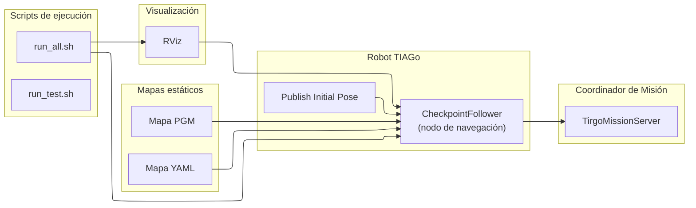

<div align="center">

# `move`

Paquete de **navegación del robot TIAGo** para el sistema **TirGoPharma**.

Implementa la **lógica mínima y controlada de movimiento autónomo**  
necesaria para la demo: desplazamiento entre puntos clave  
(dispensador ↔ paciente) y publicación de **hitos de navegación**  
para el coordinador de misión.

Compatible con **ROS 1 (Noetic)**.

</div>

---

## 1. Visión general

El paquete **`move`** encapsula la navegación del robot TIAGo mediante una lista de **checkpoints predefinidos** sobre un mapa estático.

Su objetivo **no es** desarrollar un stack completo de navegación, sino proporcionar un **comportamiento fiable, reproducible y trazable** para la demo end-to-end de TirGoPharma.

Este paquete se encarga de:

- Lanzar **RViz** con una configuración predefinida  
- Cargar el **mapa estático** del entorno  
- Ejecutar el nodo de navegación `checkpointfollower.py`  
- Publicar **flags ROS** que indican el progreso de la navegación  
  (llegada al dispensador, llegada al paciente, etc.)

El coordinador de misión (`tirgo_mission_server`) utiliza estos flags para avanzar su **máquina de estados**.

---

## 2. Estructura del paquete

```text
move/
├── CMakeLists.txt
├── package.xml
├── configs/
│   └── rviz_configs.rviz           # Configuración visual de RViz
├── launch/
│   └── rviz.launch                 # Lanzador de RViz
├── maps/
│   ├── Mapa_aula.yaml              # Metadatos del mapa
│   └── Mapa_aula.pgm               # Imagen del mapa
├── scripts/
│   ├── run_all.sh                  # Script principal de ejecución
│   └── run_test.sh                 # Script de pruebas
└── src/
    └── move/
        ├── checkpointfollower.py   # Lógica principal de navegación
        ├── publish_initial_pose.py # Publicador de pose inicial
        ├── comunicacion_test.py    # Test de comunicación por topics
        └── test_puntos.py          # Validación de coordenadas
````

---

## 3. Rol dentro de TirGoPharma

Dentro del sistema global, el paquete **`move`** actúa como **módulo de ejecución de navegación**:

* **Recibe órdenes** desde el coordinador de misión
* Ejecuta el desplazamiento físico del robot
* **Publica flags ROS** indicando la finalización de cada tramo

Ejemplos de flags publicados (orientativos):

* `/tirgo/tiago/arrived`
* `/tirgo/tiago/at_patient`

Estos flags permiten que la misión avance de forma **determinista y trazable**.

---

## 4. Requisitos

* **ROS 1 Noetic** (o distribución compatible)
* Workspace con el paquete `move` compilado
* TIAGo real o simulación (Gazebo) en funcionamiento
* Dependencias Python:

  * `rospy`
  * `numpy`
  * `tf.transformations`

---

## 5. Uso

### 5.1 Preparación

Antes de ejecutar el paquete:

1. Asegúrate de que el robot o la simulación están activos
2. Lanza `roscore` si no está ya en ejecución
3. Carga el entorno del workspace:

```bash
cd ~/carpeta_compartida/ros_ws
source devel/setup.bash
```

### 5.2 Ejecución del sistema

El script principal **orquesta todo el flujo de navegación**: RViz, mapa y nodo de control.

```bash
roscd move/scripts
./run_all.sh
```

Comportamiento esperado:

* RViz se abre con el mapa del aula
* El robot aparece localizado en el mapa
* `checkpointfollower.py` comienza a recorrer los checkpoints
* Se publican los flags de llegada correspondientes

### 5.3 Ejecución de pruebas

```bash
roscd move/scripts
./run_test.sh
```

* Permite depurar posiciones o recalibrar el robot sin levantar todo el sistema.

### 5.4 Lanzar RViz por separado

```bash
source ~/carpeta_compartida/ros_ws/devel/setup.bash
roslaunch move rviz.launch
```

* Carga la configuración visual de `configs/rviz_configs.rviz`.

---

## 6. Documentación detallada por componente

Para profundizar en cada parte del paquete, consulta los README específicos:

| Componente                | Descripción                                                                  | Enlace                                       |
| ------------------------- | ---------------------------------------------------------------------------- | -------------------------------------------- |
| **Scripts y ejecución**   | Scripts Bash para levantar todo el sistema o pruebas                         | [`scripts/README.md`](./scripts/README.md)   |
| **Launch files**          | Archivos launch de ROS para iniciar nodos y RViz                             | [`launch/README.md`](./launch/README.md)     |
| **Nodos y código fuente** | Código Python que implementa la navegación, checkpoints y orquestación       | [`src/move/README.md`](./src/move/README.md) |
| **Configuración y RViz**  | Configuración visual de RViz para una visualización consistente              | [`configs/README.md`](./configs/README.md)   |
| **Mapas estáticos**       | Mapas del entorno (aula/laboratorio) usados por la navegación y localización | [`maps/README.md`](./maps/README.md)         |

---

## 7. Notas de diseño

* La navegación se basa en **checkpoints fijos**, no en planificación dinámica
* Esto reduce incertidumbre y hace la demo **más estable y reproducible**
* El objetivo es **integración de sistema**, no optimización de navegación

---

## 8. Arquitectura del paquete



* `CheckpointFollower` → nodo principal que recorre los checkpoints
* `Publish Initial Pose` → posiciona el robot al inicio
* `run_all.sh` / `run_test.sh` → scripts que levantan nodos y RViz
* `TirgoMissionServer` → recibe flags de navegación (`arrived`, `at_patient`)
* `RViz` → interfaz gráfica para visualización de mapa, robot y sensores

---

## 9. Resumen

* `move` implementa la **navegación autónoma mínima necesaria** para TirGoPharma
* Publica hitos de navegación consumidos por `tirgo_mission_server`
* Diseñado para ser **simple, fiable y fácil de depurar**
* Funciona tanto en **robot real como en simulación**

Este paquete permite que el robot **se mueva cuando debe moverse** y que el resto del sistema **sepa exactamente cuándo ha llegado**.
