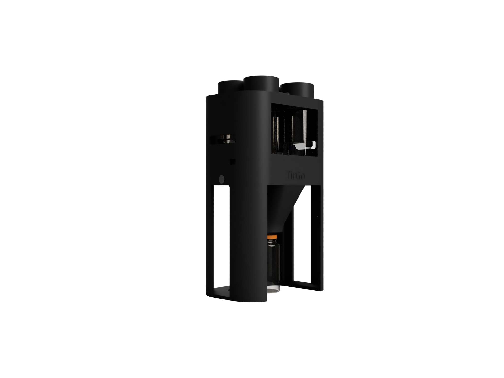
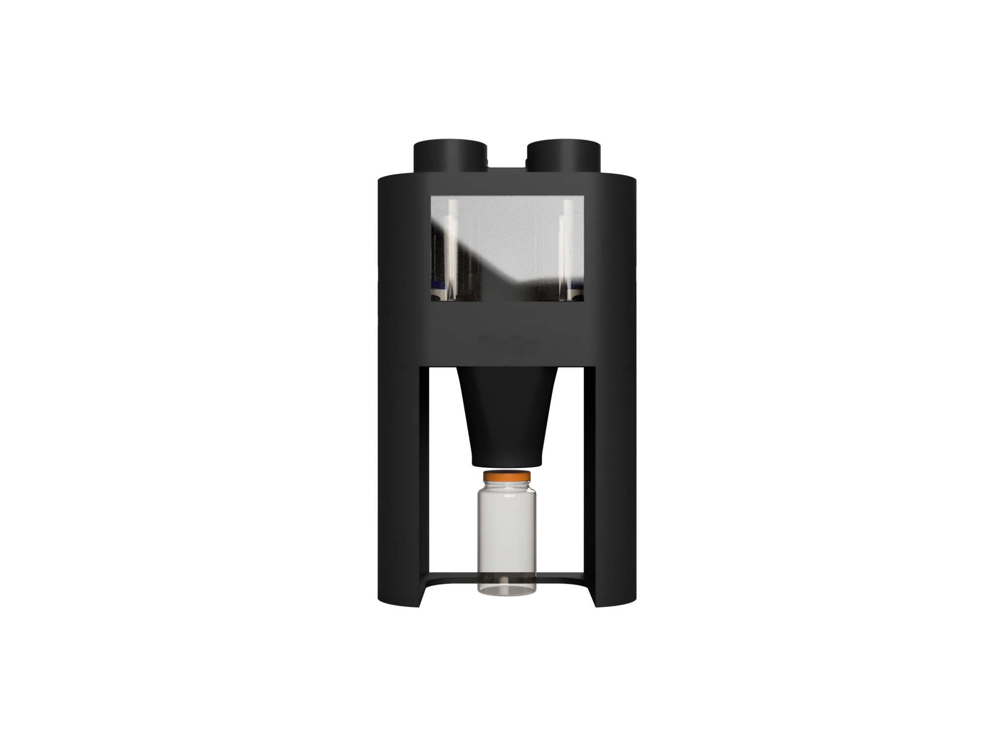
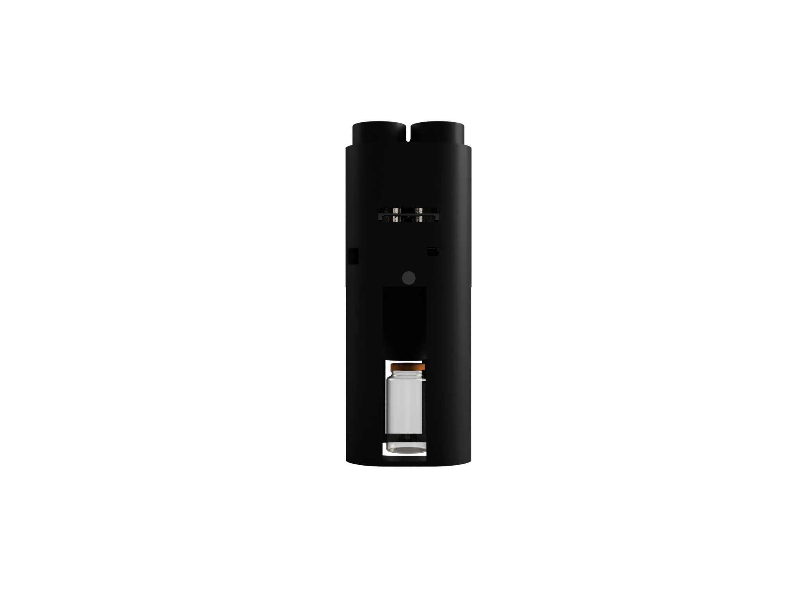
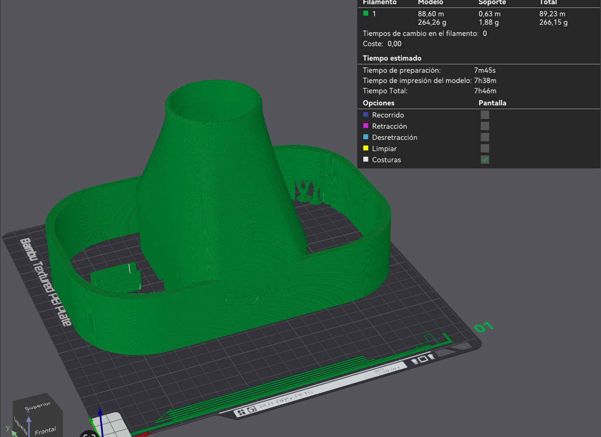
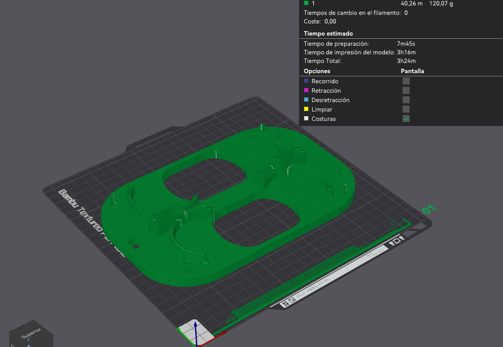

# Hardware Dispensador TirGo

**Diseño mecánico, validación e ingeniería de fabricación aditiva.**

Módulo compacto para la dosificación automatizada de fármacos, diseñado para integración robótica y fabricación mediante impresión 3D FDM.

[Diseño CAD] • [Impresión 3D] • [Mecatrónica]

---

## Índice

- [1. Visión general del sistema](#1-visión-general-del-sistema)
- [2. Diseño CAD y validación](#2-diseño-cad-y-validación)
- [3. Mecatrónica y Lista de Materiales (BOM)](#3-mecatrónica-y-lista-de-materiales-bom)
- [4. Preparación para fabricación (DFM)](#4-preparación-para-fabricación-dfm)
- [5. Proceso de impresión 3D](#5-proceso-de-impresión-3d)
- [6. Postprocesado y ensamblaje](#6-postprocesado-y-ensamblaje)
- [7. Integración de frascos y pruebas](#7-integración-de-frascos-y-pruebas)
- [8. Resultado final](#8-resultado-final)
- [9. Próximos pasos](#9-próximos-pasos)

---

## 1. Visión general del sistema

El dispensador está concebido como un **módulo compacto, robusto y reproducible**, pensado para integrarse en entornos automatizados (como farmacias robotizadas o el robot TIAGo). El diseño prioriza:

* **Modularidad:** Separación estructural para facilitar mantenimiento y sustitución de piezas.
* **Fabricación FDM:** Optimizado para impresoras 3D estándar sin sacrificar tolerancias.
* **Universalidad:** Integración limpia de frascos de farmacia estándar.
* **Estética Industrial:** Cerramiento protector, accesibilidad y líneas limpias.

A nivel funcional, el sistema combina una estructura portante, una tolva interna de direccionamiento, un sistema de guiado de frascos y un volumen superior para almacenamiento y actuación.

---

## 2. Diseño CAD y validación

El diseño se ha realizado íntegramente en CAD, iterando desde volúmenes simples hasta la geometría final funcional. Se han priorizado espesores constantes para FDM y radios para evitar concentraciones de tensiones.

### Vistas Técnicas del Conjunto

  <table>
    <tr>
      <td align="center">
        <b>Vista Isométrica (Ensamblaje)</b> 
         
        <a href="../../../docs/Galeria/RenderPerspectivaIsometrica.png">Ver imagen original</a>
      </td>
      <td align="center">
        <b>Vista Frontal (Alzado)</b> 
         
        <a href="../../../docs/Galeria/RenderAlzadoFrontal.png">Ver imagen original</a>
      </td>
    </tr>
    <tr>
      <td align="center">
        <b>Perfil Lateral</b> 
         
        <a href="../../../docs/Galeria/RenderPerfilLateral.png">Ver imagen original</a>
      </td>
      <td align="center">
        <b>Mecanismo Superior</b> 
         
        <a href="../../../docs/Galeria/RenderDetalleMecanismoSuperior.png">Ver imagen original</a>
      </td>
    </tr>
  </table>

Estas vistas permitieron verificar:
* **Coaxialidad** del cuello de salida y alineación vertical.
* **Espacio libre** para la manipulación de frascos.
* **Continuidad** de superficies internas (evitar atascos en la tolva).
* **Validación de electrónica:** Espacio reservado para el actuador y cableado.

---

## 3. Mecatrónica y Lista de Materiales (BOM)

Para el sistema de liberación y dosificación de los medicamentos, se ha optado por una solución compacta y de bajo consumo.

### Componentes Principales

| Componente | Cantidad | Función |
| :--- | :---: | :--- |
| **Servo Motor** | 2 | Accionamiento de las levas de dispensación. |
| **Cuerpo Principal** | 1 | Estructura, tolva y alojamiento de servos. |
| **Base Estructural** | 1 | Chasis de soporte y anclaje al robot. |
| **Frascos** | 4 | Contenedores de medicamento. |

> **Nota técnica sobre los SG90:** El diseño integra alojamientos específicos (interference fit) para los micro-servos, permitiendo un acople directo a los gatillos de dispensación sin necesidad de adhesivos complejos.

---

## 4. Preparación para fabricación (DFM)

Antes de imprimir, el modelo se adaptó específicamente a fabricación aditiva (Design for Additive Manufacturing):

* **División estratégica:** Separación de la base y el cuerpo superior para reducir riesgos de fallo y facilitar la impresión.
* **Voladizos:** Eliminación de ángulos críticos (<45º) para reducir soportes.
* **Orientación:** Optimizada para maximizar la resistencia mecánica en el eje Z.

---

## 5. Proceso de impresión 3D

La fabricación se realizó mediante **impresión 3D FDM**, utilizando parámetros ajustados para resistencia estructural (PETG / PLA+).

### Pieza A: Cuerpo del Dispensador (Tolva)

  
   
  <a href="../../../docs/Galeria/LaminadoEmbudoInterno.png">Ver captura de laminado original</a>

* **Tiempo estimado:** ~7h 45m
* **Estrategia:** Infill estructural y costuras alineadas en la cara posterior para estética visual.
* **Soportes:** Mínimos, solo en los puentes de los alojamientos de servos.

### Pieza B: Base Estructural

  
   
  <a href="../../../docs/Galeria/LaminadoBaseEstructural.png">Ver captura de laminado original</a>

* **Tiempo estimado:** ~3h 24m
* **Estrategia:** Alta densidad de relleno para asegurar un centro de gravedad bajo y mayor estabilidad en la base.

---

## 6. Postprocesado y ensamblaje

Tras la impresión, se realizaron tareas críticas para asegurar el funcionamiento mecánico:

* **Retirada de soportes:** Especial cuidado en los alojamientos de los servos.
* **Limpieza:** Revisión de superficies internas de la tolva para asegurar que no haya imperfecciones que frenen la caída del medicamento.
* **Verificación:** Comprobación dimensional de los encajes.

El ajuste entre piezas fue diseñado con **holguras controladas**, permitiendo un ensamblaje en seco o con mínima tornillería, evitando la necesidad de mecanizado posterior.

---

## 7. Integración de frascos y pruebas

El sistema está diseñado para trabajar con frascos estándar, manteniendo un guiado vertical estable y protección frente a interferencias externas.

### Prueba de ensamblaje (4 Botes)

  
   
  <a href="../../../docs/Galeria/RenderEnsamblajeCompleto.png">Ver render de alta resolución</a>

Esta fase de integración permitió validar:
1.  **Tolerancias reales vs CAD:** Ajuste perfecto de los botes en sus bahías.
2.  **Estabilidad estructural:** El conjunto soporta el peso de los 4 frascos llenos sin deformación.
3.  **Accesibilidad:** Las ventanas permiten verificar el stock visualmente sin desmontar nada.

---

## 8. Resultado final

El resultado es un **dispensador funcional, fabricable y escalable**. El diseño final refleja:

* **Iteración de ingeniería:** Evolución desde volúmenes simples a una pieza compleja optimizada.
* **Pensamiento orientado a fabricación:** Cada decisión de diseño (ángulos, espesores, partición) se tomó pensando en la impresora 3D.
* **Integración mecánica limpia:** Los actuadores y los frascos quedan protegidos y ordenados.

Este documento deja constancia del trabajo de ingeniería detrás del sistema, más allá del simple objeto impreso.

---

## 9. Próximos pasos

* Integración del cableado hacia el controlador (ESP32 / Arduino / ROS Driver).
* Ensayos de ciclo de vida y fatiga mecánica en las levas impresas.
* Optimización de flujo para reducir tiempos de impresión en serie.
* Preparación de documentación para usuario final.
