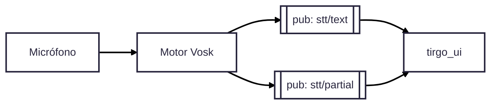

<div align="center">

# stt_vosk

Nodo de **reconocimiento de voz (Speech-To-Text)** para **ROS 1 (Noetic)**,
basado en **Vosk** y **PyAudio**.

Convierte audio capturado por micrófono en **texto publicable por ROS**,
permitiendo interacción por voz con el sistema **TirGoPharma**.
Diseñado para integrarse principalmente con la interfaz web (`tirgo_ui`).

</div>

---

## Visión general

El paquete **`stt_vosk`** implementa un nodo ROS que escucha audio en tiempo real,
ejecuta reconocimiento de voz en streaming y publica el texto reconocido en topics ROS.

Su objetivo es **apoyar la interacción humano–robot** durante la demo,
permitiendo que el usuario active o complemente acciones mediante voz
(por ejemplo, usando una *wake word*).

Características principales:

- Reconocimiento de voz **offline** (sin servicios externos)
- Soporte para modelos Vosk en distintos idiomas
- Publicación de **texto final** y **texto parcial**
- Configuración flexible vía parámetros ROS
- Integración directa con `tirgo_ui`

---

## 1. Estructura del paquete

```text
stt_vosk/
├── package.xml
├── CMakeLists.txt
├── README.md
├── launch/
│   └── stt_vosk.launch               # Lanzador del nodo STT
└── scripts/
    ├── stt_vosk_node.py              # Nodo principal (Vosk + PyAudio + ROS)
    └── list_audio_devices.py         # Lista micrófonos disponibles
````

---

## 2. Qué hace el nodo

El nodo `stt_vosk_node.py` ejecuta el siguiente flujo:

1. Abre un dispositivo de audio (micrófono) usando **PyAudio**
2. Carga un **modelo Vosk** desde disco
3. Procesa el audio en streaming
4. Publica el **texto final reconocido** en `stt/text`
5. (Opcional) Publica **texto parcial** en `stt/partial` mientras el usuario habla

---

## 3. Rol dentro de TirGoPharma

Dentro del sistema global, **`stt_vosk`** actúa como módulo de **entrada por voz**.

* Publica texto reconocido en ROS
* No toma decisiones ni ejecuta lógica de negocio
* La interpretación del texto queda en manos de otros módulos
  (principalmente `tirgo_ui`)

Este desacoplamiento permite **activar o desactivar la voz**
sin afectar al resto del sistema.

---

## 4. Dependencias

* **ROS 1 Noetic**
* Paquetes ROS:

  * `rospy`
  * `std_msgs`
* Python 3 con:

  * `vosk`
  * `pyaudio`
* Un **modelo Vosk** descargado (por ejemplo `vosk-model-small-es-0.42`)
  en una ruta accesible desde el sistema

---

## 5. Instalación

```bash
cd ~/carpeta_compartida/ros_ws/src
cp -r /ruta/al/stt_vosk .
cd ~/carpeta_compartida/ros_ws
catkin_make
source devel/setup.bash
```

⚠️ Asegúrate de que la ruta al modelo Vosk configurada en el launch **existe**.

---

## 6. Uso rápido

### 6.1 Listar dispositivos de audio

Para identificar el índice del micrófono disponible:

```bash
rosrun stt_vosk list_audio_devices.py
```

Salida típica:

```text
[0] Built-in Audio ... | rate max: 48000 Hz | channels: 2
[9] USB PnP Audio Device ... | rate max: 16000 Hz | channels: 1
```

Usa el índice adecuado (por ejemplo `9`) como `device_index`.

---

### 6.2 Lanzar el nodo STT

```bash
roslaunch stt_vosk stt_vosk.launch
```

Ejemplo de configuración del launch:

```xml
<node pkg="stt_vosk" type="stt_vosk_node.py" name="stt_vosk" output="screen">
  <param name="model_path" value="/home/TirGo/carpeta_compartida/models/vosk-es-small" />
  <param name="device_index" value="9" />
  <param name="sample_rate" value="16000" />
  <param name="publish_partial" value="true" />
  <param name="wake_word" value="hola tirgo" />
</node>
```

Si todo está correcto, el nodo indicará por consola que está escuchando
y comenzará a publicar texto al detectar voz.

---

## 7. Parámetros del nodo

| Parámetro          | Tipo   | Descripción                                   |
| ------------------ | ------ | --------------------------------------------- |
| `~model_path`      | string | Ruta al modelo Vosk                           |
| `~sample_rate`     | int    | Frecuencia de muestreo (16000 recomendado)    |
| `~device_index`    | int    | Índice del micrófono                          |
| `~chunk`           | int    | Tamaño del bloque de audio (8000 por defecto) |
| `~publish_partial` | bool   | Publica texto parcial en `stt/partial`        |
| `~wake_word`       | string | Palabra/frase clave para activar la UI        |

---

## 8. Topics ROS

### Publica

* **`stt/text`** (`std_msgs/String`)
  Texto final reconocido (consumido por `tirgo_ui`)

* **`stt/partial`** (`std_msgs/String`)
  Texto parcial durante la locución (opcional)

### Suscribe

* Ninguno
  (entrada únicamente por micrófono)

---

## 9. Diagrama de funcionamiento



---

## 10. Problemas típicos

* **`OSError: [Errno -9996] Invalid input device`**
  → El `device_index` no existe. Ejecuta de nuevo `list_audio_devices.py`.

* **No publica ningún texto**
  → El modelo Vosk no está en la ruta indicada (`model_path` incorrecto).

* **Mucho retardo**
  → Reduce el tamaño de `chunk` (por ejemplo a 4096).

* **No ves nada en la UI**
  → Comprueba con:

  ```bash
  rostopic echo stt/text
  ```

---

## 11. Resumen

* `stt_vosk` proporciona reconocimiento de voz **offline** para TirGoPharma
* Publica texto en ROS de forma simple y desacoplada
* Está pensado como módulo **opcional**, no crítico para la demo
* Facilita una interacción humano–robot más natural

Este paquete permite que el sistema **escuche**,
pero deja que otros módulos decidan **qué hacer con lo que oye**.
