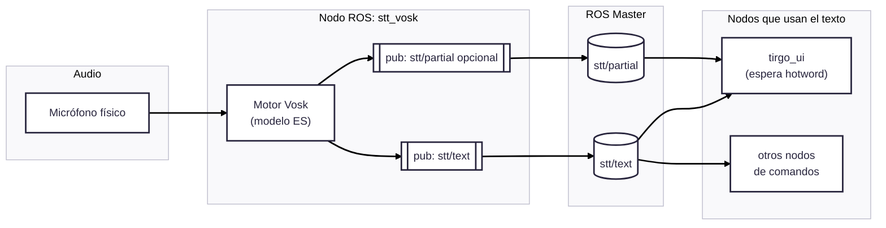

# stt_vosk

Nodo de **reconocimiento de voz** para **ROS 1 (Noetic)** usando **Vosk** y **PyAudio**.

Escucha por el micrófono, pasa el audio al modelo de Vosk (en español, o el que le pongas) y publica el texto reconocido en topics ROS para que otros nodos lo usen. Está pensado para integrarse con tu paquete `tirgo_ui`.

---

## 1. Estructura del paquete

```text
stt_vosk/
├── package.xml
├── CMakeLists.txt
├── README.md
├── launch/
│   └── stt_vosk.launch          
└── scripts/
    ├── stt_vosk_node.py         ← nodo principal (Vosk + PyAudio + ROS)
    └── list_audio_devices.py    ← script para listar micrófonos disponibles
````

---

## 2. Qué hace

1. Abre un dispositivo de audio (tu micro) con PyAudio.
2. Carga un **modelo Vosk** desde disco.
3. Reconoce voz en streaming.
4. Publica el **texto final reconocido** en `stt/text` (`std_msgs/String`).
5. (Opcional) Publica el **texto parcial** en `stt/partial` mientras hablas.

---

## 3. Dependencias

* ROS 1 Noetic
* `rospy`, `std_msgs`
* Python 3 con:

  * `vosk`
  * `pyaudio`
* Un **modelo Vosk** descargado (por ejemplo `vosk-model-small-es-0.42`) en una ruta accesible.

---

## 4. Instalación

```bash
cd ~/catkin_ws/src
cp -r /ruta/al/stt_vosk .
cd ~/catkin_ws
catkin_make
source devel/setup.bash
```

Asegúrate de que la ruta al modelo que pongas en el launch **existe**.

---

## 5. Uso rápido

### 5.1 Listar dispositivos de audio

El paquete trae un script para saber qué índice de micrófono tienes que usar:

```bash
rosrun stt_vosk list_audio_devices.py
```

La salida será algo tipo:

```text
[0] Built-in Audio ... | rate max: 48000 Hz | channels: 2
[9] USB PnP Audio Device ... | rate max: 16000 Hz | channels: 1
```

Te quedas con el número (por ejemplo `9`) y lo pones en el launch como `device_index`.

---

### 5.2 Lanzar el STT

```bash
roslaunch stt_vosk stt_vosk.launch
```

Ese launch debería definir:

```xml
<node pkg="stt_vosk" type="stt_vosk_node.py" name="stt_vosk" output="screen">
  <param name="model_path" value="/home/TirGo/carpeta_compartida/models/vosk-es-small" />
  <param name="device_index" value="9" />
  <param name="sample_rate" value="16000" />
  <param name="publish_partial" value="true" />
  <param name="wake_word" value="hola tirgo" />
</node>
```

Si todo va bien, verás en consola que está escuchando y cuando hables debería publicar.

---

## 6. Parámetros del nodo

* `~model_path` (string): ruta al modelo Vosk.
* `~sample_rate` (int): 16000 por defecto, que es lo que espera Vosk.
* `~device_index` (int): índice del micro.
* `~chunk` (int): tamaño de bloque de audio; 8000 suele ir bien.
* `~publish_partial` (bool): si `true`, también publica en `stt/partial`.
* `~wake_word` (string): cadena que, si aparece en el texto final, puedes usar para despertar la UI.

---

## 7. Topics ROS

**Publica:**

* `stt/text` (`std_msgs/String`)
  → texto final reconocido (esto es lo que debe escuchar `tirgo_ui`).

* `stt/partial` (`std_msgs/String`)
  → texto parcial mientras hablas (opcional).

**No suscribe** a ningún topic (es solo entrada de voz → texto).

---

## 8. Diagrama Mermaid



---

## 9. Problemas típicos

* **`OSError: [Errno -9996] Invalid input device`** → el `device_index` no existe. Vuelve a ejecutar `list_audio_devices.py` y coge el número correcto.
* **No publica nada** → el modelo no está en la ruta que pusiste (`model_path` mal).
* **Mucho retardo** → baja `chunk` a 4096.
* **No ves el texto** → prueba con `rostopic echo stt/text` para ver qué está saliendo realmente.
