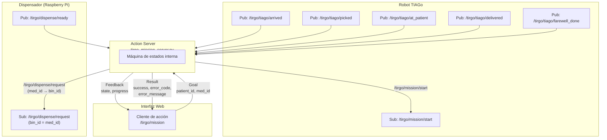

# `tirgo_mission_server`

Action Server de **TirgoPharma** encargado de coordinar toda la misión robótica de **dispensación → recogida → entrega → despedida** entre:

* La **interfaz web** (`tirgo_ui`)
* El **robot TIAGo** (flags de navegación y manipulación)
* El **dispensador Raspberry Pi**
* La base de datos y lógica de negocio de TirgoPharma

Funciona sobre **ROS 1 (Noetic)** y utiliza el Action `/tirgo/mission` definido en `tirgo_msgs`.

Este paquete implementa:

* Una **máquina de estados** controlada por flags ROS
* El **Action Server `/tirgo/mission`**
* Gestión completa de **timeouts**, **cancelaciones**, **feedback continuo**, **resultados**, **publicaciones de alto nivel**
* Tests de integración automáticos con **rostest**
* Un script para **extraer un resumen automático de los tests**

Es el **coordinador** entre la web y el hardware.

---

## 1. Estructura del paquete

```text
tirgo_mission_server/
├── package.xml
├── CMakeLists.txt
├── src/
│   └── tirgo_mission_server.py       ← núcleo: Action Server + FSM
├── test/
│   ├── test_mission_flow.test        ← ejecuta rostest
│   └── test_mission_flow.py          ← tests de integración (camino feliz + timeouts)
├── scripts/
│   └── resumen_tests.sh              ← script de resumen de ejecución de tests
└── README.md
```

---

## 2. Diagrama general del sistema



---

## 3. Máquina de estados del Action Server

La FSM del servidor avanza estrictamente según flags ROS, en este orden:

| Estado               | Flag esperado                | Descripción                      |
| -------------------- | ---------------------------- | -------------------------------- |
| `GOING_TO_DISPENSER` | `/tirgo/tiago/arrived`       | TIAGo llega al dispensador       |
| `WAITING_DISPENSE`   | `/tirgo/dispense/ready`      | Dispensador ha soltado el envase |
| `PICKING_UP`         | `/tirgo/tiago/picked`        | TIAGo ha cogido el envase        |
| `GOING_TO_PATIENT`   | `/tirgo/tiago/at_patient`    | Llegada al paciente              |
| `AT_PATIENT`         | `/tirgo/tiago/delivered`     | Entrega realizada                |
| `FAREWELL`           | `/tirgo/tiago/farewell_done` | Despedida completada             |
| `DONE`               | —                            | Finalización correcta            |

Si un flag no llega a tiempo → la misión finaliza con **error_code = TIMEOUT_***.

---

## 4. Topics ROS usados

### 4.1 Suscribe (flags del sistema real)

| Topic                        | Tipo | Publicado por  | Significado            |
| ---------------------------- | ---- | -------------- | ---------------------- |
| `/tirgo/tiago/arrived`       | Bool | TIAGo          | Llegada al dispensador |
| `/tirgo/dispense/ready`      | Bool | Dispensador Pi | Cajetín liberado       |
| `/tirgo/tiago/picked`        | Bool | TIAGo          | Envase cogido          |
| `/tirgo/tiago/at_patient`    | Bool | TIAGo          | Llegada al paciente    |
| `/tirgo/tiago/delivered`     | Bool | TIAGo          | Entrega hecha          |
| `/tirgo/tiago/farewell_done` | Bool | TIAGo          | Despedida finalizada   |

---

### 4.2 Publica (órdenes de alto nivel)

| Topic                     | Tipo   | Descripción                                                    |
| ------------------------- | ------ | -------------------------------------------------------------- |
| `/tirgo/mission/start`    | String | Instrucción para que TIAGo inicie navegación hacia dispensador |
| `/tirgo/dispense/request` | Int32  | Solicita al dispensador abrir la cubeta (bin_id) correcta      |

---

## 5. Acción `/tirgo/mission` (tirgo_msgs)

La acción se define en:

```
tirgo_msgs/action/TirgoMission.action
```

### Goal

```yaml
string patient_id    # hash del DNI
int32  med_id        # id del medicamento → bin_id del dispensador
```

### Feedback

```yaml
string state
float32 progress
```

### Result

```yaml
bool success
string error_code
string error_message
```

---

## 6. Timeouts soportados

Configurables vía parámetros privados (`~timeout_*`):

| Fase                   | Parámetro           | Error code         |
| ---------------------- | ------------------- | ------------------ |
| Llegada al dispensador | `~timeout_arrive`   | `TIMEOUT_ARRIVE`   |
| Dispensador listo      | `~timeout_ready`    | `TIMEOUT_READY`    |
| Pick del envase        | `~timeout_pick`     | `TIMEOUT_PICK`     |
| Llegada al paciente    | `~timeout_patient`  | `TIMEOUT_PATIENT`  |
| Entrega                | `~timeout_deliver`  | `TIMEOUT_DELIVER`  |
| Despedida              | `~timeout_farewell` | `TIMEOUT_FAREWELL` |

Cancelación del cliente → `PREEMPTED`.

---

## 7. Instalación

```bash
cd ~/carpeta_compartida/ros_ws/src
# Copiar aquí tirgo_mission_server y tirgo_msgs
cd ..
catkin_make
source devel/setup.bash
```

---

## 8. Ejecución

```bash
rosrun tirgo_mission_server tirgo_mission_server.py
```

## 9. Tests automatizados

El paquete **`tirgo_mission_server`** incluye una batería de tests pensada para comprobar que:

* La **máquina de estados** avanza correctamente en función de los flags ROS.
* Se respetan todos los **timeouts** configurados.
* El Action Server publica el **feedback** y el **result** esperados.
* Se generan las órdenes adecuadas hacia TIAGo y el dispensador.

Los tests se basan en **`rostest`** + **`rosunit`** y se centran en pruebas de **integración** del nodo completo.

### 9.1. Estructura de los tests

```text
tirgo_mission_server/
├── src/
│   └── tirgo_mission_server.py      ← Action Server + FSM
└── test/
    ├── test_mission_flow.test       ← fichero .test (launch + configuración)
    └── test_mission_flow.py         ← lógica de los casos de prueba
```

* **`test_mission_flow.test`**

  * Define un `roslaunch` de prueba que levanta:

    * `roscore`
    * el nodo `tirgo_mission_server.py`
    * nodos “fake”/helpers que publican los flags (`/tirgo/tiago/arrived`, `/tirgo/dispense/ready`, etc.)
  * Configura los **timeouts** a valores pequeños (segundos) para acelerar las pruebas.
  * Ejecuta `test_mission_flow.py` con `rosunit`.

* **`test_mission_flow.py`**

  * Contiene los distintos **casos de prueba** implementados con `unittest`/`rosunit`.
  * Usa un **Action Client** (`SimpleActionClient`) contra `/tirgo/mission`.
  * Publica flags simulados en los tópicos `/tirgo/tiago/*` y `/tirgo/dispense/ready`.
  * Verifica `feedback`, `result`, `success`, `error_code` y las órdenes publicadas por el servidor.

---

### 9.2. Casos cubiertos

Los tests actuales cubren, como mínimo, los siguientes escenarios:

1. **Camino feliz (happy path)**

2. **Timeout de llegada al dispensador (`TIMEOUT_ARRIVE`)**

3. **Timeout del dispensador (`TIMEOUT_READY`)**

4. **Timeout de pick (`TIMEOUT_PICK`)**

5. **Timeout de llegada al paciente (`TIMEOUT_PATIENT`)**

6. **Timeout de entrega (`TIMEOUT_DELIVER`)**

7. **Timeout de despedida (`TIMEOUT_FAREWELL`)**

8. **Cancelación del cliente (`PREEMPTED`)**

---

### 9.3. Requisitos para ejecutar los tests

Es necesario disponer de:

* **ROS 1 Noetic** correctamente inicializado.
* El workspace compilado (`catkin_make`) con:

  * `tirgo_mission_server`
  * `tirgo_msgs`
* Paquetes de test de ROS:

  * `rostest`
  * `rosunit`

Antes de lanzar los tests:

```bash
cd ~/carpeta_compartida/ros_ws
catkin_make
source devel/setup.bash
```

---

### 9.4. Ejecución de los tests

Desde una terminal con el entorno de ROS cargado:

```bash
rostest tirgo_mission_server test_mission_flow.test
```

Esto:

1. Levanta el `roscore` (si no estaba lanzado).
2. Arranca `tirgo_mission_server.py` con parámetros de timeout reducidos.
3. Lanza los nodos fake de flags (si se usan).
4. Ejecuta `test_mission_flow.py` con `rosunit`.
5. Genera los logs en `~/.ros/log/.../test_mission_flow-*.log`.

Para no tener que buscar los logs a mano, se puede usar el script de la sección **10** (`scripts/resumen_tests.sh`), que extrae un **resumen de resultados**.

---

## 10. Script de resumen automático de tests

Para evitar navegar manualmente por `~/.ros/log`, se incluye un script que:

* Lanza los tests
* Localiza automáticamente el último directorio de logs
* Encuentra el archivo `test_mission_flow-*.log`
* Extrae el bloque **RESUMEN DE TESTS**
* Muestra el resultado de forma clara

Ejecutar:

```bash
bash scripts/resumen_tests.sh
```

Resultado:

```
RESUMEN DE TESTS: TirgoMissionServer
------------------------------------
✔ Camino feliz
✔ Timeout llegada
✔ Timeout ready
✔ Timeout pick
✔ Timeout at_patient
✔ Timeout deliver
✔ Timeout farewell
✔ Preempt
```

---

## 11. Flujo típico en producción

1. La web (`tirgo_ui/rosio.py`) envía un goal con `patient_id` + `med_id`
2. El servidor publica `/tirgo/mission/start` y `/tirgo/dispense/request`
3. TIAGo y la Raspberry Pi van publicando sus flags
4. El servidor avanza por la FSM y envía **feedback** continuo
5. Si todo va bien → `success = true`
6. Si algún flag no llega → `error_code = TIMEOUT_*`
7. Si el cliente cancela → `PREEMPTED`

---

## 12. Dependencias

* `rospy`
* `std_msgs`
* `actionlib`
* `actionlib_msgs`
* `tirgo_msgs`
* `rostest`
* `rosunit`
