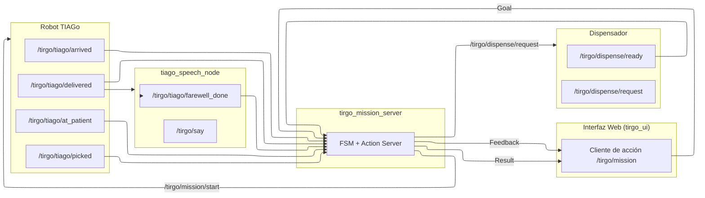

<div align="center">

# tirgo_mission_server

Action Server de TirGoPharma encargado de coordinar la misión robótica completa  
dispensación → recogida → entrega → despedida.

Actúa como coordinador central **a nivel ROS**, orquestando la interacción entre
la interfaz web, el robot TIAGo y el dispensador físico mediante una
máquina de estados sobre ROS 1 (Noetic).

</div>

---

## Visión general

El paquete `tirgo_mission_server` implementa el núcleo de coordinación de misiones
del sistema TirGoPharma.

Su responsabilidad es **orquestar el flujo end-to-end de una misión robótica**
utilizando exclusivamente **contratos ROS** (actions y topics), sin acceder
directamente a bases de datos ni a lógica de negocio.

El servidor implementa una **máquina de estados estricta**, que solo avanza
cuando recibe los flags ROS esperados desde los distintos módulos del sistema.

Utiliza el Action `/tirgo/mission` (definido en `tirgo_msgs`) para:

- recibir solicitudes desde la interfaz web (`tirgo_ui`)
- emitir feedback continuo del estado de la misión
- devolver un resultado final trazable (éxito, timeout o cancelación)

Este paquete incluye:

- Un Action Server con FSM interna
- Gestión completa de timeouts, cancelaciones y feedback
- Publicación de órdenes de alto nivel hacia TIAGo y el dispensador
- Un nodo auxiliar de voz para completar la despedida
- Tests de integración automáticos con `rostest`

---

## 1. Estructura real del paquete

```text
tirgo_mission_server/
├── package.xml
├── CMakeLists.txt
├── README.md
├── scripts/
│   ├── tirgo_mission_server.py   # Action Server + FSM
│   └── tiago_speech_node.py      # Nodo de voz / despedida
├── launch/
│   └── tiago_speech.launch       # Launch del nodo de voz
└── test/
    ├── test_mission_flow.test    # rostest
    └── test_mission_flow.py      # tests de integración
````

Nota: el paquete **no utiliza `src/`**. Todos los nodos ejecutables están en `scripts/`
y se instalan vía `catkin_install_python`.

---

## 2. Rol dentro del sistema TirGoPharma

`tirgo_mission_server` actúa como **orquestador de misión**, no como gestor de datos.

Responsabilidades reales:

* Coordinar el flujo de la misión mediante flags ROS
* Publicar órdenes de navegación y dispensación
* Gestionar timeouts y cancelaciones
* Emitir feedback y resultado al cliente de acción

Responsabilidades que **NO** asume:

* Gestión de base de datos (MongoDB)
* Traducción de medicación a stock
* Decisiones de negocio

Estas responsabilidades pertenecen a `tirgo_ui`, que prepara el goal antes
de llamar al Action Server.

---

## 3. Componentes del paquete

### 3.1 Action Server: `tirgo_mission_server.py`

* Implementa el Action `/tirgo/mission`
* Contiene la FSM principal
* Publica órdenes y consume flags
* Finaliza la misión con éxito, timeout o cancelación

### 3.2 Nodo auxiliar: `tiago_speech_node.py`

* Gestiona la despedida verbal del robot
* Publica `/tirgo/tiago/farewell_done`
* Es necesario para completar el estado `FAREWELL`

Si este nodo no se ejecuta, la FSM puede terminar en `TIMEOUT_FAREWELL`.

---

## 4. Diagrama general del sistema (alineado con el código)



---

## 5. Máquina de estados 

La FSM avanza únicamente cuando recibe los flags ROS esperados:

| Estado             | Flag esperado                | Descripción                |
| ------------------ | ---------------------------- | -------------------------- |
| GOING_TO_DISPENSER | `/tirgo/tiago/arrived`       | TIAGo llega al dispensador |
| WAITING_DISPENSE   | `/tirgo/dispense/ready`      | Dispensador listo          |
| PICKING_UP         | `/tirgo/tiago/picked`        | Recogida del envase        |
| GOING_TO_PATIENT   | `/tirgo/tiago/at_patient`    | Llegada al paciente        |
| AT_PATIENT         | `/tirgo/tiago/delivered`     | Entrega realizada          |
| FAREWELL           | `/tirgo/tiago/farewell_done` | Despedida completada       |
| DONE               | —                            | Misión completada          |

---

## 6. Topics ROS

### 6.1 Suscripciones

| Topic                        | Tipo | Publicado por     |
| ---------------------------- | ---- | ----------------- |
| `/tirgo/tiago/arrived`       | Bool | TIAGo             |
| `/tirgo/dispense/ready`      | Bool | Dispensador       |
| `/tirgo/tiago/picked`        | Bool | TIAGo             |
| `/tirgo/tiago/at_patient`    | Bool | TIAGo             |
| `/tirgo/tiago/delivered`     | Bool | TIAGo             |
| `/tirgo/tiago/farewell_done` | Bool | tiago_speech_node |

### 6.2 Publicaciones

| Topic                     | Tipo   | Descripción                         |
| ------------------------- | ------ | ----------------------------------- |
| `/tirgo/mission/start`    | String | Inicio de misión                    |
| `/tirgo/dispense/request` | Int32  | Solicitud de cubeta (bin_id físico) |

---

## 7. Acción `/tirgo/mission`

Definida en `tirgo_msgs/action/TirgoMission.action`.

### Goal

```yaml
string patient_id
int32  med_id
```

Nota: `med_id` se utiliza como **identificador físico de cubeta (bin_id)**.
La traducción medicación → bin debe realizarla `tirgo_ui`.

### Feedback

```yaml
string state
float32 progress
```

### Result

```yaml
bool success
string error_code
string error_message
```

Errores posibles:

* `BAD_GOAL`
* `TIMEOUT_*`
* `PREEMPTED`

---

## 8. Timeouts

Configurables vía parámetros privados:

| Fase                | Parámetro           | Error code       |
| ------------------- | ------------------- | ---------------- |
| Llegada dispensador | `~timeout_arrive`   | TIMEOUT_ARRIVE   |
| Dispensador listo   | `~timeout_ready`    | TIMEOUT_READY    |
| Pick                | `~timeout_pick`     | TIMEOUT_PICK     |
| Llegada paciente    | `~timeout_patient`  | TIMEOUT_PATIENT  |
| Entrega             | `~timeout_deliver`  | TIMEOUT_DELIVER  |
| Despedida           | `~timeout_farewell` | TIMEOUT_FAREWELL |

---


## 9. Ejecución

Ejecución manual:

```bash
rosrun tirgo_mission_server tirgo_mission_server.py
rosrun tirgo_mission_server tiago_speech_node.py
```

En el sistema completo, ambos nodos se lanzan desde `tirgo_ALL.sh`.

---

## 10. Tests automatizados

Ejecución:

```bash
rostest tirgo_mission_server test_mission_flow.test
```

Casos cubiertos:

1. Camino feliz
2. Timeouts por fase
3. Cancelación del cliente
4. Validación de publicación de órdenes

---

## 11. Resumen

* `tirgo_mission_server` es el orquestador de misión a nivel ROS.
* Implementa una FSM (Máquina de Estados Finita) estricta y testeada.
* No gestiona base de datos ni lógica de negocio.
* Depende del nodo de voz para completar la despedida.
* Es un componente central del flujo TirGoPharma.
