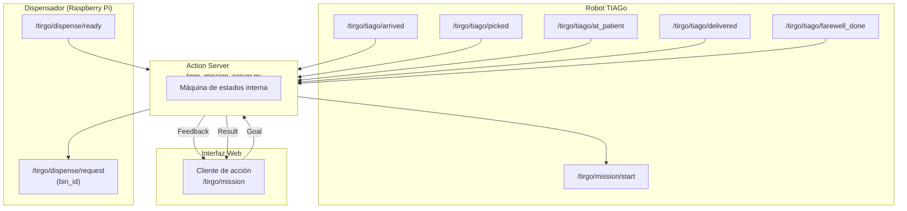

<div align="center">

# tirgo_mission_server

**Action Server de TirgoPharma** encargado de coordinar la misión robótica completa  
**dispensación → recogida → entrega → despedida**.

Actúa como **coordinador central** entre la **interfaz web**, el **robot TIAGo**,  
el **dispensador físico (Raspberry Pi)** y la **base de datos**, implementando  
una **máquina de estados (FSM)** sobre **ROS 1 (Noetic)**.

</div>

---

## Visión general

El paquete **`tirgo_mission_server`** implementa el **núcleo de coordinación** del sistema TirGoPharma.

Su responsabilidad es **orquestar el flujo end-to-end** de una dispensación de medicación,
avanzando por una **máquina de estados estricta**, controlada exclusivamente por **flags ROS**
publicados por los distintos módulos del sistema.

Utiliza el **Action `/tirgo/mission`** definido en `tirgo_msgs` para:

- recibir solicitudes desde la interfaz web,
- emitir **feedback continuo** del estado de la misión,
- devolver un **resultado final trazable** (éxito, timeout o cancelación).

Este paquete implementa:

- Una **máquina de estados (FSM)** robusta
- El **Action Server `/tirgo/mission`**
- Gestión completa de **timeouts**, **cancelaciones**, **feedback** y **resultados**
- Publicación de **órdenes de alto nivel** hacia TIAGo y el dispensador
- **Tests de integración** automáticos con `rostest`
- Un script para **extraer un resumen automático de los tests**

---

## 1. Estructura del paquete

```text
tirgo_mission_server/
├── package.xml
├── CMakeLists.txt
├── src/
│   └── tirgo_mission_server.py       ← núcleo: Action Server + FSM
├── test/
│   ├── test_mission_flow.test        ← ejecuta rostest
│   └── test_mission_flow.py          ← tests de integración
├── scripts/
│   └── resumen_tests.sh              ← resumen automático de tests
└── README.md
````

---

## 2. Diagrama general del sistema



---

## 3. Máquina de estados (FSM)

La FSM del servidor avanza **exclusivamente** cuando recibe los flags ROS esperados,
en el siguiente orden:

| Estado               | Flag esperado                | Descripción                     |
| -------------------- | ---------------------------- | ------------------------------- |
| `GOING_TO_DISPENSER` | `/tirgo/tiago/arrived`       | TIAGo llega al dispensador      |
| `WAITING_DISPENSE`   | `/tirgo/dispense/ready`      | Dispensador libera el envase    |
| `PICKING_UP`         | `/tirgo/tiago/picked`        | TIAGo recoge el envase          |
| `GOING_TO_PATIENT`   | `/tirgo/tiago/at_patient`    | Llegada al paciente             |
| `AT_PATIENT`         | `/tirgo/tiago/delivered`     | Entrega realizada               |
| `FAREWELL`           | `/tirgo/tiago/farewell_done` | Despedida completada            |
| `DONE`               | —                            | Misión completada correctamente |

Si un flag no llega a tiempo, la misión finaliza con un **error_code = TIMEOUT_***.

---

## 4. Topics ROS

### 4.1 Suscripciones (flags del sistema)

| Topic                        | Tipo | Publicado por  |
| ---------------------------- | ---- | -------------- |
| `/tirgo/tiago/arrived`       | Bool | TIAGo          |
| `/tirgo/dispense/ready`      | Bool | Dispensador Pi |
| `/tirgo/tiago/picked`        | Bool | TIAGo          |
| `/tirgo/tiago/at_patient`    | Bool | TIAGo          |
| `/tirgo/tiago/delivered`     | Bool | TIAGo          |
| `/tirgo/tiago/farewell_done` | Bool | TIAGo          |

---

### 4.2 Publicaciones (órdenes de alto nivel)

| Topic                     | Tipo   | Descripción                              |
| ------------------------- | ------ | ---------------------------------------- |
| `/tirgo/mission/start`    | String | Inicio de navegación al dispensador      |
| `/tirgo/dispense/request` | Int32  | Solicitud de apertura de cubeta (bin_id) |

---

## 5. Acción `/tirgo/mission`

Definida en:

```
tirgo_msgs/action/TirgoMission.action
```

### Goal

```yaml
string patient_id
int32  med_id
```

### Feedback

```yaml
string state
float32 progress
```

### Result

```yaml
bool success
string error_code
string error_message
```

---

## 6. Timeouts soportados

Configurables vía parámetros privados (`~timeout_*`):

| Fase                | Parámetro           | Error code         |
| ------------------- | ------------------- | ------------------ |
| Llegada dispensador | `~timeout_arrive`   | `TIMEOUT_ARRIVE`   |
| Dispensador listo   | `~timeout_ready`    | `TIMEOUT_READY`    |
| Pick del envase     | `~timeout_pick`     | `TIMEOUT_PICK`     |
| Llegada al paciente | `~timeout_patient`  | `TIMEOUT_PATIENT`  |
| Entrega             | `~timeout_deliver`  | `TIMEOUT_DELIVER`  |
| Despedida           | `~timeout_farewell` | `TIMEOUT_FAREWELL` |

Cancelación del cliente → `PREEMPTED`.

---

## 7. Instalación

```bash
cd ~/carpeta_compartida/ros_ws/src
# Copiar aquí tirgo_mission_server y tirgo_msgs
cd ..
catkin_make
source devel/setup.bash
```

---

## 8. Ejecución

```bash
rosrun tirgo_mission_server tirgo_mission_server.py
```

---

## 9. Tests automatizados

El paquete incluye **tests de integración** para validar el comportamiento completo
del Action Server y su FSM.

### Casos cubiertos

1. Camino feliz
2. Timeout llegada al dispensador
3. Timeout dispensador listo
4. Timeout pick
5. Timeout llegada al paciente
6. Timeout entrega
7. Timeout despedida
8. Cancelación del cliente (`PREEMPTED`)

### Ejecución

```bash
rostest tirgo_mission_server test_mission_flow.test
```

---

## 10. Resumen automático de tests

Para evitar revisar manualmente los logs:

```bash
bash scripts/resumen_tests.sh
```

Salida esperada:

```
RESUMEN DE TESTS: TirgoMissionServer
------------------------------------
✔ Camino feliz
✔ Timeout llegada
✔ Timeout ready
✔ Timeout pick
✔ Timeout at_patient
✔ Timeout deliver
✔ Timeout farewell
✔ Preempt
```

---

## 11. Flujo típico en producción (resumen)

1. `tirgo_ui` envía un goal con `patient_id` y `med_id`
2. El servidor publica órdenes de misión y dispensación
3. TIAGo y el dispensador publican sus flags
4. La FSM avanza emitiendo feedback continuo
5. La acción finaliza con **éxito**, **timeout** o **cancelación**

---

## 12. Dependencias

* `rospy`
* `std_msgs`
* `actionlib`
* `actionlib_msgs`
* `tirgo_msgs`
* `rostest`
* `rosunit`
