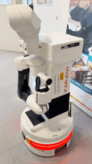

<div align="center">


# tirgo_tiago_arm_seq 

Paquete encargado de la ejecución de las secuencias de manipulación
del brazo del robot TIAGo dentro del sistema TirGoPharma.

Implementa un nodo residente y reactivo por eventos
que controla torso, brazo, cabeza y gripper para realizar de forma
segura y secuencial la recogida y entrega de la medicación.

</div>

---

## 1. Visión general

El paquete `tirgo_tiago_arm_seq` implementa la capa de ejecución física del brazo
del robot TIAGo dentro del flujo completo de dispensación autónoma de medicación.

Este nodo:

- No decide cuándo actuar.
- No planifica navegación.
- No coordina la misión.

Su única responsabilidad es ejecutar secuencias de movimiento del brazo
cuando recibe eventos de alto nivel publicados por otros subsistemas
(navegación, dispensador y coordinador de misión).

---

## 2. Demo

Este gif enseña una muestra de una ejecución real de las secuencias principales del brazo
(entrega) para entender rápidamente el comportamiento del nodo.

<p align="center">
  
</p>

[Ver GIF en el repositorio](../../../docs/Galeria/brazo.gif)


---


## 3. Estructura del paquete

```text
tirgo_tiago_arm_seq/
├── CMakeLists.txt
├── package.xml
├── launch/
│   └── tiago_secuencia_brazo.launch   # Lanzador del nodo
├── scripts/
│   └── tiago_secuencia_brazo.py       # Nodo residente de control del brazo
└── src/
````

---

## 4. Funcionamiento general

El nodo se inicializa y permanece en ejecución continua,
esperando eventos publicados por otros componentes del sistema.

### 4.1 Secuencia de recogida

1. La base del robot alcanza la posición frente al dispensador.

2. El dispensador confirma que el medicamento está listo publicando:

   ```
   /tirgo/dispense/ready = true
   ```

3. El nodo ejecuta la secuencia de recogida:

   * despliegue progresivo del brazo
   * aproximación al dispensador
   * apertura del gripper
   * agarre del bote
   * cierre del gripper
   * retorno a posición HOME con el bote asegurado

4. Publica el evento:

   ```
   /tirgo/tiago/picked = true
   ```

Esto permite que el robot se desplace hacia el paciente
con el medicamento ya asegurado, evitando movimientos innecesarios.

---

### 4.2 Secuencia de entrega

1. La base del robot alcanza la posición de entrega al paciente.

2. El sistema de navegación publica:

   ```
   /tirgo/tiago/at_patient = true
   ```

3. El nodo ejecuta la secuencia de entrega:

   * posicionamiento del brazo
   * apertura del gripper para soltar el bote
   * retirada controlada del brazo
   * retorno a posición HOME

4. Publica el evento:

   ```
   /tirgo/tiago/delivered = true
   ```

La inversión de la lógica del gripper garantiza una
entrega controlada y segura del medicamento.

---

## 5. Qué hace exactamente el nodo

* Controla:

  * Torso (`torso_lift_joint`)
  * Brazo (7 GDL)
  * Cabeza
  * Gripper
* Ejecuta una secuencia de poses predefinidas
* Sincroniza los pasos principales esperando la finalización
  del actionlib del brazo
* Publica eventos de estado para el resto del sistema
* Ignora explícitamente los eventos `false`

El único mecanismo de sincronización estricta es el Action Server del brazo.
Torso, cabeza y gripper se controlan mediante trayectorias temporizadas.

---

## 6. Interfaces ROS

### 6.1 Suscriptores (eventos de alto nivel)

| Topic                     | Tipo            | Significado                         |
| ------------------------- | --------------- | ----------------------------------- |
| `/tirgo/dispense/ready`   | `std_msgs/Bool` | Medicamento listo en el dispensador |
| `/tirgo/tiago/at_patient` | `std_msgs/Bool` | Robot en posición de entrega        |

El nodo solo actúa cuando recibe `true`.
Los valores `false` se ignoran.

---

### 6.2 Publicadores de control

#### Brazo (Actionlib)

* `/arm_controller/follow_joint_trajectory`
* Tipo: `control_msgs/FollowJointTrajectoryAction`

Se utiliza como elemento principal de sincronización durante la secuencia.

#### Torso, cabeza y gripper

* `/torso_controller/command`
* `/head_controller/command`
* `/gripper_controller/command`
* Tipo: `trajectory_msgs/JointTrajectory`

---

### 6.3 Publicadores de estado (feedback al sistema)

| Topic                    | Tipo            | Cuándo se publica    |
| ------------------------ | --------------- | -------------------- |
| `/tirgo/tiago/picked`    | `std_msgs/Bool` | Finaliza la recogida |
| `/tirgo/tiago/delivered` | `std_msgs/Bool` | Finaliza la entrega  |

Estos eventos permiten que la misión continúe
sin acoplarse al control interno del brazo.

---

## 7. Requisitos

* Ubuntu 20.04
* ROS Noetic
* Robot TIAGo (real o simulado)
* Controladores activos:

  * `arm_controller`
  * `torso_controller`
  * `head_controller`
  * `gripper_controller`

---

## 8. Ejecución

### Opción recomendada (launch)

```bash
source /opt/ros/noetic/setup.bash
source ~/catkin_ws/devel/setup.bash
roslaunch tirgo_tiago_arm_seq tiago_secuencia_brazo.launch
```

### Opción directa (rosrun)

```bash
rosrun tirgo_tiago_arm_seq tiago_secuencia_brazo.py
```

Al arrancar, el nodo:

* espera al Action Server del brazo
* queda en modo espera de eventos
* no ejecuta movimientos hasta recibir señales válidas

---

## 9. Disparo manual de secuencias (testing)

### Simular recogida

```bash
rostopic pub /tirgo/dispense/ready std_msgs/Bool "data: true" -1
```

### Simular entrega

```bash
rostopic pub /tirgo/tiago/at_patient std_msgs/Bool "data: true" -1
```

---


## 10. Resumen

* `tirgo_tiago_arm_seq` implementa la manipulación del brazo dentro de TirGoPharma.
* Reacciona a eventos claros y publica hitos explícitos.
* Prioriza seguridad, simplicidad e integración.
* Representa la capa donde el sistema interactúa físicamente con el entorno.
