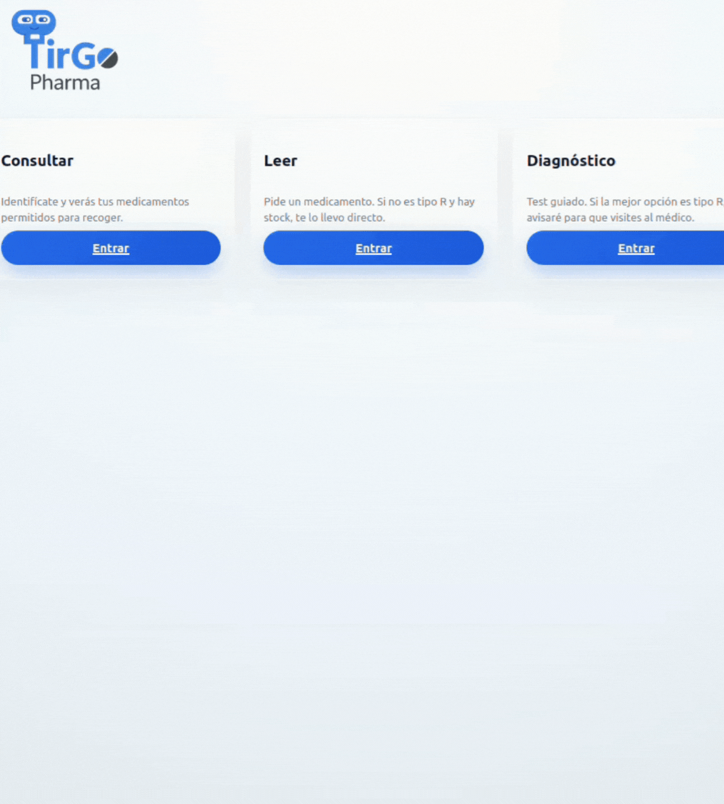
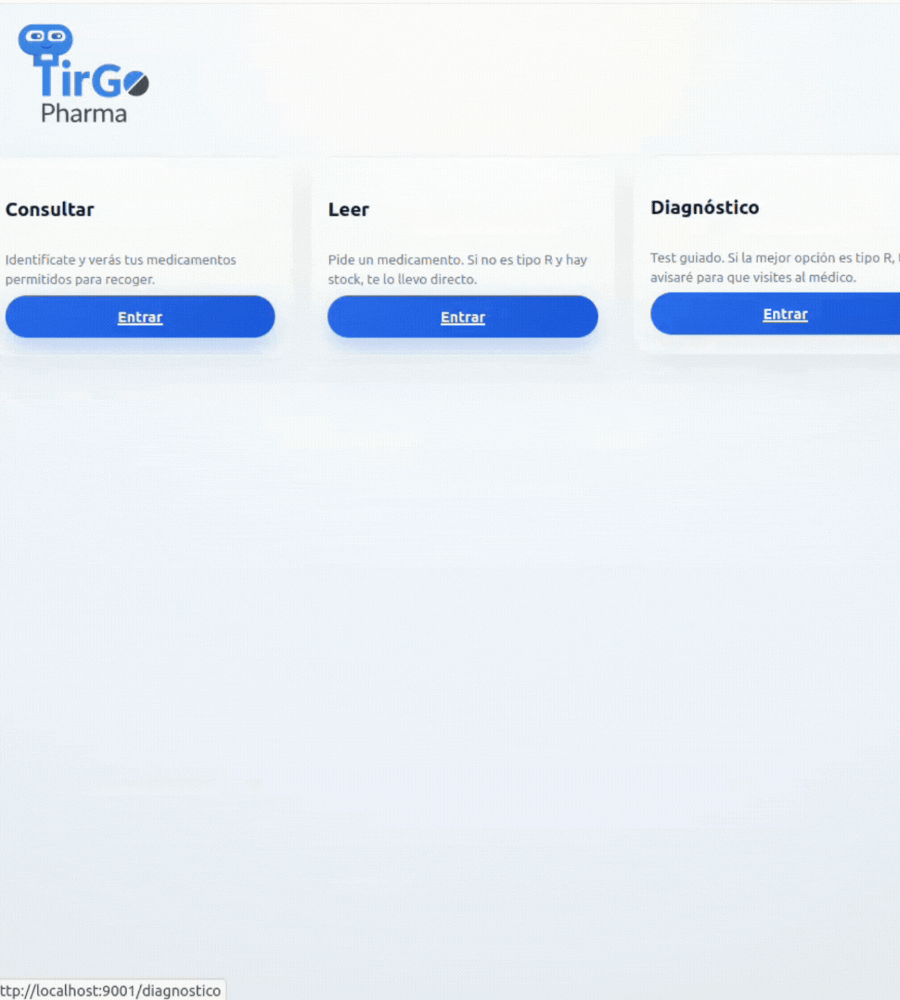
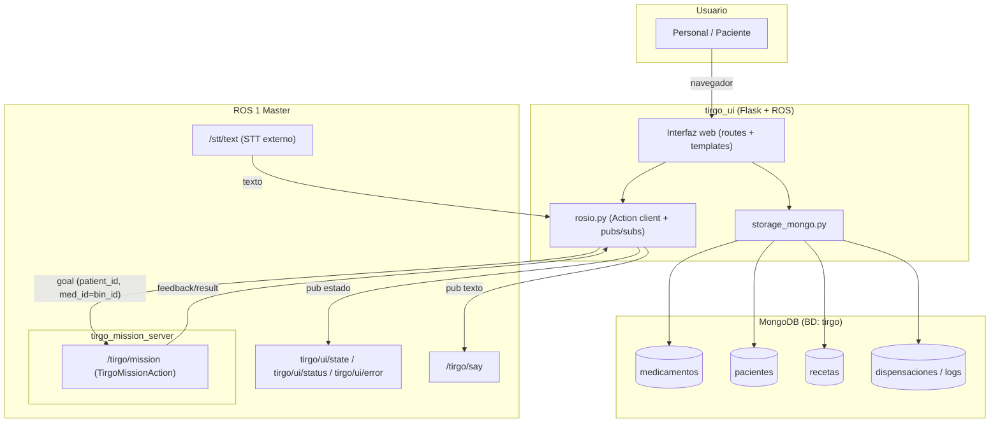

<div align="center">

# tirgo_ui

Interfaz web de TirgoPharma integrada en ROS 1 (Noetic).

Aplicación Flask empaquetada como paquete ROS para lanzarse con `rosrun` / `roslaunch`.

Puente entre usuario ↔ web ↔ MongoDB ↔ ROS.

</div>

---

## Quickstart

> 1) Levanta misión + (opcional) STT

En el sistema real, el servidor de misión se lanza como dos nodos (Action Server + voz/despedida):

```bash
# Action Server + FSM
rosrun tirgo_mission_server tirgo_mission_server.py

# Nodo auxiliar de voz (publica /tirgo/tiago/farewell_done)
rosrun tirgo_mission_server tiago_speech_node.py
````

STT (opcional):

```bash
roslaunch stt_vosk stt_vosk.launch
```

> 2. Lanza la web

```bash
roslaunch tirgo_ui web.launch
```

> 3. Abre la UI y (si estás en DEV) simula hotword

Web: `http://localhost:9001`

```bash
curl -X POST http://localhost:9001/simulate_hola
```

---

## Capturas de la UI (tirgo_ui)

### 1) Menú principal — entrada a los 3 flujos

Pantalla inicial con las tres rutas principales de la web: Consultar, Leer y Diagnóstico. Sirve como punto de entrada rápido para elegir el flujo de interacción.

<p align="center">
  
</p>

---

### 2) Selección de medicamento — catálogo con stock y bin

Listado visual de medicamentos disponibles. Cada tarjeta muestra stock, bin_id (cajetín del dispensador) y el tipo L/R (libre / requiere receta), que condiciona el siguiente paso del flujo.

<p align="center">
  
</p>

---

### 3) Identificación para tipo R — validación previa a misión

Formulario de identificación cuando el medicamento es de tipo R (requiere receta). Esta pantalla activa la validación (paciente/receta) antes de lanzar la misión de dispensación vía Action `/tirgo/mission`.

<p align="center">
  
</p>

---

## Galería (GIFs de flujo)

> Los GIFs están en `carpeta_compartida/docs/Galeria/`.


### Consultar (GIF)

<p align="center">
  
</p>

[Ver GIF en el repositorio](../../../docs/Galeria/consultar.gif)


### Leer (GIF)

<p align="center">
  
</p>

[Ver GIF en el repositorio](../../../docs/Galeria/leer.gif)

### Diagnóstico (GIF)

<p align="center">
  
</p>

[Ver GIF en el repositorio](../../../docs/Galeria/diagnostico.gif)

---

## Índice

* [0. Resumen](#0-resumen)
* [1. Estructura del paquete](#1-estructura-del-paquete)
* [2. Rol en el sistema completo](#2-rol-en-el-sistema-completo)
* [3. Diagrama general del sistema](#3-diagrama-general-del-sistema)
* [4. Dependencias](#4-dependencias)
* [5. Variables de entorno importantes](#5-variables-de-entorno-importantes)
* [6. Instalación](#6-instalación)
* [7. Puesta en marcha](#7-puesta-en-marcha)

  * [7.1. Arranque recomendado en el repositorio grande](#71-arranque-recomendado-en-el-repositorio-grande)
  * [7.2. Lanzar STT y Action Server de misión (manual)](#72-lanzar-stt-y-action-server-de-misión-manual)
  * [7.3. Lanzar la web con `web.launch`](#73-lanzar-la-web-con-weblaunch)
  * [7.4. Lanzar a mano (sin launch)](#74-lanzar-a-mano-sin-launch)
* [8. Flujo típico de uso](#8-flujo-típico-de-uso)

  * [8.1 Validaciones de entrada (Consultar/Leer)](#81-validaciones-de-entrada-consultarleer)
  * [8.2 Diagnóstico: casos contemplados](#82-diagnóstico-casos-contemplados)
* [9. ROS: acción y tópicos utilizados](#9-ros-acción-y-tópicos-utilizados)

  * [9.1. Acción de misión](#91-acción-de-misión)
  * [9.2. Tópicos publicados](#92-tópicos-publicados)
  * [9.3. Tópicos suscritos](#93-tópicos-suscritos)
  * [9.4. Contrato STT (hotword)](#94-contrato-stt-hotword)
* [10. Base de datos (MongoDB)](#10-base-de-datos-mongodb)
* [11. Modo desarrollo (simulación de voz)](#11-modo-desarrollo-simulación-de-voz)
* [12. Comandos útiles](#12-comandos-útiles)
* [13. Tests automatizados](#13-tests-automatizados)

  * [13.1. Estructura de tests](#131-estructura-de-tests)
  * [13.2. Qué cubren los tests (garantías funcionales)](#132-qué-cubren-los-tests-garantías-funcionales)
  * [13.3. Requisitos para ejecutar los tests](#133-requisitos-para-ejecutar-los-tests)
  * [13.4. Ejecutar los tests](#134-ejecutar-los-tests)

---

## 0. Resumen

Este paquete expone una aplicación Flask dentro de un paquete ROS, para poder lanzarse con `rosrun` / `roslaunch` y comunicarse con el resto del sistema mediante ROS.

La web sirve como capa de interacción con el usuario y permite:

* Desbloquear la interfaz por voz (hotword) escuchando el tópico de STT.
* Consultar pacientes, recetas y medicamentos almacenados en MongoDB.
* Lanzar una misión de dispensación a través del Action Server `/tirgo/mission`.
* Mostrar el estado de la misión a partir del feedback/result del Action y del estado interno de sesión.
* Publicar estado de UI en ROS y enviar texto a `/tirgo/say` para que el robot lo pronuncie (si existe el nodo correspondiente).

Está pensada para funcionar junto al paquete:

* `stt_vosk` (reconocimiento de voz; opcional, pero recomendado)
* `tirgo_mission_server` (Action Server de misión)
* una instancia de MongoDB (persistencia)

---

## 1. Estructura del paquete

```text
tirgo_ui/
├── package.xml
├── CMakeLists.txt
├── launch/
│   ├── web.launch            # lanzamiento típico
│   └── ...                   # otros launch de pruebas o legado
├── scripts/
│   └── tirgo_web_server      # entrypoint ROS que arranca Flask
├── src/
│   └── tirgo_ui/
│       ├── app.py            # crea la app Flask y registra blueprints
│       ├── config.py         # puerto, hotword, tópico STT, etc.
│       ├── rosio.py          # Action client + pubs/subs ROS
│       ├── mongo_client.py   # cliente Mongo (helper de conexión)
│       ├── storage_mongo.py  # acceso a MongoDB (queries, validaciones)
│       ├── services.py       # lógica auxiliar (mínima / potencial legado)
│       ├── session.py        # control de sesión activa en la UI
│       └── routes/           # blueprints Flask
│           ├── main.py       # pantalla principal + simular hotword
│           ├── consultar.py  # búsqueda de paciente / recetas
│           ├── leer.py       # confirmar y lanzar la misión
│           └── diagnostico.py# flujo guiado de diagnóstico
├── templates/                # HTML (Jinja2)
└── static/                   # CSS, JS, imágenes de medicamentos
```

---

## 2. Rol en el sistema completo

`tirgo_ui` es el componente que concentra la lógica de interacción y negocio:

* Lee y valida datos en MongoDB (pacientes/recetas/medicamentos/stock).
* Traduce el medicamento seleccionado a bin físico del dispensador.
* Construye y envía goals de misión a `/tirgo/mission` (Action Client).
* Presenta feedback y resultado en la UI web.

Punto crítico (contrato real):

* `tirgo_mission_server` NO gestiona base de datos.
* La UI es quien valida receta/stock y quien decide el bin físico.
* El `med_id` que envía la UI al Action `/tirgo/mission` se usa como bin_id físico hacia el dispensador.

---

## 3. Diagrama general del sistema

Nota: el diagrama es equivalente al flujo real, con enlaces explícitos.



---

## 4. Dependencias

ROS 1 Noetic:

* `rospy`
* `actionlib`
* `std_msgs`
* `tirgo_msgs` (definición de `TirgoMissionAction`)

Python:

* Flask
* pymongo

Servicios:

* MongoDB accesible (local o contenedor)
* (Opcional) `stt_vosk` publicando en el tópico configurado
* `tirgo_mission_server` proporcionando el Action Server `/tirgo/mission`

---

## 5. Variables de entorno importantes

Estas variables suelen establecerse desde `launch/web.launch` o desde Docker.

### `PORT`

Puerto HTTP de la web. Por defecto: `9001`.

---

### `MONGO_URI` (importante)

Cadena de conexión a MongoDB.

Importante (alineado con el repositorio grande):

* En el sistema completo, la URI real se inyecta desde `.env`/Docker Compose.
* Evita copiar credenciales antiguas del tipo `tirgo_app:tirgo` (pueden no existir en la DB real).

Ejemplos:

```bash
# Con autenticación (genérico)
export MONGO_URI="mongodb://<user>:<password>@127.0.0.1:27017/tirgo?authSource=tirgo"

# Sin autenticación (modo pruebas)
export MONGO_URI="mongodb://127.0.0.1:27017/tirgo"
```

---

### `TIRGO_HOTWORD`

Palabra/frase que debe llegar desde el STT para desbloquear la interfaz.

Ejemplo: `hola tirgo`.

---

### `TIRGO_STT_TOPIC`

Tópico desde el que se lee el texto del STT.

Ejemplo:

```bash
export TIRGO_STT_TOPIC="/stt/text"
```

---

### `TIRGO_DEV`

Si vale `1`, activa endpoints de prueba (por ejemplo, simular hotword).

---

### `FLASK_SECRET_KEY` (producción)

Clave de Flask para la sesión.

En producción debe ser una cadena larga y privada.

---

### `TIRGO_PEPPER` (producción)

Secreto utilizado para hashing/HMAC del identificador del paciente (por ejemplo DNI).
En despliegue real no debe faltar.

---

### `FLASK_DEBUG`

Modo debug de Flask (`1`/`0`).

---

## 6. Instalación

```bash
cd ~/carpeta_compartida/ros_ws/src
# aquí se ubica el paquete tirgo_ui
cd ..
catkin_make
source devel/setup.bash
```

Asegúrate de que la máquina / contenedor tiene acceso a la instancia de MongoDB.

---

## 7. Puesta en marcha

### 7.1. Arranque recomendado en el repositorio grande

En el repositorio grande, el arranque soportado se realiza con el script global:

```bash
cp .env.example .env
./tirgo_ALL.sh
```

Este modo configura MongoDB, la UI y los nodos ROS de forma coherente.

---

### 7.2. Lanzar STT y Action Server de misión (manual)

STT (opcional pero recomendado):

```bash
roslaunch stt_vosk stt_vosk.launch
```

Servidor de misión (obligatorio para dispensación):

```bash
rosrun tirgo_mission_server tirgo_mission_server.py
rosrun tirgo_mission_server tiago_speech_node.py
```

Nota: `tiago_speech_node.py` es el que publica `/tirgo/tiago/farewell_done`.
Sin este nodo, la misión puede terminar en `TIMEOUT_FAREWELL`.

---

### 7.3. Lanzar la web con `web.launch`

Modo desarrollo (por defecto):

```bash
roslaunch tirgo_ui web.launch
```

Modo despliegue (recomendación):

```bash
roslaunch tirgo_ui web.launch \
  tirgo_dev:=0 \
  flask_debug:=0 \
  flask_secret_key:=<cadena-secreta-larga> \
  mongo_uri:="mongodb://<user>:<password>@<HOST_MONGO>:27017/tirgo?authSource=tirgo"
```

Nota: la lista exacta de argumentos depende de `web.launch`. Si tu launch actual no expone alguno,
se recomienda ampliarlo para alinear configuración y documentación.

---

### 7.4. Lanzar a mano (sin launch)

```bash
export PORT=9001
export MONGO_URI="mongodb://127.0.0.1:27017/tirgo"
export TIRGO_STT_TOPIC="/stt/text"
export TIRGO_HOTWORD="hola tirgo"
export TIRGO_DEV=1

rosrun tirgo_ui tirgo_web_server
```

---

## 8. Flujo típico de uso

1. Llega la voz (opcional)

* El nodo STT (por ejemplo `stt_vosk`) publica en `TIRGO_STT_TOPIC` una cadena.
* La UI detecta la hotword configurada y desbloquea la sesión.

2. La web se desbloquea

* `tirgo_ui` cambia del estado “esperando voz” al menú principal.

3. Menú con 3 opciones principales

* Leer

  * muestra medicamentos disponibles (desde Mongo)
  * si el medicamento es tipo L, permite solicitarlo directamente
  * si es tipo R, pide identificación y valida receta activa

* Consultar

  * pide identificación
  * muestra recetas activas asociadas en Mongo

* Diagnóstico

  * cuestionario guiado
  * propone un medicamento o recomienda alternativa
  * si se acepta, sigue el mismo flujo de validación y misión

4. Validación técnica y lanzamiento de misión

La UI valida en MongoDB:

* medicamento existe y tiene `stock > 0`
* si es tipo R, receta activa para el paciente

Luego:

* determina `bin_id` físico del medicamento
* registra la operación en `dispensaciones/logs`
* construye `TirgoMissionGoal(patient_id, med_id)` donde `med_id` es el bin_id físico
* envía el goal al Action Server `/tirgo/mission` mediante `rosio.py`

5. Seguimiento

* la UI consume feedback/result del Action
* actualiza estado/pantallas en función del progreso y resultado
* publica estado en `tirgo/ui/state`, `tirgo/ui/status`, `tirgo/ui/error`
* puede publicar texto en `/tirgo/say`

---

### 8.1 Validaciones de entrada (Consultar/Leer)

En los flujos que requieren identificación (por ejemplo **Consultar** y **medicación tipo R** en **Leer**),
la UI aplica validaciones para evitar consultas erróneas y garantizar consistencia:

**Validación de nombre y apellidos**

* Rechaza entradas con números (p. ej. `"Juan2"`).
* Rechaza vacíos / solo espacios.
* Normaliza el texto (trim, case y variantes) para hacer búsquedas robustas.

**Validación de DNI**

* Rechaza formatos imposibles (longitud/patrón incorrecto).
* Normaliza el DNI antes de calcular su identificador opaco (`dni_hash`).
* Si el DNI no es válido, la UI informa del error y no continúa el flujo.

**Consecuencia funcional**

* Si un dato es inválido, la UI:

  * muestra feedback al usuario,
  * no consulta / no lanza misión,
  * mantiene el sistema en estado seguro.

> Nota: la UI opera contra `dni_hash` (no DNI en claro) para consultar `pacientes`/`recetas` en Mongo.

---

### 8.2 Diagnóstico: casos contemplados

El flujo **Diagnóstico** está diseñado como un árbol de decisión con salidas finitas.
Cubre explícitamente **4 resultados**:

#### Caso A — Recomendar uno de los medicamentos disponibles (3 opciones “medicación”)

* El sistema recomienda uno de los medicamentos del catálogo.
* Se valida `stock`.
* Si el medicamento recomendado es tipo **R**, se exige identificación y receta activa.
* Si es tipo **L**, se puede lanzar misión directamente.

#### Caso B — Medicamento con receta (1 opción “R”)

* Se informa que requiere receta.
* Se solicita identificación.
* Solo si hay receta activa + stock se lanza la misión.

#### Caso C — Visita al médico

* El sistema concluye que **no** debe dispensarse medicación.
* Recomienda **visita médica**.
* No se lanza misión.

#### Caso D — Reposo y descanso

* El sistema concluye que **no** es necesaria medicación.
* Recomienda **reposo**.
* No se lanza misión.

Resumen rápido:

| Resultado de Diagnóstico        |     ¿Dispensa? | ¿Lanza misión? |
| ------------------------------- | -------------: | -------------: |
| Medicamento tipo L              |              ✅ |              ✅ |
| Medicamento tipo R (con receta) | ⚠️ condicional |             ⚠️ |
| Visita al médico                |              ❌ |              ❌ |
| Reposo y descanso               |              ❌ |              ❌ |

---

## 9. ROS: acción y tópicos utilizados

### 9.1. Acción de misión

Nombre: `/tirgo/mission`
Tipo: `tirgo_msgs/TirgoMissionAction`

`tirgo_ui` actúa como cliente de esta acción.

Contrato crítico:

* `med_id` que envía la UI debe ser el bin_id físico (no un id lógico de base de datos).

---

### 9.2. Tópicos publicados

* `tirgo/ui/state` (`std_msgs/String`)
  Estados de alto nivel de la interfaz.
  Ejemplos: `IDLE`, `WAITING_HOTWORD`, `READY`, `DISPENSING`, `ERROR`.

* `tirgo/ui/status` (`std_msgs/String`)
  Estado detallado (texto o JSON).

* `tirgo/ui/error` (`std_msgs/String`)
  Mensajes de error orientados a diagnóstico.

* `/tirgo/say` (`std_msgs/String`)
  Mensajes de texto que un nodo de voz del robot puede convertir en audio.

---

### 9.3. Tópicos suscritos

* `TIRGO_STT_TOPIC` (por defecto `/stt/text`) (`std_msgs/String`)
  Texto reconocido por el sistema de STT.

---

### 9.4. Contrato STT (hotword)

La UI desbloquea la sesión cuando recibe un mensaje que contiene la hotword configurada (`TIRGO_HOTWORD`).

Recomendaciones prácticas:

* El topic de STT debe publicar `std_msgs/String` con frases completas.
* Si el STT publica parciales y finales por topics separados, configurar la UI para escuchar solo el final.
* Si el STT publica un token especial (por ejemplo `__WAKE__`), debe tratarse como evento y no como texto natural.

---

## 10. Base de datos (MongoDB)

La aplicación utiliza `storage_mongo.py` y `mongo_client.py`.

Accede a la base `tirgo` (definida por `MONGO_URI`).

Esquema conceptual:

### 1) `medicamentos`

Catálogo que la web presenta al usuario:

| id  | nombre             | tipo | bin_id | stock |
| --- | ------------------ | ---- | ------ | ----- |
| 101 | Paracetamol 1g     | L    | 1      | 9     |
| 202 | Ibuprofeno 400 mg  | L    | 2      | 6     |
| 303 | Amoxicilina 500 mg | R    | 3      | 0     |
| 404 | Omeprazol 20 mg    | L    | 4      | 10    |

Campos clave:

* `tipo`: “libre” (L) o “receta” (R).
* `bin_id`: cubeta física del dispensador.
* `stock`: unidades disponibles.

### Validación de datos (entrada y coherencia)

Además de consultar, la UI valida coherencia para evitar estados “rotos”:

* `stock` debe ser numérico y no negativo para permitir dispensación.
* `bin_id` debe existir para poder traducir `med_id` a cubeta física.
* Si falta información crítica (p. ej. medicamento sin `bin_id`), la UI bloquea el flujo y reporta error.

---

### 2) `pacientes`

Información de pacientes:

* `nombre`, `apellidos`
* `nombre_norm`, `apellidos_norm` (para búsqueda)
* `dni_hash` u opaco equivalente

Notas:

* La búsqueda se apoya en versiones normalizadas (`*_norm`) para tolerar mayúsculas/minúsculas y variaciones típicas.
* La UI opera contra `dni_hash` (no DNI en claro).

---

### 3) `recetas`

Asociación paciente–medicamento:

* `dni_hash`
* `medicamento_id`
* `activa` (true/false)
* campos adicionales (fechas, comentarios, etc.)

Regla de negocio aplicada:

* Si el medicamento es tipo **R**, se exige receta activa para permitir la misión.

---

### 4) `dispensaciones` / `logs`

Registro histórico:

* `ts` (timestamp)
* `medicamento_id`
* `dni_hash` (cuando aplica)
* resultado de la misión (éxito, error_code, etc.)

Resumen de uso:

1. El usuario elige flujo (leer/consultar/diagnóstico).
2. La UI consulta `medicamentos`, y según caso valida `pacientes`/`recetas`.
3. Si es válido: registra en `dispensaciones/logs` y lanza la misión.
4. La UI muestra feedback/result del Action.

---

## 11. Modo desarrollo (simulación de voz)

Si:

```bash
export TIRGO_DEV=1
```

La web expone endpoints de prueba (por ejemplo simular hotword):

```bash
curl -X POST http://localhost:9001/simulate_hola
```

Esto permite desbloquear la interfaz sin STT real.

---

## 12. Comandos útiles

```bash
# Compilación del workspace
cd ~/carpeta_compartida/ros_ws
catkin_make
source devel/setup.bash

# Lanzar STT (opcional)
roslaunch stt_vosk stt_vosk.launch

# Lanzar el servidor de misión (dos nodos)
rosrun tirgo_mission_server tirgo_mission_server.py
rosrun tirgo_mission_server tiago_speech_node.py

# Lanzar la web
roslaunch tirgo_ui web.launch

# Verificación rápida de STT
rostopic echo /stt/text

# Verificación rápida del Action (feedback/result)
rostopic echo /tirgo/mission/feedback
rostopic echo /tirgo/mission/result
```

---

## 13. Tests automatizados

El paquete `tirgo_ui` incluye una batería de tests.

Validan:

* lógica interna (Flask, sesión, helpers de Mongo)
* integración con la capa ROS a través de `rosio.py` en modo dummy

El objetivo es garantizar que la interfaz web funciona incluso si ROS o Mongo no están disponibles,
y que las rutas críticas (lanzar misión, consultar pacientes, diagnóstico) se comportan correctamente.

### 13.1. Estructura de tests

```text
tirgo_ui/tests/
├── conftest.py
├── test_main_routes.py
├── test_consultar.py
├── test_leer.py
├── test_diagnostico.py
├── test_session.py
├── test_storage_mongo.py
└── test_web_ros_integration.py
```

### 13.2. Qué cubren los tests (garantías funcionales)

Validación de hotword y desbloqueo:

* La UI permanece bloqueada hasta hotword (o simulación en dev).
* Se verifica el estado publicado en `tirgo/ui/state`.

Flujos Consultar y Leer:

* Búsqueda de pacientes y normalización.
* Recetas activas e inactivas.
* Errores: paciente inexistente, receta inexistente, medicamento sin stock, tipo R sin receta.

Lanzamiento correcto de misión:

* Construcción del goal `TirgoMissionGoal(patient_id, med_id)`.
* Asegurar que `med_id` corresponde al bin_id físico cuando se dispone de `bin_id`.
* Envío al Action Client dummy (sin ROS real).

Cobertura de sesión:

* Cambios de estado internos.
* Reseteos.
* Estados de error.

Mongo en modo seguro:

* Las funciones no deben romper incluso sin Mongo real (stubs/mocks).
* Simulación de stock, recetas y registro de dispensaciones.

Integración web + ROS dummy:

* Pipeline: endpoint → lógica → rosio → misión simulada → HTML/respuesta esperada.
* Feedback incremental simulado.

### 13.3. Requisitos para ejecutar los tests

Instalar dependencias:

```bash
pip install pytest
```

ROS no es necesario para unitarios ni para integración dummy.
Mongo real no es necesario si los tests usan stubs/mocks.

### 13.4. Ejecutar los tests

```bash
cd ~/carpeta_compartida/ros_ws/src/tirgo_ui
pytest -q

# Ejecutar un fichero concreto
pytest tests/test_leer.py -q

# Filtrar por nombre
pytest -k "receta_activa" -q

# Ver detalle
pytest -vv
```
